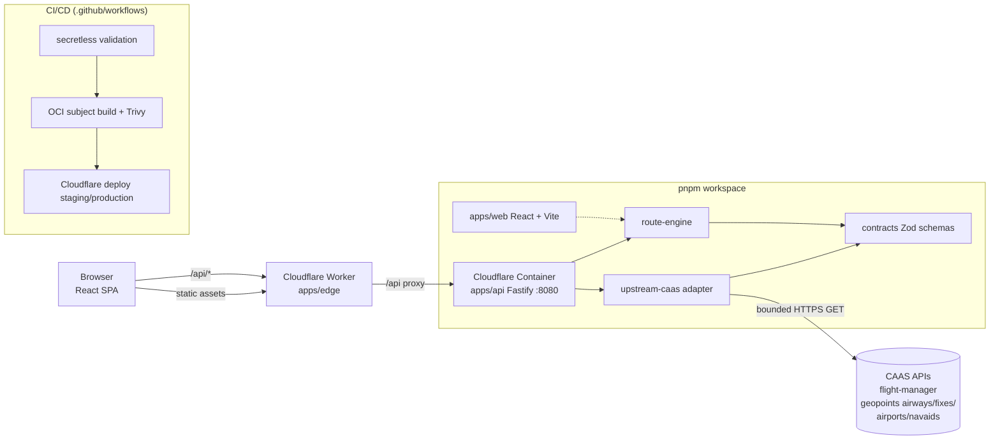

# Flight Route Explorer — CAAS Tech Challenge

   

A proof-of-concept that answers the [CAAS Tech Challenge](CAAS%20Tech%20Challenge_v2.21.pdf): query the CAAS Flight Object Manager and Aeronautical Data Service APIs, list flight plans, search by callsign, and display the selected flight's route on a global map — with an optional extension that proposes alternate routes.

**At a glance**

| | |
|---|---|
| Backend | Fastify 5 BFF (`apps/api/`) — sole CAAS client, in-memory generations, no database |
| Frontend | React 19 + Vite 8 SPA (`apps/web/`) with a dependency-free tile map |
| Deployment | Cloudflare Worker (`apps/edge/`) + Cloudflare Container, staging auto-deployed from `master` |
| Contract | Shared Zod schemas (`packages/contracts/`) across adapter, engine, API, and UI |
| Quality | Secretless CI lanes, reproducible OCI builds, Trivy-gated, evidence-retained |

**Contents:** [Overview](#overview) · [Requirements Coverage](#challenge-requirements-coverage) · [Component Diagram](#component-diagram) · [How It Works](#how-it-works-key-concepts) · [Build & Run](#build--run-steps) · [CI/CD](#cicd-pipeline) · [Design Rationale](#design-rationale) · [AI Usage](#ai-usage-declaration) · [Road to Production](#road-to-production) · [Governance & Evidence](#governance--evidence)

## Overview

Flight Route Explorer is a private, single-user, non-operational decision-support demo. It does **not** file, dispatch, approve, or recommend real routes; it visualizes and compares recorded flight-route data.

What was built:

- **Backend-for-frontend (BFF)** — a Fastify API (`apps/api/`) that is the only client of the upstream CAAS APIs. It acquires all five reference families (Flight Plans, Airways, Fixes, Airports, NAVAIDs), validates every response, and serves a normalized `/api/v1` JSON contract. State is held in rotating in-memory generations — there is no database.
- **Frontend** — a React + Vite single-page app (`apps/web/`) with a dependency-free tile map (EPSG:3857 projection over OpenStreetMap tiles) for listing flights, callsign search, selecting a flight, and drawing its route.
- **Edge deployment** — a Cloudflare Worker (`apps/edge/`) that serves the built frontend and routes `/api/*` to the Fastify server running in a Cloudflare Container built from `containers/Dockerfile`.
- **Shared packages** — Zod contract schemas (`packages/contracts/`), the upstream CAAS adapter (`packages/upstream-caas/`), and the route computation engine (`packages/route-engine/`).
- **End-to-end CI/CD** — secretless GitHub Actions validation, reproducible OCI image builds with Trivy scanning, and automated staging deployment to Cloudflare.

## Challenge Requirements Coverage

| Challenge requirement (Section 2) | Where it is implemented |
|---|---|
| List of all air-routes | Flight overview list served from `/api/v1`, rendered by `apps/web/` |
| Callsign search | Search in the `apps/web/` toolbar against the API flight list |
| Display selected flight route on a global map | `apps/web/src/TileMap.tsx` — self-contained EPSG:3857 tile map, routes drawn from exact resolved coordinates |
| Backend / frontend split | `apps/api/` (Fastify BFF) and `apps/web/` (React SPA) |
| Node.js / TypeScript preference | TypeScript end-to-end, Node.js ≥ 22 |
| Linux build, containerised artifact | `containers/Dockerfile` (digest-pinned, non-root); `pnpm run oci:build` |
| CI/CD automation (GitHub Actions) | Four workflows in `.github/workflows/` — see [CI/CD Pipeline](#cicd-pipeline) |
| Cloud deployment | Cloudflare Workers + Containers, staging auto-deployed from `master` (Azure path documented, inert) |
| Optional: alternate route computation | Donor-subpath synthesis + gap-distance modeling in `packages/route-engine/` |

## Component Diagram



Locally, the same split applies: Vite dev server for the frontend (proxies `/api`) and the Fastify server for the backend.

## How It Works (Key Concepts)

**1. Data acquisition.** `packages/upstream-caas/` performs bounded, allow-listed HTTPS GETs against the five CAAS endpoint families, with retries, freshness windows (live ≤ 5 min, reference ≤ 24 h), and strict schema validation. Startup fails closed if any mandatory family is unusable; refreshes build a new generation and swap atomically after full validation. Airways are fetched, parsed, and validated but their unproven values are never surfaced in output — routes are drawn from exactly resolved coordinates only.

**2. Route resolution.** For a selected flight plan, each waypoint is resolved by **exact reference matching** against Fixes, Airports, and NAVAIDs — never by proximity inference. Unresolved positions are preserved as explicit gaps, and ambiguous matches are preserved, not guessed. Modeled route distance is a full-precision Haversine total (R = 3440.065 NM), displayed to 0.1 NM and treated as descriptive only.

**3. User journey.** The UI lists all air-routes and supports callsign search. Selecting a flight draws its recorded route on the tile map with leg/waypoint detail and auto-fits the view.

**4. Route synthesis (the optional alternate-route task).** `packages/route-engine/src/synthesis.ts` (algorithm `donor-subpath-v1`) proposes alternate routes by borrowing contiguous subpaths from other recorded flights ("donors") whose waypoints join the selected route at shared reference IDs or exact coordinates. Candidates are bounded, deduplicated, and carry donor provenance.

**5. Gap-distance estimation and corridor analysis.** Where a candidate route has uncovered gaps, `packages/route-engine/src/gap-distance.ts` estimates their distance using a trained circuity model over span/latitude/heading cells (with an endpoint-corridor feature), letting synthesized candidates be distance-compared against the recorded baseline at full precision (`compare.ts`).

## Build & Run Steps

Prerequisites: Node.js ≥ 22.22.2, pnpm 11.5.2 (pinned via `packageManager`; `corepack enable` is sufficient).

```sh
pnpm install --frozen-lockfile   # install workspace dependencies
pnpm run build                   # build the frontend (Vite) and all packages
pnpm run typecheck               # workspace-wide TypeScript checks
pnpm test                        # all unit tests (node:test + vitest)
```

**Run locally (development):**

```sh
cp .env.example .env             # then set apikey to your CAAS API credential
pnpm --filter @flight-route-explorer/api run dev   # Fastify API (port from .env)
pnpm --filter @flight-route-explorer/web run dev   # Vite dev server; /api proxied to the API
```

The Fastify server is the only component that holds the CAAS credential; the browser only ever calls same-origin `/api`.

**Full validation suite** (offline lanes, evidence, security/performance measurement, container lanes):

```sh
pnpm run verify
```

**Containerized build** (Linux, digest-pinned base, non-root runtime, production deps only):

```sh
pnpm run oci:build               # reproducible build + subject manifest
pnpm run test:container          # loopback container lane + smoke test
```

## CI/CD Pipeline

Four GitHub Actions workflows under `.github/workflows/`:

| Workflow | Trigger | Purpose |
|---|---|---|
| `ci-secretless-validation.yml` | push to `master`, PRs | Hermetic offline validation: config/policy checks, typecheck, lint, unit tests, plus semgrep, dependency audit, and gitleaks secret scan. No credentials in scope. |
| `oci-subject-build.yml` | push to `master`, PRs | Builds the authoritative OCI subject from the digest-pinned `containers/Dockerfile`, verifies image assertions, scans HIGH/CRITICAL vulnerabilities with Trivy (exit-code gated), and uploads the digest-bundle evidence. |
| `cloudflare-deploy.yml` | push to `master` (staging), manual dispatch (production) | Builds frontend assets and deploys Worker + assets + container via Wrangler. GitHub Environments scope deployment credentials; production requires explicit manual dispatch. |
| `poc-pr-static.yml` | PRs touching infra/deploy/app paths | Offline static validation of deployment artifacts (Bicep, deploy scripts). |

Production deployment topology: Cloudflare Worker serving static SPA assets, with `/api/*` forwarded to the Fastify container instance managed as a Durable Object (`wrangler.jsonc`). Inert Azure artifacts (`infra/bicep/`, `deploy/`) document an alternative cloud path but are not deployed by CI.

## Design Rationale

**Algorithm choices**

- *Exact reference resolution over proximity matching.* Aviation reference points have canonical identifiers; guessing the "nearest" fix would silently corrupt a route. Unresolved/ambiguous points are surfaced explicitly instead.
- *Haversine at full precision (R = 3440.065 NM).* Aviation distances are nautical miles on a spherical model; rounding is applied only at the display boundary so comparisons never accumulate error.
- *Donor-subpath synthesis instead of graph search.* The dataset is recorded flights, not a connectivity graph; borrowing proven subpaths from real flights produces alternates that are structurally plausible and always traceable to donor provenance. A trained span/latitude/heading circuity model estimates uncovered gaps so candidates can be fairly distance-compared.

**Tooling choices**

- *TypeScript end-to-end* — matches CAAS's stated preference and lets one Zod contract surface (`packages/contracts/`) be the single source of truth shared by adapter, engine, API, and frontend.
- *Fastify 5* — minimal, fast, and easy to lock down (request/response hooks for cross-origin defense, size caps, security headers).
- *React 19 + Vite 8* — per the challenge, no graphical design is required; a framework-based SPA with instant dev feedback was the pragmatic pick.
- *pnpm workspaces* — one lockfile, `workspace:*` links, and a frozen-lockfile guarantee across CI and the container build.
- *Cloudflare Workers + Containers* — demonstrates edge routing plus a real containerized Linux artifact without managing a cluster.
- *Dependency-free tile map* — a small self-contained EPSG:3857 projection avoids a mapping SDK dependency in a POC.

**Architecture choices**

- *Monorepo with one-way dependencies* — `contracts` ← `upstream-caas` / `route-engine` ← `apps/*`; import-boundary lint enforces this in CI.
- *BFF pattern* — the backend is the sole CAAS client; the credential never reaches the browser, and all upstream data is validated before it enters any generation.
- *No database* — state is fully rebuildable from upstream in minutes; rotating immutable in-memory generations give atomic refresh semantics with zero persistence complexity, appropriate for a POC.

## AI Usage Declaration

AI-assisted coding tools were used during development, implementation, test authoring, and documentation. All AI-suggested output — tooling choices, framework selections, and generated code — was reviewed, tested, and verified by the author before inclusion, and the rationale behind every AI-influenced actions are supported by human decision and reasoning.

## Road to Production

Gaps between the current POC and production maturity:

- **Security hardening** — authenticated/authorized API access (currently single-user), rate limiting, WAF, and key rotation procedures; the CI already enforces secret scanning, dependency audit, and Trivy gating as the baseline.
- **Observability** — structured metrics/tracing, upstream-failure dashboards, and alerting on generation refresh degradation (a minimal structured logger exists; it is not wired to a telemetry backend).
- **Scaling** — the single in-memory generation and `max_instances: 1` container suit a POC; production would need horizontal instances sharing a generation source or a cache tier, plus graceful container cold-start handling.
- **Data governance** — retention/licensing review of upstream records, airway-topology data quality assessment (airways are currently validated but not displayed), and freshness-window tuning against real API quotas.
- **CI/CD automation** — canary/rollback automation for production deploys, container registry push with signed digests, and scheduled live-lane evidence runs.

---

## Governance & Evidence

Supporting material for the evidence-first development process used in this repository (supersedes nothing above; retained for traceability):

- [Documentation index](docs/index.md) — entry point for architecture, operations, security, and data-use docs
- [Master product document](docs/product/master-product-document.md) and [POC architecture](docs/architecture/poc-boundary.md)
- [Real CAAS data contract](docs/data-use/caas-contract.md) and [data-use gates](docs/data-use/data-use-authorization-gate.md)
- [Validation and evidence rules](docs/testing/evidence-and-validation.md); retained machine-executed records under [docs/evidence/](docs/evidence/)
- [Architecture decision records](docs/adr/) and [POC capability/gate-status matrix](docs/status/poc-capability-and-gate-matrix.md)
- [Security posture](docs/security/) including dependency audit and Trivy scan reports
- Inert Azure POC artifacts: [infra/bicep/](infra/bicep/), [deploy/](deploy/)
