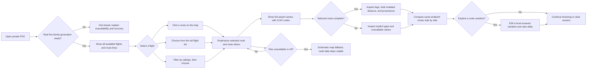

# Flight Route Explorer — personas and end-to-end customer journey

Status: Supporting product/UX analysis incorporated into the master product document
Date: 2026-08-16
Audience: Product and UX stakeholders

> The [master product document](master-product-document.md) is the source of truth for product direction, target experience, terminology, requirements, and priorities. This document remains supporting journey, persona, and service-blueprint detail.

## 1. Purpose and evidence boundary

This document maps how a user is intended to experience Flight Route Explorer and overlays what is currently implemented and evidenced. It deliberately keeps three things separate:

1. **Intended experience** — the target product journey governed by the master product document.
2. **Current experience** — behavior present in the local-first POC.
3. **Evidence** — behavior demonstrated by retained tests, lane records, or machine-executed UAT.

The personas below are **proto-personas**, not research-validated personas. They are grounded in the source brief, product boundary, walkthrough requirements, and implemented interaction model; no user interviews or field observation are claimed.

### Source authority

The [master product document](master-product-document.md) governs product intent and supersedes this document when product-direction wording differs. Binding technical contracts remain in [system design §0](../superpowers/specs/2026-08-11-flight-route-explorer-design.md#0-normative-poc-reconciliation---2026-08-12), the [implementation plan](../superpowers/plans/2026-08-11-flight-route-explorer-implementation-plan.md), and [ADR-0001](../adr/0001-poc-authority-and-legacy-reconciliation.md) until explicitly reconciled. The [README](../../README.md), [capability/gate matrix](../status/poc-capability-and-gate-matrix.md), and retained records govern current implementation and evidence claims.

Historical design Sections 3–29 are non-binding. Current design §0.5 supersedes the older no-tile boundary by authorizing the constrained OpenStreetMap tile layer with a schematic fallback.

### Product-owner journey decisions — 2026-08-16

The intended experience in this document incorporates the product decisions now reconciled across the binding design, current implementation, and focused validation:

1. Show every available flight and route line in the initial map/list overview. Callsign search is an optional filter, not the gateway to the product.
2. Synchronize map, list, and search selection. Selecting from any surface emphasizes one route and mutes the others everywhere.
3. Show a full airport name with its ICAO code, using the governed bundled OurAirports exact-ICAO reference. It is pinned, checksummed, deterministically generated, Public Domain/Unlicense, community-maintained, and not an official ICAO publication.
4. Compare routes without a winner label. Show modeled distance, completeness, gaps, and other available facts side by side; do not present “best,” “winner,” or Rank 1 as the target experience.
5. Keep route editing as an optional branch named **Explore a route variation**, explicitly local and unsaved.

“All data” means all product-safe normalized flight summaries and route overlays. It does not mean exposing raw CAAS objects, the full reference catalogs, credentials, personal fields, or hidden Airways values.

## 2. Product intent

### Value proposition

**Help one aviation-data-literate POC operator begin with a complete visual overview of available flights and route lines, select a flight from the map, list, or callsign filter, understand exactly what its source data supports, compare same-endpoint routes without declaring a winner, and optionally explore a local unsaved variation—without presenting the result as operational flight advice.**

### Primary job to be done

> When I open the explorer, show me the available flights and route lines immediately. Let me select from the map, list, or callsign filter; identify airports by full name and code; inspect the selected route’s data and gaps; compare like-for-like routes without declaring a winner; and optionally explore a local unsaved variation.

### Non-jobs

The product does not file, dispatch, approve, clear, navigate, or recommend a route. It does not evaluate weather, NOTAMs, ATC constraints, fuel, aircraft suitability, legality, or regulatory constraints. It never invents coordinates or airway topology to make a route appear complete.

Required persistent safety copy:

> **Demonstration only. Operational weather, NOTAM, ATC, fuel, aircraft suitability, and regulatory constraints are not evaluated.**

## 3. Personas

### 3.1 Primary proto-persona — Route Exploration Analyst

**Working name:** Alex
**Role in this POC:** The sole private runtime user; an aviation-data-literate technical analyst/operator. In the challenge context, this may be the developer demonstrating the product. Alex is not modeled as a pilot making an operational decision.

| Dimension | Description |
|---|---|
| Context | Uses a private, single-user POC during analysis or a guided demonstration. Opens to an overview of every available flight and route line rather than an empty search state. |
| Goals | Understand the network at a glance; select the right flight from the map, list, or callsign filter; identify full airport names; inspect geometry and data quality; compare same-endpoint routes; optionally explore a local variation. |
| Behaviors | Scans the map and full list first, then selects directly or narrows with callsign search. Uses bounded drawers for route data, comparison, and optional variation. Checks distance, completeness, provenance, freshness, and gaps without looking for a declared winner. |
| Needs | An immediate all-route overview; synchronized map/list/search selection; full airport names with ICAO codes; visible unresolved gaps; neutral comparison language; exact-reference variation editing; clear recovery states. |
| Frustrations | Empty search-gated maps; acronym-only destinations; duplicate callsigns; route clutter without emphasis; incomplete or ambiguous points; stale generations; unsaved variations disappearing on restart. |
| Trust threshold | High. Alex needs the interface to distinguish source facts, modeled calculations, and unavailable values. A confident-looking inferred line or winner label would destroy trust. |
| Success | Can move between overview and focused inspection, identify airports by name and code, compare routes without treating one as operationally best, optionally explore a variation, and clear the session. |

**Quote:** “Show me exactly what the data proves—and where it stops.”

#### Primary needs hierarchy

1. **Trust:** no guessed points, hidden gaps, exposed secrets, or operational claims.
2. **Orientation:** all available routes are visible immediately; selection emphasizes one route and mutes the rest without losing network context.
3. **Comprehension:** completeness, descriptive distance, provenance, and freshness are understandable together.
4. **Comparison:** same-endpoint routes are shown side by side with modeled distance, completeness, and gaps, without a winner label.
5. **Optional exploration:** a local unsaved route variation is available after inspection but is never required to complete the main journey.
6. **Recovery:** failures explain what happened, preserve safe local state where possible, and offer a clear retry or restart path.

### 3.2 Secondary proto-persona — Challenge Reviewer / Product Owner

**Working name:** Morgan
**Role in this POC:** Observes the guided walkthrough, probes product judgment, and evaluates whether the challenge outcome is met. Morgan is not a second authorized runtime user by default.

| Dimension | Description |
|---|---|
| Context | Has about 30 minutes: a 20-minute demonstration plus questions. Needs to assess the product, engineering choices, limitations, and evidence quickly. |
| Goals | See the core journey work; understand why data is sanitized and gaps are preserved; verify comparison language is honest; assess accessibility, failure handling, delivery readiness, and AI-use transparency. |
| Behaviors | Watches the primary flow, asks for an incomplete route or failure state, probes the neutral-comparison boundary, and asks what would be required for production. |
| Needs | A coherent story from user problem to interaction to evidence; visible safety boundaries; concise architecture and test evidence; clear distinction between implemented, evidenced, and deferred work. |
| Frustrations | Demo theater; unexplained AI-generated code; claims that outrun evidence; a report-heavy UI that hides the map; “best route” language without operational inputs. |
| Success | Can explain the product’s value and boundary, observe a credible end-to-end flow, identify remaining gaps, and make an informed acceptance or feedback decision. |

**Quote:** “Show me the user value, the engineering judgment, and the evidence—without hiding the limitations.”

## 4. Journey at a glance

### Emotional trajectory

| Moment | Likely state | UX obligation |
|---|---|---|
| Entry overview | Curious | Show the complete product-safe flight/list/map overview immediately after readiness. |
| Browse | Oriented | Keep all route lines visible while preventing clutter from obscuring selectable geometry. |
| Selection | Focused | Synchronize map, list, and callsign-filter selection; emphasize one route and mute the rest. |
| Identification | Reassured | Use full airport names with ICAO codes, with a documented code fallback. |
| Inspection | Analytical | Explain completeness, modeled distance, provenance, and gaps without inferred geometry. |
| Comparison | Deliberate | Present facts side by side without a winner or operational-preference label. |
| Optional variation | Exploratory | Make the branch visibly local, unsaved, exact-reference-based, and non-operational. |
| Failure | Concerned | Fail closed, preserve safe state, and provide a deterministic recovery action. |
| Exit | Confident | Clear local state and leave no implication that a route was approved or saved. |

## 5. Detailed primary journey

| Stage | User goal and actions | Intended frontstage experience | User thought / emotion | Friction and UX opportunities | Guardrail and success signal |
|---|---|---|---|---|---|
| **1. Access and readiness** | Open the private application. | App becomes usable only after a complete real-data generation is ready. Readiness/freshness is visible; unsafe partial startup is never presented. | “Is this live and usable?” Cautious. | Cold acquisition can take time or fail. Explain the state without exposing upstream details or offering synthetic data. | Startup fails if any mandatory family is unusable. No credential or raw CAAS object reaches the browser. |
| **2. See the complete overview** | Scan all available flights in the list and all route lines on the global map. | The initial ready state is populated, not empty. Every product-safe flight is listed; every available resolved route overlay is visible. | “What is available, and where does it go?” Curious. | Overlapping lines can create visual noise. Use restrained base styling, line separation where possible, and strong selected/unselected contrast. | “All” excludes raw reference catalogs, personal fields, credentials, and hidden Airways values. Gaps remain explicit. |
| **3. Select from map, list, or callsign filter** | Click a route line, choose a list row, or enter a callsign to narrow the same collection. | All three surfaces share one selection model. The callsign control filters/finds but never unlocks otherwise hidden data. Duplicate callsigns still require explicit record choice. | “Let me choose the flight in the way that fits what I know.” Focused. | Thin/overlapping map lines can be hard to click. Provide adequate hit targets, keyboard-equivalent list selection, and persistent selected state. | Never guess from callsign or map proximity; selection resolves to an opaque flight identity. |
| **4. Focus and identify the selected flight** | Confirm the chosen flight and its endpoints. | The selected line is emphasized; all other lines remain visible but muted. List row, map line, HUD, and detail drawers update together. Airports display as `Full Airport Name (ICAO)`, for example `Singapore Changi Airport (WSSS)`. | “I selected the right route and know the actual places.” Reassured. | The upstream contract does not always supply full names, so the server enriches by exact ICAO from the governed bundle. | If no exact bundled name exists, show `Name unavailable (ICAO)`; never invent or fuzzy-match a name. |
| **5. Understand the selected route on the map** | Pan/zoom or use Map Only while retaining the all-route context. | Selected endpoints, resolved segments, and gap boundaries are distinguishable. Other routes stay muted. Tile failure or toggle falls back to the schematic map. | “How does this route fit the broader network?” Oriented. | Antimeridian routes, gaps, and high overlap can look broken. Text labels and route data explain the state. | Draw only exact resolved coordinates. Never bridge an unresolved or ambiguous gap. |
| **6. Inspect route data and completeness** | Open Data; review points, legs, modeled distance, provenance, freshness, and gaps. | A complete route shows per-leg and total modeled distance. An incomplete route shows unavailable values and the exact unresolved positions. | “How was this picture derived?” Analytical. | A polished map can overpower caveats. Keep completeness and gaps visible in both map and data views. | Haversine uses full precision with `R = 3440.065 NM`; display rounds to `0.1 NM`. Unavailable values stay unavailable. |
| **7. Compare routes without a winner** | Open Compare; inspect same-endpoint routes side by side. | Show full endpoint names/codes, modeled distance, completeness, point count, provenance, freshness, and gaps in selected-first neutral source order. | “How do these routes differ on the facts we actually have?” Deliberate. | Distance can still be mistaken for recommendation. Explain that operational factors are not evaluated and let users choose what to inspect. | Comparison never asserts operational preference; public preference fields are prohibited. |
| **8. Optionally explore a route variation** | From an inspected route, choose Explore a route variation; add, remove, or reorder exact intermediate points while endpoints stay locked. | The optional editor appears in a bounded drawer/bottom sheet. It says the variation is local and unsaved, and that manual-direct segments are not airways. | “What changes if I alter the sequence?” Exploratory. | Ambiguous reference names and validation failures can interrupt flow. Require an exact unambiguous point and preserve state through safe retries. | Variation is generation/revision-bound, rate-limited, size-bounded, lost on restart, and never filed or approved. |
| **9. Assess the variation** | Review variation status, modeled distance, and delta against the selected recorded route, then return to browsing. | Delta appears only when both computations are complete. Missing inputs remain explicit. The variation remains outside the main recorded-route comparison unless a later contract says otherwise. | “What changed in this model—not which route should fly?” Analytical. | A full directed diff, undo/redo, and ambiguous-coordinate choice are not currently supported. Do not imply they exist. | No winner label or operational recommendation is produced for the variation. |
| **10. Refresh or recover** | Refresh data or retry a failed browse, detail, comparison, or variation request. | Refresh builds separately and swaps atomically. Failed refresh retains only a still-usable complete generation. Errors identify the failed action and provide Retry; focus returns predictably. | “Can I recover without losing my place?” Concerned. | Refresh can invalidate selection or tokens. Explain what changed and rebind the overview to the new generation. | No partial generation or synthetic fallback. Expired tokens/cursors fail closed and are reacquired. |
| **11. Clear and exit** | Clear the focused selection/variation or close/restart the app. | Clear returns to the populated all-flight overview rather than an empty screen. Search filter, HUD, and local variation reset; all route lines remain available. | “I’m back to the whole picture; nothing was submitted.” Confident. | “Clear” must distinguish clearing selection from hiding the dataset. | Nothing persists across restart. Clear does not modify CAAS or approve a route. |

## 6. Service blueprint

| Phase | User action | Frontstage UI | Backstage application behavior | External/data dependency | Evidence or control point |
|---|---|---|---|---|---|
| Ready | Opens app | Readiness, freshness, safety notice, populated map/list shell | Fastify acquires and validates a complete immutable generation | Flight Plans, Airways, Fixes, Airports, NAVAIDs | Five-family local/live lanes; fail-closed startup tests |
| Overview | Scans all flights and route lines | Full flight list plus all route overlays; no search required | Traverses generation-bound overview pages exactly once and produces product-safe geometry/summaries | Active in-memory generation | Implemented; >10-route map/list rendering and exact-once traversal tested |
| Select | Clicks map, list, or callsign-filter result | One synchronized selection; chosen line emphasized, others muted | Resolves every surface to the same opaque flight identity | Active generation only | Implemented; list/map/HUD/filter and exact-overlap chooser tested |
| Identify | Reads origin/destination | Full airport names with ICAO codes | Exact code join against the governed bundle | Pinned OurAirports bundle | Implemented; manifest, checksum, record count, exact join, fallback, and deterministic generation tested |
| Understand | Views map and Data | Resolved segments, gaps, legs, totals, provenance | Exact identifier resolution; gap preservation; Haversine calculation | Reference families; Airways values remain hidden | Route-safety tests, API contract tests, machine UAT |
| Compare | Opens Compare and changes focused route | Neutral side-by-side route facts; no winner label | Same-endpoint candidate assembly and descriptive metrics | Active generation only | Implemented; removed preference fields guarded by tests |
| Variation | Optionally explores a local unsaved change | Locked endpoints, exact-point search, variation status and delta | Bounded token; exact validation; separate server computation | No upstream write | Implemented under Explore variation product copy |
| Recover | Refreshes or retries | Action-specific alert, Retry, predictable focus | Atomic refresh; prior usable generation retained; expired tokens rejected | Upstream availability and generation freshness | Refresh/failure lanes; stale-generation machine observation |
| End | Clears selection or leaves | Returns to all-route overview | Focused selection/variation discarded; base overview retained while generation is usable | No persistence or CAAS mutation | Implemented and tested |

## 7. Degraded and alternate journeys

| Trigger | What the user should see | Safe recovery | Product rule |
|---|---|---|---|
| Mandatory family unusable at startup | Application unavailable/readiness failure; no partial route browser | Correct configuration/upstream issue, then restart and reacquire | Fail closed; no synthetic runtime fallback |
| Search request fails | Action-specific alert with Retry; existing safe state remains | Retry without full page reload | Do not expose raw upstream errors or credentials |
| Duplicate callsign | Multiple labeled records | User selects exact flight | Never guess from callsign alone |
| Route has unresolved or ambiguous points | Visible gap, incomplete status, unavailable distance/rank as applicable | Inspect gap or choose another candidate | Never infer by proximity or connect across the gap |
| No complete same-endpoint route | Incomplete routes remain visible with unavailable modeled values and explicit gaps | Compare the facts that exist; do not manufacture a complete result | Target comparison has no winner label; incomplete data remains explicit |
| Route-options request fails | “Could not load route options.” and Retry | Retry and restore focus to options heading | Preserve selected flight and map state where safe |
| Draft validation fails | Explicit failure and Retry; current edits retained if still generation-valid | Retry validation or reset draft | Never display stale computed distance/delta as current |
| Cursor or token crosses a refresh | Expired-state message, not silent continuation | Re-run the search/browse or recreate the draft against the new generation | Return `CURSOR_EXPIRED` / equivalent fail-closed response |
| Active generation becomes unusable | Search/readiness failure such as `GENERATION_STALE` | Refresh or restart to reacquire | Do not continue presenting expired data as live |
| OSM tiles fail or user disables them | Schematic map replaces tiles; route overlay/data remain usable | Continue analysis or re-enable tiles | Tile availability must not gate route understanding |
| Browser/app restarts | Previous variation and selection absent; all-flight overview reacquired | Start from the refreshed overview | Variations are ephemeral; no database or snapshot store |

## 8. Secondary persona journey

| Stage | Morgan’s goal | Expected touchpoint | Evidence needed | Current boundary |
|---|---|---|---|---|
| **1. Frame the problem** | Understand the source challenge and customer value. | Two-minute problem, safety, and architecture introduction. | Source brief and binding design. | Ready as documentation; live walkthrough not yet run. |
| **2. Observe immediate discovery** | See all available flights and route lines without entering a callsign. | Populated overview, synchronized map/list selection, and optional callsign filtering. | Exact-once traversal, >10-route rendering, filter parity, overlap, and keyboard-equivalence evidence. | Implemented and focused tested; real-data visual-density review remains separate. |
| **3. Verify meaningful labels** | Recognize endpoints without decoding ICAO identifiers. | Full airport names with codes in map, list, HUD, and comparison. | Dataset provenance, license, exact-code joins, fallback, and deterministic update tests. | Implemented with the governed OurAirports bundle; it is explicitly non-official. |
| **4. Probe trust and comparison** | Test incomplete data, neutral comparison, hidden airway values, and freshness. | Inspect gaps and unavailable values; compare routes without a declared winner. | Route-safety, airway-exclusion, stale-generation, and comparison evidence. | Current public contracts omit preference fields; older Rank-era evidence remains historical only. |
| **5. Explore an optional variation** | See whether a user can test a change without implying submission. | Explore a route variation, exact point validation, distance delta, retry behavior. | Interaction/variation lanes and UAT. | Implemented under current product wording; live revised UAT remains separate. |
| **6. Assess delivery quality** | Understand tests, accessibility, container, CI, and deployment plan. | Concise evidence summary and exact OCI subject. | Offline/security/accessibility/container records; `PG-03` pass. | Azure deployment, auth, rollback drills, and teardown are designed but unexecuted. |
| **7. Decide and give feedback** | Identify strengths, risks, and next actions. | Explicit target-versus-current summary and roadmap. | This map plus the gate matrix. | Production remains prohibited; reviewer does not become a runtime principal by observing the demo. |

## 9. Intended versus currently evidenced journey

Legend: **Evidenced** = retained local/machine evidence exists; **Partial** = core behavior exists but target scope or human evidence is incomplete; **Target decision** = approved intended behavior that still requires contract and implementation work; **Designed only** = documented but not executed.

| Journey capability | Intended experience | Current evidence status | What is evidenced | Remaining gap or caution |
|---|---|---|---|---|
| Private access | One approved user accesses the POC through Entra when deployed. | **Designed only for Azure** | Local loopback application and server-only secret boundary. | No Azure resources, Entra app, deployed auth, or negative-auth run is evidenced. |
| Complete real-data readiness | App starts only with all five families usable. | **Evidenced locally** | Local/live five-family lanes; exact CI subject passed `PG-03`; secret excluded. | Azure acquisition leg remains unexecuted. |
| Default all-flight overview | Every available flight and route line appears immediately in synchronized map/list views. | **Implemented and focused tested** | Exact-once traversal, 12-route map/list rendering, and shared filtering are tested. | Real-data visual density and initial-load measurement remain subject-bound validation concerns. |
| Three-way selection | Map click, list selection, and callsign filtering share one highlighted route. | **Implemented and focused tested** | Map/list/HUD/filter synchronization, exact-overlap chooser, duplicate resolution, and keyboard list selection are tested. | Real pointer-density testing remains part of live/browser UAT. |
| Full airport names | Show `Full Airport Name (ICAO)` everywhere a destination appears. | **Implemented and governance-tested** | Exact OurAirports enrichment and `Name unavailable (ICAO)` fallback are integrated. | Updates require the documented pinned-source/checksum procedure; the source is community-maintained, not official. |
| Safety orientation | Persistent safety and non-operational framing. | **Evidenced** | Exact copy regression checks and machine UAT. | Continue usability testing for warning comprehension, not just presence. |
| Map-first route understanding | All routes provide context; the selected route is emphasized; gaps remain honest. | **Partial** | Selected-route OSM/schematic behavior, route overlay, gap preservation, responsive and machine UAT screenshots. | All-route simultaneous rendering, overlap handling, hit targets, and selected/unselected contrast are target work. |
| Route data inspection | Legs, totals, provenance, freshness, and gaps explain the focused visual. | **Evidenced for selected route** | Complete/incomplete deterministic tests; live UAT showed incomplete `SIA469` with no supplied distance/rank. | Human comprehension of provenance/freshness language is untested. |
| Comparison without winner | Same-endpoint routes show modeled facts side by side without preference or winner labels. | **Implemented and focused tested** | Neutral selected-first/source ordering, descriptive distance, complete/incomplete groups, and absent preference fields are tested. | Older Rank-era evidence proves only its historical subject and contract. |
| Optional route variation | Explore a route variation is an optional local unsaved branch after inspection. | **Implemented** | Current add/remove/reorder, validation, retry, TTL/rate-limit, delta mechanics, and product wording are tested. | Keep it outside the required main journey. |
| Variation comparison | Show status, modeled distance, and delta only when both computations are complete. | **Evidenced for current mechanics** | Current product computes a separate local status, distance, and delta. | No full directed diff, ambiguous-coordinate selection, undo/redo, persistence, or ranking among recorded routes. |
| Failure recovery | Browse/detail/variation failures are explicit and retryable; stale state fails closed. | **Evidenced in current flow** | Retry/focus tests; refresh-retains/fail-closed lanes; live stale-generation observation and restart recovery. | Recovery must return to the populated overview and rebind selection after generation changes. |
| Map fallback | Route data remains usable without OSM tiles. | **Evidenced for selected route** | Tile contract and schematic fallback tests. | Validate fallback clarity and all-route performance under real tile failure. |
| Clear and exit | Clear removes focused selection/variation but keeps the all-flight overview. | **Implemented and focused tested** | Clearing selection preserves the populated overview. | Historical machine UAT records retain their older observed behavior. |
| Accessibility | Keyboard, responsive, forced-colors, reduced-motion, and automated semantics work. | **Partially evidenced** | 17 accessibility tests, focused keyboard-equivalent list selection, 8 responsive tests, and historical browser UAT. | No retained human assistive-technology walkthrough; real-data all-route visual-density review remains separate. |
| Reviewer walkthrough | Explain the product in 20 minutes and reserve 10 minutes for questions. | **Current protocol revised; live rerun pending** | Current protocol covers populated overview, governed names, neutral comparison, and optional variation. | Historical machine UAT remains immutable and does not prove the revised walkthrough. |
| Azure release and recovery | Deploy unchanged digest privately; prove auth, smoke, abort/rollback, and teardown. | **Designed only** | Procedures and `PG-03` exact-subject prerequisite exist. | All Azure writes and execution evidence remain unauthorized/unperformed. |

## 10. Experience principles

1. **Overview first.** The ready state shows every product-safe flight and route line; search narrows the collection but does not unlock it.
2. **Map, list, and search are one control system.** Any selection updates every surface and emphasizes one route while retaining muted context.
3. **Full names before codes alone.** Use `Full Airport Name (ICAO)` from an approved bundled source; fall back honestly when a name is unavailable.
4. **Map first, drawers second.** Data, comparison, and optional variation support the map; they do not replace it with a stacked report.
5. **Evidence before confidence.** Every visual claim must be traceable to normalized source data, approved metadata, or an explicit modeled calculation.
6. **Gaps are information.** Missing and ambiguous points remain visible; completeness is never cosmetically repaired.
7. **Comparison has no winner.** Show available facts and differences without implying operational preference.
8. **Variation is optional and ephemeral.** Local unsaved exploration never blocks the core browse-select-inspect-compare journey.
9. **Recovery is part of the journey.** Retry, refresh, fallback, and restart return users to a safe populated overview.
10. **Accessible state, not color alone.** Selection, completeness, gaps, and errors require text and semantic state in addition to styling.

## 11. Product and UX opportunities

| Priority | Opportunity | Why it matters | Acceptance signal |
|---|---|---|---|
| **Complete** | Reconcile neutral comparison across binding contracts and implementation. | Winner treatment was unsafe without operational inputs. | Binding design, code, tests, and current docs use selected-first neutral source order and prohibit public preference fields. |
| **Implemented / measurement continues** | All-route overview API and rendering strategy. | Rendering every route changes loading and interaction behavior. | Exact-once traversal, no silent truncation, >10-route rendering, synchronized selection, and overlap behavior are tested; real-data measurement remains subject-bound. |
| **Complete** | Govern the bundled airport-name reference. | Full names cannot be invented from ICAO codes, and source/license/update drift affects trust. | Source, commit, license, checksums, deterministic generation, exact-code join, update/rollback process, and fallback are documented and tested. |
| **P1** | Build direct accessible map-route selection. | Clicking a thin or overlapping route needs a larger hit target and a keyboard-equivalent list path. | Pointer selection is reliable; keyboard users achieve the same selection; map/list/HUD/detail state never diverges. |
| **P1** | Rename and reposition the draft flow as Explore a route variation. | The current name implies copying a mutable flight plan and makes an optional feature look mandatory. | Entry copy says local and unsaved; the main journey completes without entering the variation tool. |
| **P1** | Add a concise, gap-aware comparison summary. | Users need differences without a winner label or inferred geometry. | Users can identify distance, completeness, added/removed/reordered points, provenance, and unavailable comparisons. |
| **P1** | Run a human comprehension session on the revised mental model. | Existing evidence validates the old search-first, Rank 1 journey more strongly than the new overview-first journey. | A participant can select through all three paths and explain names/codes, gaps, modeled distance, no-winner comparison, and local variation. |
| **P2** | Validate all-route schematic fallback and dense-route readability. | Simultaneous overlays may become unusable when tiles fail or many routes overlap. | Users remain oriented and can select/inspect a route with tiles disabled and the full dataset visible. |

## 12. Journey success measures

These are product measures, not claims that telemetry currently exists.

### Task effectiveness

- Time from ready state to complete all-flight map/list rendering.
- Selection success and time through each path: map click, list row, and callsign filter.
- Synchronization accuracy across map, list, HUD, and detail drawers.
- Time from selection to correct verbal identification of full origin/destination names, codes, completeness, and available modeled values.
- Route-switch completion without stale map/data state.
- Optional variation completion and successful retry after an injected validation failure.
- Clear-selection completion with return to the all-flight overview and correct understanding that nothing was submitted.

### Comprehension and trust

- Percentage of users who can select the same flight through map, list, and callsign filter.
- Percentage who can identify an airport by full name and understand the accompanying ICAO code.
- Percentage who can explain the difference between modeled distance and operational suitability.
- Percentage who correctly interpret an incomplete route and visible gap.
- Percentage who understand why Airways are fetched but not displayed as route topology.
- Percentage who correctly describe freshness and the effect of refresh/restart.
- Zero observed winner or operational-preference claims: best, winner, valid, recommended, safe, cleared, or suitable.

### Accessibility and resilience

- Core journey completes with keyboard only at desktop and narrow widths, including a keyboard-equivalent path for map selection.
- Selected versus muted route state never relies on color alone.
- Route data remains usable when tiles fail or are disabled.
- Retry preserves safe local context and restores focus predictably.
- Human assistive-technology verification is either completed or explicitly waived with the remaining risk recorded.

## 13. Traceability

| Journey element | Primary source or decision |
|---|---|
| Show every flight and route line by default | Implemented with exact-once traversal and no 10-route cap; focused >10-route test passes |
| Select through synchronized map, list, or callsign filter | Implemented with one `flightId`, exact-overlap chooser, and keyboard list path |
| Full airport names with ICAO codes | Implemented from the governed non-official OurAirports exact-ICAO bundle with explicit fallback |
| Select flight and display route globally | Challenge PDF §1; design `SRC-01` |
| List/search by callsign | Challenge PDF §1; design `SRC-02`; `AC-POC-BROWSE-01` |
| Per-leg/total modeled distance | Design `USR-01`; design §0.4 |
| Compare without winner label | Implemented under revised `USR-02` / `AC-POC-COMPARE-01`; public preference fields prohibited |
| Optionally explore a local unsaved variation | Product-owner journey decision, 2026-08-16, adapting design `USR-03` |
| Explain differences | Design `USR-04` |
| Keep the map dominant | Design `USR-05`; implemented map-first interaction model |
| Preserve ambiguity and gaps | Design §0.3; implementation plan §1.2 |
| Non-operational safety boundary | README binding contract; design §§0.4 and 1 |
| Current machine-executed journey evidence | [UAT records](../testing/artifacts/) and [timed walkthrough checklist](../testing/artifacts/timed-walkthrough-checklist.md) |
| Current gate/evidence status | [POC capability and gate-status matrix](../status/poc-capability-and-gate-matrix.md) and README |

## 14. Product decision summary

The intended customer journey is now:

> **Open to the complete available flight network, select any flight from the map, list, or callsign filter, identify its airports by full name and code, inspect exact route data and gaps, compare same-endpoint routes without declaring a winner, and optionally explore a local unsaved variation.**

This journey is implemented and focused-tested locally: exact-once uncapped overview traversal, shared selection, exact-overlap choice, governed exact-ICAO names with fallback, neutral comparison without public preference fields, and Explore variation product copy. Current focused tests and the new loopback record support those local claims. Historical Rank-era UAT/evidence remains immutable older-subject history. Revised live timed walkthrough and all Azure deployment/auth/rollback evidence remain outstanding.
