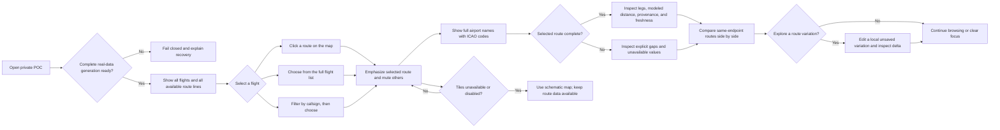

# Flight Route Explorer — Master Product Document

Status: Master authority for product direction and target experience
Version: 1.3 (implementation-aligned)
Date: 2026-08-20
Product decision authority: The user
Audience: Product, UX, engineering, delivery, and challenge reviewers

## 0. Document authority and use

This document is the single source of truth for Flight Route Explorer **product direction**. It consolidates the challenge brief, README, documentation index, binding design, implementation plan, customer journey, personas, current evidence, and the product-owner decisions made through 2026-08-20.

It governs:

- product vision, value proposition, personas, jobs, and outcomes;
- target user journey and interaction model;
- user-facing terminology and information hierarchy;
- product requirements, priorities, and success measures;
- the distinction between target behavior, current implementation, and retained evidence.

It does not silently rewrite historical evidence or technical controls. Authority is partitioned as follows:

| Domain | Authority | Rule |
|---|---|---|
| Product direction and target experience | This master product document | Later approved product decisions supersede older product-intent wording. |
| Binding technical contracts, safety constraints, acceptance criteria, and gate definitions | [System design §0](../superpowers/specs/2026-08-11-flight-route-explorer-design.md#0-normative-poc-reconciliation---2026-08-12), [implementation plan](../superpowers/plans/2026-08-11-flight-route-explorer-implementation-plan.md), and [ADR-0001](../adr/0001-poc-authority-and-legacy-reconciliation.md) | A conflicting technical contract remains binding until explicitly reconciled and re-evidenced. |
| Current implementation status | [README](../../README.md) and [capability/gate matrix](../status/poc-capability-and-gate-matrix.md) | Code or documentation text alone does not prove execution. |
| Evidence validity and gate outcomes | [Evidence and validation contract](../testing/evidence-and-validation.md) plus retained records | This document may summarize evidence but cannot create or upgrade it. |
| Original challenge intent | [CAAS Tech Challenge v2.21](../../CAAS%20Tech%20Challenge_v2.21.pdf) | Preserved as the source brief; reconciled product decisions are recorded here. |

This partition was chosen so product direction can evolve without retroactively changing technical obligations or what an evidence record proved. A single document silently overriding contracts, archives, or measurements was rejected because it would erase audit history and make target intent indistinguishable from implemented fact.

### 0.1 Conflict handling

When this master’s target direction conflicts with a binding technical contract:

1. this master governs what the product should become;
2. the existing technical contract governs what may be implemented and claimed today;
3. the conflict is marked for explicit reconciliation rather than implemented silently;
4. implementation changes require an explicit contract amendment and tests, and evidence claims require a new subject-bound record;
5. neither source silently overrides the other.

Reconciliation is explicit because a product-copy change can alter public contracts, safety meaning, tests, and evidence. Immediate implementation from the newer wording was rejected: it would create a period in which product, code, and proof make incompatible claims.

### 0.2 Supporting documents

The detailed [personas and customer journey](customer-journey-and-personas.md) remains supporting analysis. It no longer owns product direction. Existing architecture, operations, security, testing, data-use, and evidence documents remain in place for technical depth and audit history.

## 1. Executive product definition

### 1.1 Product statement

Flight Route Explorer is a private, single-user, non-operational decision-support demonstration. It opens with every available product-safe flight and route line visible, lets the user select a flight from the map, full flight list, or callsign filter, identifies airports by full name and International Civil Aviation Organization (ICAO) code, shows exact resolved route geometry and explicit gaps, compares same-endpoint routes without declaring a winner, and optionally lets the user explore a local unsaved route variation.

### 1.2 Value proposition

> See the available route network first, focus any flight through the interaction that fits what you know, and understand exactly what the data supports—without confusing modeled geometry with operational advice.

### 1.3 Primary job to be done

> When I open the explorer, show me all available flights and route lines. Let me select from the map, list, or callsign filter; identify airports by full name and code; inspect exact route data and gaps; compare like-for-like routes without a winner label; and optionally explore a local unsaved variation.

### 1.4 Non-jobs

The product does not:

- file, dispatch, approve, clear, navigate, or recommend a route;
- evaluate weather, notices to air missions (NOTAMs), air traffic control, fuel, aircraft suitability, legality, or regulatory constraints;
- infer a nearby point, fix name, airway, or operational path from a gap;
- silently repair the recorded route;
- claim authoritative airway topology from unproven Airways fields;
- expose credentials, raw upstream records, personal fields, or the airway-name reference list values;
- persist a selected route or local variation across restart;
- provide production operational control.

Required persistent copy:

> **Demonstration only. Operational weather, NOTAM, ATC, fuel, aircraft suitability, and regulatory constraints are not evaluated.**

The private, single-user boundary matches the one authorized POC operator and minimizes redistribution, identity, and support obligations while broader data rights remain unresolved. The non-operational boundary is mandatory because the product lacks the inputs needed to judge safety or suitability; broader access or recommendation language was rejected rather than implying authority the data cannot support.

## 2. Source-brief synthesis

The challenge brief asks for software that interrogates CAAS application programming interfaces (APIs), lists and searches flight plans, lets a user select a flight, resolves and displays the associated route on a global map, separates frontend and backend responsibilities, builds on Linux, produces a container, automates delivery, documents technical decisions and artificial-intelligence use, and supports a 30-minute walkthrough.

The accepted POC interpretation adds these constraints:

- real CAAS runtime data with no synthetic demo fallback;
- five mandatory families: Flight Plans, Airways, Fixes, Airports, and navigational aids (NAVAIDs);
- exact reference resolution with ambiguity and gaps preserved;
- a server-only CAAS client and sanitized browser contract;
- local-first delivery and an unchanged, secretless continuous-integration image;
- Azure as a later, explicitly authorized private POC release path, supplemented by a separate Cloudflare staging-only lane;
- no production intent.

This interpretation uses all five supplied families while refusing to invent relationships that discovery did not prove. Real data was selected over a synthetic demonstration to meet the challenge honestly; a server-only sanitized contract was selected over browser-to-CAAS access to protect the key and minimize exposed fields; local-first delivery was selected over cloud-first development to keep cost, privilege, and teardown risk outside the normal feedback loop.

## 3. Product principles

1. **Overview first.** The ready state shows every available product-safe flight and route line because recognition and network context should not depend on knowing a callsign. Search narrows the collection; it never unlocks it.
2. **One synchronized selection.** Map, list, callsign filter, heads-up display, and detail surfaces always refer to the same opaque flight identity so stale or contradictory selections cannot coexist.
3. **Full names before codes alone.** Show `Full Airport Name (ICAO)` from the governed bundled OurAirports exact-ICAO reference because names reduce decoding effort while codes preserve precision; use `Name unavailable (ICAO)` when no exact name exists.
4. **Map first, progressive detail second.** Bounded drawers or bottom sheets support the spatial task while avoiding the overload of a permanently stacked report.
5. **Evidence before confidence.** Every visible claim comes from normalized source data, approved metadata, or an explicit modeled calculation so visual polish cannot outrun provenance.
6. **Gaps are information.** Missing and ambiguous points remain visible because bridging them would turn uncertainty into a false route.
7. **Comparison has no winner.** Show available facts and differences because the product lacks the operational inputs required to justify a preference.
8. **Variation is optional and ephemeral.** Local unsaved exploration never blocks the core journey because route editing is useful for inquiry but is not the product's primary job.
9. **Recovery is part of the experience.** Refresh, retry, fallback, and restart return users to a safe populated overview rather than leaving ambiguous partial state.
10. **Accessibility is behavioral.** Selection, completeness, gaps, and errors use text and semantic state, not color alone, so the same meaning survives different input and display modes.

## 4. Personas

These are source-grounded proto-personas, not research-validated market segments. The two roles were chosen because the POC has one authorized operator and one challenge evaluator; inventing broader customer segments without interviews or field evidence was rejected.

### 4.1 Primary — Alex, Route Exploration Analyst

| Dimension | Definition |
|---|---|
| Role | Sole private runtime user; aviation-data-literate analyst or technical evaluator, not an operational pilot. |
| Starting context | Opens a populated network overview, sometimes with a known callsign and sometimes with only a geographic or endpoint interest. |
| Goals | Understand the available network, select the intended flight, identify real airport names, inspect geometry and data quality, compare routes, and optionally test a local variation. |
| Behaviors | Scans the map and list first; selects directly or filters by callsign; checks completeness, modeled distance, provenance, freshness, and gaps. |
| Needs | Immediate overview, synchronized selection, full airport names, honest gaps, neutral comparison, predictable recovery, and accessible alternatives to map clicking. |
| Frustrations | Empty search-gated states, acronym-only destinations, overlapping routes without disambiguation, hidden incompleteness, stale data, and unexplained local-data loss. |
| Success | Can explain what each route shows, what is missing, how routes differ, and why none is being recommended. |

Quote: “Give me the whole picture, then let me focus without losing context.”

### 4.2 Secondary — Morgan, Challenge Reviewer / Product Owner

| Dimension | Definition |
|---|---|
| Role | Observes the guided demonstration and evaluates user value, judgment, evidence, and remaining risk; not a second runtime principal by default. |
| Goals | See the complete journey, probe incomplete and failure states, understand delivery quality, and distinguish product direction from current proof. |
| Needs | A coherent 20-minute narrative, real-data interaction, safe language, concise evidence, and explicit gaps. |
| Frustrations | Demo theater, unsupported “best route” claims, map-obscuring reports, unexplained artificial-intelligence output, and claims that outrun retained evidence. |
| Success | Can judge the product and engineering decisions without mistaking planned Azure or target UX work for completed behavior. |

Quote: “Show me the intended experience and exactly which parts are proven.”

## 5. Target interaction model



### 5.1 Default overview

After readiness, the interface shows:

- every active-generation flight in the full list;
- every available resolved route component on the global map;
- visible gap treatment for incomplete routes;
- muted styling for unselected routes;
- no requirement to enter a callsign before data appears.

“All” means all product-safe flight and route information. It excludes raw upstream records, reference catalogs, credentials, personal fields, and Airways values/types.

No future performance cap may silently truncate the overview. If scale requires progressive loading, simplification, or grouping, the interface must disclose it and preserve an exact route-selection path.

The populated overview replaces the former search gate because it supports discovery and preserves network context. The client traverses every generation-bound cursor exactly once and renders all returned safe flights and available resolved components; there is no 10-route cap. Silent caps remain prohibited because “all flights” would otherwise become an unverifiable claim.

### 5.2 Selection

Map, list, and callsign filter share one selection state:

- clicking a route line selects its flight;
- selecting a list row focuses the same map line;
- callsign input filters the existing collection and does not create a separate result universe;
- every selection updates map, list, heads-up display, comparison, and data surfaces atomically;
- other routes remain visible but muted.

If several routes overlap at a pointer location, the product presents an explicit chooser. It does not guess by proximity. Every map action has a keyboard-equivalent list path.

One shared selection model was chosen over independent map, list, and search state because divergence would undermine trust in every detail view. An explicit overlap chooser and list equivalent were chosen over nearest-line guessing or precision clicking so identity remains exact and selection remains accessible.

### 5.3 Airport labels

Display airport endpoints as:

> `Full Airport Name (ICAO)`

Example:

> `Singapore Changi Airport (WSSS)`

If no authoritative name is available:

> `Name unavailable (WSSS)`

Names come from the bundled OurAirports reference pinned at commit `be07e33e6cc10087f57064f2bb3fccfcd39f5801`, joined by exact uppercase four-letter ICAO code. The 10,444-record bundle is checksummed, deterministically generated, Public Domain/Unlicense, community-maintained, and not an official ICAO publication. No fuzzy, proximity, generated-code, or runtime third-party join is allowed.

A build-time bundle was chosen over runtime lookup so labels are repeatable, license-reviewable, available offline, and do not add a third-party privacy or availability dependency. Exact code joins and the code-only fallback were chosen over fuzzy matching because an absent name is safer than a plausible but incorrect airport.

### 5.4 Inspection

The selected route exposes:

- full origin and destination names with codes;
- completeness state;
- ordered points and resolved legs;
- explicit unresolved or ambiguous gaps;
- per-leg and total modeled distance when computation is complete;
- provenance and freshness;
- map and tabular parity.

Map and table parity is required because geometry alone is neither sufficiently precise nor universally perceivable. Provenance, freshness, and completeness remain separate from modeled values so users can distinguish source facts, calculations, and unavailable data.

### 5.4.1 Computed alternate route

For the challenge's optional alternate-route task, the product computes a single coordinate-derived alternate: the densified direct great-circle path between the resolved departure and destination airports, served by `POST /api/v1/routes/alternate` (`{flightId}` → geometry, full-precision distance, label `direct-great-circle`, and the persistent safety copy). It is drawn dashed and clearly labelled; it is a computed path, never a borrowed, interpolated, or inferred subpath, and never a recommendation or a cleared route. The recorded source route, gaps, completeness, distance, signature, comparison, and ordering are never mutated.

The earlier estimated-gap-preview and observed-donor subpath synthesis capabilities were removed on 2026-08-23 ([ADR-0003](../adr/0003-airway-labels-and-direct-alternate.md)).

### 5.5 Comparison without a winner

Compare only routes with the same origin and destination. Show available facts side by side:

- full endpoint names and codes;
- completeness;
- modeled distance when complete;
- point and leg counts;
- provenance and freshness;
- explicit gaps and unavailable values.

The target interface does not display **best route**, **winner**, or **Rank 1** labels. It does not convert shortest modeled distance into operational preference. Users may explicitly sort by modeled distance, but sorting does not add a winner badge or recommendation.

The binding design, implementation, public DTOs, tests, and current walkthrough are reconciled to this neutral contract. Older generated Rank-era evidence remains immutable historical proof for its named older subject only.

Neutral facts were chosen over a system-declared winner because shortest modeled distance omits weather, fuel, clearances, aircraft, and regulatory constraints. User-invoked sorting remains acceptable because it is an inspection action, not a recommendation.

### 5.6 Explore a route variation

This optional branch replaces the user-facing phrase “Create and edit a local copy.”

- entry label: **Explore a route variation**;
- state label: **Local and unsaved**;
- endpoints remain locked;
- intermediate points require exact, unambiguous reference selection;
- add, remove, and reorder remain bounded;
- manual-direct segments are not described as airways;
- modeled distance and delta appear only when both computations are complete;
- no winner label, filing, approval, persistence, or operational claim is produced.

Existing code and technical documents may continue to use `draft` as an internal term until a separately approved refactor. Product copy uses **route variation**.

The phrase and optional placement were chosen to signal inquiry rather than mutation of a filed plan. Local, unsaved, locked-endpoint behavior avoids upstream writes and durable shared state; a collaborative or persistent editor was rejected as outside the single-user demonstration and would require a new storage, concurrency, and authorization design.

### 5.7 Clear and exit

Clear removes the focused selection, callsign filter, open details, and local variation. It returns to the populated all-flight overview rather than an empty application. Restart reacquires the current real-data generation; no user variation persists.

This reset boundary clears task-specific state but preserves orientation. Returning to an empty search state was rejected because it would contradict overview-first discovery; restart remains a full reset because persistence adds little value to an explicitly ephemeral POC.

## 6. End-to-end customer journey

| Stage | User action | Product response | User state | Success condition |
|---|---|---|---|---|
| Ready | Open the POC | Acquire a complete five-family generation or fail closed | Cautious | No partial or synthetic generation is shown |
| Overview | Scan map and full list | Show all flights and route components immediately | Curious | User can understand the available network without searching |
| Select | Click map, choose list, or filter by callsign | Resolve one opaque identity and synchronize all surfaces | Focused | Same route is highlighted everywhere |
| Identify | Confirm endpoints | Show full airport names with ICAO codes | Reassured | User understands the real places without decoding codes |
| Inspect | Open route data | Show exact segments, gaps, legs, modeled distance, provenance, and freshness | Analytical | User can explain how the visual was derived |
| Compare | Open route comparison | Show same-endpoint facts side by side without a winner | Deliberate | User can describe differences without inferring recommendation |
| Optional variation | Choose Explore a route variation | Validate a local unsaved change and show eligible modeled delta | Exploratory | User understands it is temporary and never submitted |
| Recover | Refresh or retry | Preserve safe state, explain invalidation, and return to a populated overview | Concerned | User has one clear recovery action |
| Clear | Clear focus or leave | Reset focused state while retaining/reacquiring the overview | Confident | User knows nothing was filed, approved, or persisted |

## 7. Product requirements register

| ID | Requirement | Priority | Target status |
|---|---|---:|---|
| `MPD-OV-01` | Show every active-generation flight in the default list after readiness. | P0 | Implemented; exact-once traversal and >10-route rendering tested |
| `MPD-OV-02` | Show every available resolved route component on the default map without search gating or silent truncation. | P0 | Implemented; >10-route map/list parity tested |
| `MPD-SEL-01` | Synchronize selection across map, list, callsign filter, heads-up display, and details. | P0 | Implemented; list/map/filter/HUD synchronization tested |
| `MPD-SEL-02` | Provide direct route-line selection and an explicit overlapping-route chooser. | P0 | Implemented for exactly overlapping rendered paths |
| `MPD-SEL-03` | Provide a keyboard-equivalent list path for every map selection. | P0 | Implemented and keyboard-tested |
| `MPD-NAME-01` | Display a governed airport reference name with ICAO code in every endpoint label. | P0 | Implemented with exact OurAirports enrichment and explicit fallback |
| `MPD-NAME-02` | Use a versioned, checksummed, license-approved bundled dataset with exact-code join and honest fallback. | P0 | Implemented and governance-tested |
| `MPD-MAP-01` | Keep the map visually dominant; use bounded drawers/bottom sheets for detail. | P0 | Implemented interaction principle |
| `MPD-DATA-01` | Draw only exact resolved route components and preserve gaps. | P0 | Implemented/evidenced |
| `MPD-DATA-02` | Keep Airways values/types out of product output and geometry. | P0 | Implemented/evidenced |
| `MPD-DIST-01` | Show modeled distance only when the required computation is complete. | P0 | Implemented/evidenced |
| `MPD-EST-01` | For bounded incomplete routes, keep unresolved gaps explicit and never infer or bridge geometry. | P1 | Implemented |
| `MPD-EST-02` | (Retired 2026-08-23) Calibrated statistical gap annotation. | P1 | Removed with the donor-synthesis/gap-distance surface |
| `MPD-CMP-01` | Compare same-endpoint route facts without preference or winner labels. | P0 | Implemented; public preference fields prohibited by tests |
| `MPD-CMP-02` | Keep incomplete routes visible with explicit unavailable values and gaps. | P0 | Implemented under neutral complete/incomplete grouping |
| `MPD-VAR-01` | Offer Explore a route variation as an optional local unsaved branch. | P1 | Implemented |
| `MPD-VAR-02` | Lock endpoints and validate exact intermediate references. | P0 | Implemented/evidenced |
| `MPD-REC-01` | Fail closed on unusable data and provide deterministic refresh/retry/restart guidance. | P0 | Implemented/evidenced locally |
| `MPD-CLEAR-01` | Clear focus back to the populated overview, not an empty search state. | P1 | Implemented and tested |
| `MPD-A11Y-01` | Make selection, completeness, gaps, and errors perceivable without color. | P0 | Partially evidenced |
| `MPD-A11Y-02` | Support keyboard completion of the whole journey, including a map-equivalent selection path. | P0 | Implemented and focused keyboard-tested |
| `MPD-SAFE-01` | Keep the persistent safety copy and prohibit operational claims. | P0 | Implemented/evidenced |
| `MPD-FALLBACK-01` | Keep route data usable with schematic fallback when tiles fail or are disabled. | P0 | Implemented/evidenced for selected route |

P0 is reserved for the core browse-select-inspect-compare journey and controls that prevent misleading, inaccessible, or exposed data. P1 covers optional exploration or reset refinements whose absence does not invalidate the safe core journey; this split was chosen over labeling every desirable feature critical.

## 8. Terminology and language rules

| Use | Avoid or prohibit | Reason |
|---|---|---|
| Flight, recorded route | Approved/cleared flight plan | The product is read-only and non-operational |
| Compare routes | Best route, winner | Available data cannot determine operational preference |
| Modeled distance | Optimal distance | It is a geometric calculation, not an operational objective |
| Computed direct great-circle alternate | Inferred or borrowed route geometry | The alternate is a computed coordinate-derived path and never mutates the recorded route |
| Complete / incomplete | Valid / invalid route | Completeness is computational, not operational validity |
| Name unavailable (`ICAO`) | Invented full name | Airport labels require authoritative metadata |
| Explore a route variation | Create and edit a local copy | The approved phrase is clearer and less operationally suggestive |
| Local and unsaved | Saved draft | Nothing persists across restart |
| Gap / unresolved / ambiguous | Estimated or nearby point | No proximity inference is permitted |
| Computed direct great-circle alternate | Interpolated, repaired, or completed route | The alternate is computed from resolved airport coordinates only; the source route stays unchanged (Section 5.4.1) |
| International Civil Aviation Organization (ICAO) code | Acronym-only destination label | Users should see the actual airport name first |

### 8.1 Current technical wording

Current product copy uses neutral complete/incomplete route groups and **Explore variation** / **Explore a route variation**. Public route DTOs omit `rank`, `rankDistanceNm`, `rankLabel`, and `operationalProxy`. Internal implementation may still use `draft` where it denotes ephemeral server state; that internal term must not leak into product preference language.

## 9. Modeled distance and route comparison

### 9.1 What is calculated

- Exact resolved consecutive points form modeled legs.
- Full-precision Haversine distance uses `R = 3440.065 NM`.
- Visible distance rounds to `0.1 NM`.
- Incomplete routes do not receive a complete-route total or winner treatment.
- Gaps are never interpolated.

Haversine was selected as an explainable spherical approximation that can produce deterministic per-leg and total comparisons without claiming navigation-grade geodesy. **Assumption:** the exact `3440.065 NM` radius and `0.1 NM` display precision were inherited to keep calculations consistent and labels readable; the corpus does not establish that these values are superior to every other accepted Earth-radius or display convention.

### 9.2 What “best route” means

The product does not determine a best route. It lacks operational weather, NOTAM, air traffic control, fuel, aircraft, clearance, legality, and regulatory inputs. It can show modeled geometric distance and other available facts only.

### 9.3 Target ordering

The default comparison must not imply a winner. A stable neutral order is used unless the user explicitly sorts a column. Choosing modeled-distance sort changes ordering only; it does not create a Rank 1 badge or recommendation.

### 9.4 Neutral ordering contract

The selected recorded route appears first. Remaining routes preserve immutable upstream source order; canonical signature is only a deterministic final fallback. Modeled distance never determines the default order or a preferred route. Public DTOs omit preference fields. Historical generated evidence containing Rank-era checks is preserved unchanged and proves only the older subject and contract named in that record.

### 9.5 Incomplete-route distance behavior

The server omits total `distanceNm` for incomplete routes; comparison, ordering, ranking, export, topology, and source DTO behavior continue to treat the route as incomplete. The earlier client-side geometric-minimum and statistical gap-distance annotation were removed on 2026-08-23 and no longer exist.

## 10. Data behavior

### 10.1 Mandatory runtime families

| Family | Product use |
|---|---|
| Flight Plans | Overview, list, callsign filtering, selection, recorded routes |
| Airways | Mandatory fetch/schema/count validation; values and types hidden |
| Fixes | Exact intermediate-point resolution |
| Airports | Exact endpoint resolution |
| NAVAIDs | Exact intermediate-point resolution |

All five families are mandatory because the challenge requires each contract to be exercised and one coherent generation prevents route facts from different acquisition states being mixed. Airways is validated but hidden because discovery proved names, not reliable occurrence or directed-leg semantics. Partial-family startup was rejected: a superficially usable map could conceal a failed dependency and misstate completeness.

### 10.2 Generation lifecycle

- The Fastify backend-for-frontend is the only CAAS client.
- Startup requires one complete usable five-family generation.
- Refresh builds separately and swaps atomically only after full validation.
- Failed refresh retains only a still-usable complete generation.
- At most the active and immediately previous generation are retained within policy limits.
- Cursors, point references, candidate identifiers, and variation tokens bind to application revision and generation.
- Expired or cross-generation state fails closed.
- Nothing persists across restart.

The backend-for-frontend centralizes the credential and sanitization boundary instead of duplicating trust logic in the browser. Atomic swap prevents readers from seeing half-refreshed families; one prior generation supports bounded in-flight work after a swap without creating a general history store. **Assumption:** the 30-minute retention window was chosen to cover a demonstration interaction while fitting the 2 GiB container envelope; no user study establishes it as an ideal session length. A database, Blob snapshot publisher, queue, and durable draft store were rejected for this private single-replica POC because source data can be reacquired and the extra consistency, retention, and teardown surface would not improve the core demonstration.

Flights are fresh for 5 minutes and unusable after 30 minutes because they are the most time-sensitive family; reference data warns after 24 hours and becomes unusable after 7 days because it changes less frequently and is much larger to acquire. Serving a validated generation briefly through a failed refresh was chosen over immediate outage, but the unusable boundary prevents indefinite stale operation. **Assumption:** the exact windows are conservative POC policy, not a measured CAAS update SLA.

### 10.3 Bundled airport-name dataset contract

Before implementation, approve and retain:

1. authoritative source and download location;
2. version/date and content checksum;
3. license and redistribution compatibility;
4. build-time ingestion and validation procedure;
5. exact normalized ICAO-code join;
6. duplicate/conflict handling;
7. `Name unavailable (ICAO)` fallback;
8. update cadence and rollback procedure;
9. tests proving no fuzzy match or invented name;
10. provenance surfaced in product documentation.

The bundle must not trigger runtime third-party lookups. The backend enriches normalized public endpoint data so all frontend surfaces use one authoritative label.

The governance contract exists because a convenient name source can still be inaccurate, undistributable, or stale. Version, checksum, license, exact join, fallback, and rollback make enrichment reproducible and reversible; an ungoverned package or live lookup was rejected.

### 10.4 Bounded acquisition, public fields, and diagnostics

- Connect and total request budgets are 5 and 30 seconds, with one retry only for `429` or retryable `5xx`. One retry recovers a transient response without multiplying upstream load, while the total deadline prevents one family from hanging startup or refresh indefinitely. Ordinary `4xx`, authentication, and validation failures are not retried because repetition cannot repair them.
- Response byte/count limits sit above observed discovery volumes but inside the container envelope. **Assumption:** their exact headroom multipliers are conservative POC bounds rather than known CAAS quotas. A breach fails closed instead of truncating because a partial family would change route truth.

| Bound | Threshold | Why |
|---|---:|---|
| Flight Plans | 10 MiB / 10,000 records | Leaves substantial growth above the observed 222,298 bytes / 115 records while preventing an unbounded list from consuming the process. |
| Airways | 5 MiB / 100,000 names | Accommodates the observed 66,243 bytes / 9,319 names; names are still validated and discarded from product output. |
| Fixes | 96 MiB / 500,000 records | Gives the largest observed family—5.66 MB / 247,419 records—the most headroom without allowing it to exhaust the 2 GiB container. |
| Airports and NAVAIDs | 32 MiB / 100,000 records each | Both observed families are much smaller than Fixes, so separate lower ceilings preserve growth while reducing worst-case memory. |
| Aggregate references | 700,000 decoded records | Protects the shared index when several families approach individual limits; the observed aggregate was 270,789. |
| One route | 254 intermediate / 256 endpoint-inclusive occurrences | Bounds validation, geometry, tokens, and comparison while remaining far above the observed maximum route length of 39. |
| Candidate and ambiguity sets | 500 same-endpoint candidates; 50 ambiguity results per page; 500 ambiguity hard total | Paging keeps a choice usable; the hard totals fail loudly rather than omit candidates. **Assumption:** the exact values provide conservative headroom above 7 observed candidates and 160 observed duplicate references, not a usability study. |
| Browser transfer | 64 KiB request / 2 MiB response page | Bounds parser and browser work; summary/detail pagination was selected over silent truncation. **Assumption:** the exact byte ceilings are POC abuse/resource guards, not measured optimal payload sizes. |

- Public data transfer objects contain only opaque selection identity, display labels needed to choose a flight, endpoint and ordered-point facts needed to reconstruct a route, completeness/gaps, modeled metrics, provenance/freshness, and recovery state. Raw upstream identifiers/objects, unused personal fields, credentials, and Airways values are excluded; a future field must name the product behavior that requires it.
- The private one-principal POC uses query, body, response, concurrency, generation, and route-variation bounds but makes no aggregate internet-abuse or quota-throttling claim. WAF/edge throttling is deferred until access broadens because it adds infrastructure without replacing the mandatory application bounds.
- Diagnostics are scoped to the process, session, and generation and may retain bounded reason codes, counts, durations, generation identifiers, and health states. Callsigns, query strings, client IPs, authorization/cookie headers, raw dependency URLs or bodies, credentials, and unbounded exceptions are prohibited so failures remain diagnosable without creating a parallel sensitive dataset.

## 11. Safety, privacy, and security boundary

- Browser requests are same-origin application requests; the CAAS key never reaches the browser.
- Raw upstream records and credentials are excluded from browser responses, logs, images, evidence, and source control.
- Flight and user state stay out of URLs.
- Exact resolution preserves ambiguity and gaps.
- The airway-name reference list is exercised but never exposed; recorded route-element airway labels are shown on resolved legs and never supply topology.
- OpenStreetMap tile requests carry coordinates only, use no-referrer behavior, display attribution, and fall back to the schematic map.
- Network-enforced egress remains a production prerequisite; application-level allow-listing is the accepted POC residual.
- Production use remains prohibited.

Exactly one allowed Entra principal matches the private challenge boundary and minimizes data redistribution and identity drift; broader audiences require a new access and data-use decision. Separate runtime, deployment, and temporary bootstrap identities limit compromise radius, and bootstrap-only credentials and role assignments are revoked after release checks so exceptional authority cannot become the steady state.

Network-enforced egress is omitted because Azure Firewall/UDR adds substantial fixed cost and a changing control-plane allow-list to a time-boxed single-user POC. Strict origin/path/method/redirect/proxy controls remain mandatory. The omission must be reconsidered before production, broader access, a new business egress destination, or any change that weakens those application controls.

Constrained OpenStreetMap tiles were selected to add geographic context without a proprietary SDK, while no-referrer requests, tile-only coordinates, CSP, attribution, zoom 1–19, at most 64 tiles per frame, and schematic fallback limit privacy and availability coupling. **Assumption:** the exact zoom range follows the useful provider range and the frame cap bounds burst requests and browser work; neither is claimed as a user-tested optimum. A tile-provider change requires a new terms, privacy, CSP, attribution, quota/caching, accessibility, and failure review because those conclusions are provider-specific.

## 12. Product architecture and service blueprint

```text
User
  └─ React/Vite map-first interface
       ├─ all-flight list
       ├─ all-route map overview
       ├─ callsign filter
       ├─ synchronized selected route
       ├─ route data and comparison drawers
       └─ optional route-variation drawer
            │ same-origin normalized APIs
            ▼
Fastify backend-for-frontend
  ├─ generation store and refresh lifecycle
  ├─ flight overview and route-detail APIs
  ├─ exact reference resolver
  ├─ modeled-distance engine
  ├─ bundled airport-name enrichment
  └─ bounded route-variation validator
            │ allow-listed HTTPS GET
            ▼
CAAS five-family APIs
```

| Phase | Frontstage | Backstage | Current proof |
|---|---|---|---|
| Ready | Readiness, safety, populated shell | Complete five-family acquisition | Evidenced locally and on exact CI subject |
| Overview | All flights/routes | Bounded overview summaries and geometry | Implemented; exact-once client traversal and >10-route rendering tested |
| Select | Map/list/filter synchronization | One opaque identity and generation binding | Implemented and focused tested |
| Identify | Full name plus ICAO code | Exact bundled-name enrichment | Implemented with governed OurAirports bundle |
| Inspect | Segments, gaps, legs, distance, provenance | Resolution and route engine | Evidenced |
| Compare | Neutral side-by-side facts | Same-endpoint candidate assembly | Implemented and contract-tested |
| Variation | Optional local unsaved editor | Bounded exact validator and delta | Implemented with Explore variation product copy |
| Recover | Refresh/retry/fallback | Atomic refresh and fail-closed invalidation | Evidenced locally |
| Clear | Return to overview | Focused state discarded | Implemented and tested |

### 12.1 Architecture decision rationale

| Decision | Why selected over the relevant alternative |
|---|---|
| TypeScript in a pinned `pnpm` monorepo | Shared compile-time contracts and one lockfile reduce frontend/backend drift while package boundaries preserve separation; independently versioned POC repositories would add release coordination without a user benefit. |
| React/Vite frontend | Provides the required interactive map-first UI with a small, explainable build surface; a heavier full-stack framework would duplicate the separate BFF boundary. |
| Fastify backend-for-frontend | Supplies a typed, low-overhead HTTP boundary with explicit plugins; direct browser access to CAAS was rejected because it would expose the key and raw contract. |
| Pure contracts and route-engine packages | Keep resolution, distance, and comparison deterministic and testable without React, HTTP, Azure, filesystem, or clock coupling. |
| One non-root Linux image | One digest gives build, scan, local-live, and deployment evidence the same subject while separate source/build responsibilities remain; multiple deployable images would create unnecessary subject drift. |
| In-memory active/previous generations | Fits one user and one serving replica, supports atomic refresh, and bounds memory; durable distributed persistence was rejected for the reacquirable POC data. |
| Minimal Azure Container Apps topology | Managed revisions, probes, ingress/auth integration, Key Vault references, and scale-to-zero meet the late POC need with less operator surface than a bespoke cluster. ACR Basic and Key Vault Standard are sufficient because there is one image path and two runtime secrets, not a production platform. |
| Bicep with `what-if` | Native Azure preview keeps the infrastructure diff reviewable without adding another state backend or tooling stack. |
| GitHub OIDC and separated identities | Short-lived federation avoids stored Azure client secrets; separate push, exact-app update, runtime pull/secret-read, and bootstrap powers enforce least privilege. |
| One `southeastasia` region, one active revision, at most one configured replica | Authenticated discovery confirmed the required metadata there, while the single-user POC does not justify multi-region or horizontal scale. Production availability would require a new topology and evidence. |
| Pinned Node, package manager, lockfile, and Linux build path | Reproducible local/CI/container subjects matter more than developer-machine convenience; unpinned installs and non-Linux release builds were rejected as avoidable drift. |

## 13. Degraded and alternate journeys

| Trigger | User-visible behavior | Recovery rule |
|---|---|---|
| Mandatory family unusable at startup | Application unavailable; no partial overview | Correct configuration/upstream issue and restart |
| Overview load fails | Explicit action-specific error; no fabricated subset | Retry or restart; never silently truncate |
| Overlapping map routes | Explicit chooser listing candidate flights | User selects exact identity; no nearest-route guess |
| Callsign duplicates | Multiple full labels with endpoints | User chooses the exact record |
| Unresolved or ambiguous route point | Visible gap and unavailable computation | Inspect diagnostics or choose another route |
| Airport name missing from bundle | `Name unavailable (ICAO)` | Retain code; do not guess or call a runtime provider |
| Comparison request fails | Preserve selected route and show Retry | Reissue against the same valid generation |
| Variation validation fails | Preserve still-valid local edits and show Retry | Retry or reset variation |
| Generation refresh invalidates state | Explain data changed; clear/rebind focused state | Return to new populated overview |
| Tiles fail or are disabled | Schematic base map with route data | Continue journey without tiles |
| Restart | Selection and variation absent | Reacquire generation and show overview |

These journeys fail closed when integrity is uncertain because incomplete, stale, or cross-generation data can look valid in a polished interface. Existing safe state is preserved only when its generation and computed outputs remain valid; synthetic substitution, silent truncation, and guessed recovery were rejected.

## 14. Accessibility and responsive behavior

- Full journey is operable with keyboard through the list even when map interaction is unavailable.
- Map route lines have enlarged interaction targets without visually overstating geometry.
- Overlapping routes use an accessible chooser rather than precision clicking.
- Selected and muted routes differ by text/semantic state and line treatment, not color alone.
- Search remains a labeled combobox/filter over the visible collection.
- Drawers return focus to their trigger.
- Narrow screens use bottom sheets while keeping map context.
- Tables scroll inside named regions rather than causing two-dimensional page scrolling.
- Forced colors and reduced motion preserve route distinction and state.
- Human assistive-technology evidence remains separate from automated semantics.

The 320 px/400% reflow, 200% text, forced-colors, reduced-motion, named-table-region, and deterministic-focus boundaries were selected to preserve the same task and state under recognized accessibility stress conditions, not to optimize for one popular device. Keyboard list equivalence is mandatory because thin or overlapping map geometry cannot be the only precise selection mechanism.

Automated ARIA/axe checks, real-browser execution, and human assistive-technology review remain distinct because DOM rules cannot prove announcements, visual comprehension, or physical-device behavior. For the current POC, the owner selected real Chrome as the demonstration standard and retained Chromium/WebKit passes to catch engine-specific regressions; Firefox and VoiceOver execution were explicitly waived after local harness blockers. The waiver narrows the evidence claim and does not establish broad browser or screen-reader support. An unresolved severity-1 accessibility or acceptance defect blocks release because it prevents the core journey or makes its meaning unsafe, rather than being treated as optional polish.

## 15. Intended versus currently evidenced state

| Capability | Target | Current status |
|---|---|---|
| Complete five-family readiness | Required before overview | Implemented and evidenced locally; Azure leg unexecuted |
| All-flight list on open | Every flight visible | Implemented; exact-once traversal and 12-route fixture tested |
| All route lines on open | Every available resolved route component visible | Implemented with no 10-route cap; 12 map paths/list entries tested |
| Map/list/callsign synchronization | One selection across all surfaces | Implemented; list→HUD, map→list/HUD, filter parity, overlap chooser, and keyboard list path tested |
| Full airport names | Governed community reference names plus ICAO | Implemented with exact-code enrichment, checksum, deterministic generation, and fallback tests |
| Exact selected-route geometry and gaps | Required | Implemented and evidenced |
| Comparison without winner | Neutral facts and stable source order | Implemented; preference fields absent from public contracts |
| Optional Explore a route variation | Local unsaved branch | Implemented under current product wording |
| Clear to populated overview | Remove focus, retain dataset | Implemented and tested |
| Tile fallback | Route remains usable | Implemented and evidenced for selected route |
| Keyboard and responsive core flow | Required | Focused overview keyboard tests and 8 responsive tests pass |
| Live reviewer walkthrough | Revised 20-minute story | Current script prepared; revised journey not run |
| Azure access/deploy/rollback | Private authorized late release | Designed only; no execution evidence |
| Production | Prohibited | No production approval |

Current focused results include 17 accessibility tests, 28 synchronized overview/keyboard interaction tests, 4 exact-once client traversal tests, 29 API tests (4 for airport-bundle governance), 30 neutral route-safety/runtime/API-contract tests, 8 responsive tests, and a 23/23 current loopback lane. Older retained lanes and machine UAT remain valid only for their named subjects and contracts; they do not retroactively prove the revised behavior.

### 15.1 Evidence policy rationale

- A pass requires an exact commit or OCI subject, procedure, typed threshold, measurement/sample count, artifact path and full SHA-256, and semantic policy result. Exit status or a schema-valid manifest alone was rejected because either can be structurally correct while omitting a mandatory check or failing a threshold.
- Generic `validate`/`verify` remains hermetic and secretless so it is repeatable on pull requests and cannot accidentally exercise live data or Azure. Real-data and cloud lanes are separate because credentials, data-use authority, exact-subject readiness, and write authorization must be deliberate rather than inherited from a generic command.
- Minimized sanitized captures and mathematical vectors are allowed in deterministic tests because they reproduce contract and algorithm behavior without redistributing raw records; they are never a runtime or demonstration fallback.
- The repository-local semantic validator was selected over a separate policy platform because the POC has a finite versioned check set that can be hash-bound and reviewed in source. This is not a production attestation architecture. Owner self-attestation is accepted only for human authority decisions; machine gates still require the per-check rubric and artifacts. Per-window data-use approval must name the audience, fields, authority reference, retention/teardown, attribution, date, decider, and retained hash; a blank or uncited entry remains blocked rather than becoming a pass by assertion.
- Fixture-backed performance runs provide a deterministic local regression baseline. Live and CI performance values remain deferred until the exact subject and required authorization are available because otherwise upstream and machine variance would be mixed into a claim that cannot be reproduced or scoped.
- Artificial intelligence may assist analysis, implementation, and test generation, but human source review, deterministic tests, authorized live validation, and retained evidence remain authoritative because generated output is neither decision authority nor proof.
- Fail-loud and keep-gate-blocked is the default fallback because a false pass would authorize downstream work on incomplete proof. Later live, CI, `PG-00`, and `PG-03` artifacts were added as capability and authorization became available; older partial records are retained for audit history, not treated as complete current gates.
- A short locator using the first 16 SHA-256 hex characters is only a human-readable cross-reference; the full digest remains the integrity authority. Per-subject Trivy reports are retained to show scan history, and the authoritative report for a gate is the one explicitly bound to its exact OCI digest and manifest—not the newest filename.

## 16. Delivery and lifecycle boundary

- Development and live-data integration remain local/loopback-first.
- Secretless Linux continuous integration builds the authoritative Open Container Initiative (OCI) image.
- The exact image passed the local real-data `PG-03` gate.
- No Azure write occurs without explicit authorization, a demonstration within 48 hours, and a successful go/no-go preflight.
- First-deployment failure uses ingress-disabled abort and cleanup.
- Later rollback restores code and complete app-scoped configuration, then reacquires current CAAS data.
- Teardown targets 24 hours after a demonstration; seven days is the maximum planned lifetime without separately authorized retention.
- Azure deployment, authentication, rollback, and teardown remain unexecuted.

### 16.1 Release and lifecycle rationale

Local-first work keeps the fast implementation loop secret-safe and avoids paying for or governing idle cloud infrastructure. The authoritative secretless-CI digest, rather than a local rebuild, is promoted so the scanned and live-tested subject cannot change between proof and release. No staging environment is used because this is one private destination, not a promotion chain; pre-cloud assurance is provided by hermetic checks plus exact-subject loopback `PG-03`.

The bootstrap order—foundation, separated identities, unchanged digest push, ingress-disabled app, FQDN-bound auth, then external ingress—resolves resource dependencies while withholding exposure until readiness and authorization pass. The exact-app role is granted only after the app exists so its scope cannot be guessed or broadened in advance. External checks run absent-auth rejected, deployment identity denied, then allowed user succeeds so default-deny behavior is proved before the positive path; the first failure disables ingress. Placeholder public apps, broad deployment roles, and secrets in CI were rejected. Bootstrap authority is removed after the checks because temporary setup power must not become routine release authority.

Read-only capability checks may inform the go/no-go record but cannot authorize writes: provider registration, identity, budget, secret, and resource creation incur cost and change security state. Documentation, a successful preflight, and possession of credentials were therefore rejected as substitutes for the user's explicit cloud-write approval.

A first deployment cannot roll back because no known-good revision exists, so keeping ingress disabled and cleaning up is the honest recovery. Later rollback restores the prior revision and complete app-scoped configuration because code, identity, secret references, probes, scale, traffic, and auth jointly define serving state. CAAS data is reacquired rather than snapshot-rolled back because it is an external current source and the POC intentionally has no snapshot store.

### 16.2 Quantitative policy rationale

| Policy | Rationale |
|---|---|
| 1 vCPU / 2 GiB container; 1,536 MiB memory objective and 2,048 MiB hard limit | The shape is the smallest selected envelope for five-family acquisition and one user; the objective preserves 512 MiB of headroom before the OOM boundary. **Assumption:** the exact headroom was a conservative engineering allowance, not a production capacity study. |
| 120-second cold-start objective; 180-second hard limit | The objective keeps demonstration startup bounded, while the hard limit contains the 175-second probe budget and stops an indefinite acquisition. **Assumption:** the exact values are POC timeboxes rather than user-researched SLOs. |
| Warm p95 objective 2 seconds; every request at most 5 seconds | Two seconds targets interactive inspection and five seconds bounds a stalled request. At least 100 samples after 10 warmups gives a repeatable lightweight POC p95; it is not statistically sufficient for a production SLO. |
| Three cold starts and 1 Hz memory sampling | Repetition catches obvious startup variance and 1 Hz sampling can reveal acquisition peaks at low measurement cost. **Assumption:** these sample choices balance evidence effort and POC risk rather than establishing long-run reliability. |
| Deployment 10 minutes; healthy/smoke 2 minutes; abort at 8 minutes; rollback objective 5 minutes | The nested deadlines prevent unbounded retry and reserve time for a controlled abort or short demonstration recovery. **Assumption:** the exact split is a walkthrough operating budget, not measured production recovery performance. |
| USD 50 ceiling; alerts at USD 25, USD 37.50, and USD 45; stop new work at USD 45 | The conservative seven-day forecast of USD 34.66 leaves headroom under the owner-approved ceiling; 50/75/90% notifications provide early, mid, and final intervention, and the 90% stop preserves a 10% margin. Alerts remain governance signals because Azure budgets cannot guarantee a billing cutoff. |
| Provision no earlier than 48 hours before the demo; teardown target 24 hours after; seven-day maximum | A narrow window limits spend, secret/access exposure, and forgotten resources while allowing setup and post-demo verification. The controls are operator-enforced because tags and budgets do not delete resources and teardown itself requires explicit authority. |
| Log cap 0.1 GiB/day | The lowest selected supported cap bounds cost and data retention while still permitting reason codes, counts, durations, and health evidence. Raw or identifying diagnostics are prohibited rather than justified by a larger cap. |
| Walkthrough 20 minutes plus 10 minutes for questions, in eight fixed segments | This fits the challenge's 30-minute session while protecting decision and feedback time. The segment split prioritizes the core user journey and its evidence; an overrun is rehearsed again rather than consuming the question reserve. |

### 16.3 Production boundary rationale

A successful private POC does not establish production readiness because a broader audience changes redistribution, privacy, abuse, availability, support, incident, retention, disaster-recovery, and accessibility obligations. Production templates therefore leave owners, SLOs, RTO/RPO, retention, and approval fields blank until authorized and evidenced; filling them speculatively was rejected. Network-enforced egress, edge protection, named operations, DR tests, data authority, broader UAT, and a signed production record remain independent gates.

## 17. Product success measures

These are target measures, not claims that telemetry exists. Task measures were chosen to test whether the workflow is efficient and synchronized; comprehension measures test the principal safety risk—misreading a model as advice; accessibility and resilience measures test whether meaning and recovery survive alternate modes. Product analytics are not added to the POC because the one-user demonstration can use retained UAT without creating another data-collection surface.

### 17.1 Task effectiveness

- Time from readiness to complete all-flight map/list rendering.
- Selection success and time through map click, list row, and callsign filter.
- Synchronization accuracy across map, list, heads-up display, comparison, and data surfaces.
- Time from selection to correct identification of full origin/destination names, codes, completeness, and available modeled values.
- Route-switch completion without stale geometry or details.
- Optional variation completion and retry recovery.
- Clear-focus completion with return to the populated overview.

### 17.2 Comprehension and trust

- Users understand that modeled distance is not operational suitability.
- Users correctly interpret incomplete routes and visible gaps.
- Users understand why Airways are fetched but not rendered as topology.
- Users can explain airport full-name provenance and code fallback.
- Users understand freshness, refresh, and restart behavior.
- Zero observed use of winner or operational-preference claims.

### 17.3 Accessibility and resilience

- Core journey completes through keyboard-equivalent interactions.
- No state depends on color alone.
- Route data remains usable without tiles.
- Retry preserves safe context and restores predictable focus.
- All-route rendering remains understandable at supported widths, zoom, forced colors, and reduced motion.

## 18. Roadmap and sequencing

| Order | Workstream | Exit condition |
|---:|---|---|
| 1 | Neutral comparison reconciliation | **Complete locally:** design, plan, contracts, code, tests, README, current UAT protocol, and evidence policy agree |
| 2 | All-route overview architecture and traversal | **Complete locally:** exact-once traversal, no silent truncation, >10-route rendering, and failure guards pass focused tests |
| 3 | Airport-name governance | **Complete locally:** source/version/license/checksums/deterministic generator/exact join/fallback/update/rollback documented and tested |
| 4 | Synchronized map/list/callsign selection | **Complete locally:** direct map hit targets, exact-overlap chooser, keyboard list equivalence, and shared selection pass tests |
| 5 | Explore a route variation product copy | **Complete locally:** current UI uses the approved optional wording; internal `draft` remains an implementation term |
| 6 | Rewrite automated and human UAT | **Protocol complete; revised live execution pending** |
| 7 | Rehearse live 20-minute walkthrough | Complete, incomplete, overlap, failure, and variation paths fit timebox |
| 8 | Consider authorized Azure release | Only after revised local gate evidence and explicit cloud-write approval |

The order resolves semantic authority before implementation, then establishes all-route capacity and governed names before building interactions that depend on them. Automated and human evidence follow the revised behavior rather than being rewritten in advance, and Azure remains last so cloud cost and privilege are incurred only for a locally proven candidate. This sequence was chosen over parallel code-first changes that would amplify rework across contracts, UI, and evidence.

## 19. Product risks

| Risk | Impact | Control |
|---|---|---|
| All-route visual clutter | Routes become unselectable or misleading | Muted context, enlarged hit targets, overlap chooser, map/list synchronization, usability testing |
| Eager geometry cost | Slow readiness or excessive memory | Measured API/render policy; no silent truncation; explicit progressive strategy if approved |
| Airport dataset license/drift | Incorrect or undistributable names | Approved source, checksum, exact joins, provenance, update and rollback process |
| Historical Rank-era evidence misread as current | Incorrect evidence claim | Preserve immutable older records and require a new subject-bound record for revised behavior |
| Route-line click ambiguity | Wrong flight selected | Explicit overlap chooser; no proximity guess |
| Code/label terminology split | Internal `draft` leaks into UX | Product-copy tests require Explore variation; internal API term stays non-user-facing |
| Safety copy habituation | Users ignore boundary | Place concise persistent notice and contextual comparison/variation caveats |
| Target/evidence confusion | Planned experience presented as complete | Maintain Section 15 status and evidence links |

A residual risk is accepted only when the private POC boundary makes its impact proportionate, a compensating control exists, and a concrete trigger reopens the decision. Risks that could create a false route, expose protected data, or authorize broader use fail closed instead of being accepted for convenience.

## 20. Reconciliation closure register

| ID | Former conflict | Resolution | Remaining evidence boundary |
|---|---|---|---|
| `CR-01/03` | Winner label and preference fields | Superseded Rank-era contract; `AC-POC-COMPARE-01`, neutral UI, and forbidden-field guards implemented | Older Rank-era records remain historical only; revised live UAT pending |
| `CR-02/05` | Search gate and 10-route cap | Exact-once overview and uncapped rendering implemented; 12-route fixture passes | Real-data density/performance remains subject-bound validation |
| `CR-04` | Airport names | Pinned 10,444-record OurAirports bundle, exact join, fallback, governance and rollback implemented | Community-maintained source is explicitly non-official |
| `CR-06` | Variation terminology | Product UI uses Explore variation; internal `draft` remains scoped implementation language | Watch copy regressions |
| `CR-07` | Map selection | Enlarged hit path, exact-overlap chooser, shared selection, and keyboard list path implemented | Real-browser pointer-density review remains part of UAT |
| `CR-08` | Clear behavior | Reset preserves populated overview | Historical machine UAT remains unchanged older evidence |

## 21. Traceability matrix

| Product element | Source or decision | Technical/evidence reference |
|---|---|---|
| Select a flight and show its route globally | Challenge brief; design `SRC-01` | Current selected-route UI and UAT |
| List and callsign search | Challenge brief; design `SRC-02` | Browse/search exact-once evidence |
| Overview-first all flights/routes | Owner decision, 2026-08-16 | Implemented; exact-once and >10-route focused tests |
| Map/list/callsign synchronization | Owner decision, 2026-08-16 | Implemented; list/map/filter/HUD/overlap/keyboard tests |
| Full airport names with ICAO | Owner decision, 2026-08-16 | Implemented; governed exact OurAirports bundle and fallback tests |
| Exact resolution and explicit gaps | Design §0.3 | Route-safety and ambiguity evidence |
| Per-leg and total modeled distance | Design `USR-01`, §0.4 | Route engine and offline/live evidence |
| Compare without winner | Owner decision, 2026-08-16 | Implemented; `AC-POC-COMPARE-01` and preference-field guards |
| Optional route variation | Owner decision adapting design `USR-03` | Implemented product copy and current mechanics; internal `draft` remains non-user-facing |
| Explain differences | Design `USR-04` | Neutral comparison implemented; human comprehension remains UAT |
| Computed direct alternate | Owner direction, 2026-08-23 | Implemented under [ADR-0003](../adr/0003-airway-labels-and-direct-alternate.md); engine/api/e2e/a11y/responsive suites and adversarial negatives |
| Map remains dominant | Design `USR-05` | Current map-first UI evidence |
| Five-family server acquisition | Design §0.2/0.3 | Local/live lane records and `PG-03` |
| Non-operational boundary | README and design | Exact copy tests and UAT |
| Local-first delivery | Design §0.1 and plan | CI/OCI/container evidence |
| Azure late path | Design §0.5 and operations | Designed, not executed |

## 22. Decision log

| Date | Decision | Effect | Why / alternatives rejected |
|---|---|---|---|
| 2026-08-12 | Accept private, single-user, real-data, local-first POC | Reject staging, synthetic runtime, persistence, and production assumptions | Matches the authorized challenge audience while limiting redistribution, cost, and state; a public, synthetic, or cloud-first product would weaken the evidence claim or add unsupported obligations. |
| 2026-08-12 | Preserve exact resolution and hide unproven Airways values | Route geometry uses exact reference coordinates only | Discovery did not prove stable airway topology; proximity or airway inference was rejected because a plausible line could be false. |
| 2026-08-15 | Authorize constrained OpenStreetMap tiles with schematic fallback | Replace earlier no-tile target while retaining privacy/CSP limits | Tiles improve geographic orientation; constrained requests and a non-tile fallback avoid making provider availability or a proprietary SDK part of route truth. |
| 2026-08-15 | Retain machine-executed browser UAT and pass exact-subject `PG-03` | Establish current local evidence boundary | Exact-subject, repeatable evidence is stronger than source inspection, but it deliberately does not claim human assistive-technology or Azure execution. |
| 2026-08-16 | Show all flights and all route lines by default | Replace search-gated target entry with populated overview | Removes the need to know a callsign and preserves network context; an empty search gate was rejected. |
| 2026-08-16 | Synchronize map/list/callsign selection | Add direct map selection and one shared focused state | Prevents surfaces from showing conflicting flights; independent selection models were rejected. |
| 2026-08-16 | Add bundled community airport names | Require full name plus ICAO code and governed exact-ICAO data bundle | The pinned OurAirports source improves comprehension but is not official ICAO; fuzzy expansion and runtime lookup were rejected. |
| 2026-08-16 | Compare without a winner label | Supersede the Rank-era presentation; reconciliation completed locally | Modeled distance alone cannot establish operational preference; selected-first source order and prohibited preference fields now enforce neutrality. |
| 2026-08-16 | Rename optional editing to Explore a route variation | Keep local mechanics but remove mandatory/operational implication | The phrase signals temporary analysis rather than modification of a filed plan; making editing part of the core journey was rejected. |
| 2026-08-16 | (Retired 2026-08-23) Add a two-release incomplete-route distance annotation goal | Exact-anchor lower bounds and calibrated statistical intervals | Removed with the donor-synthesis/gap-distance surface; no statistical gap annotation remains. |
| 2026-08-18 | (Superseded 2026-08-23) Authorize server-side donor-subpath synthesis | Additive on-demand chooser borrowing same-generation observed slices | Superseded by [ADR-0003](../adr/0003-airway-labels-and-direct-alternate.md); the borrowed-path concept was removed in favor of a computed direct alternate. |
| 2026-08-16 | Establish this master document | Make one product-direction source of truth while preserving technical and evidence authority | Consolidation reduces scattered intent conflicts; rewriting technical contracts or evidence history was rejected. |

## 23. Change control

A product-direction change updates this master first. If it affects public contracts, safety wording, data semantics, trust boundaries, persistence, deployment, access, or evidence criteria, also update the relevant design, plan, ADR, tests, UAT, and evidence policy before implementation is described as conforming.

Every future change records:

- decision date and authority;
- affected `MPD-*`, `SRC-*`, `USR-*`, and `AC-POC-*` requirements;
- target-versus-current status;
- implementation and evidence impact;
- unresolved contradiction identifiers;
- superseded wording and migration path.

This change-control threshold is intentionally broader than code changes because wording, data semantics, trust boundaries, and gate criteria can alter user risk even when implementation is untouched. Recording alternatives, consequences, and migration prevents a later decision from silently erasing why the prior one was safe for its scope.
