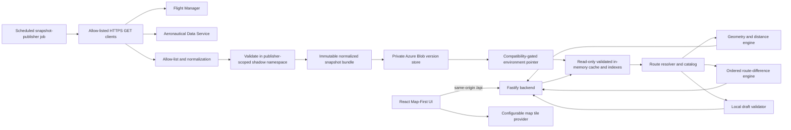

# Flight Route Explorer - System Design

Status: Revised implementation candidate; challenge approval pending final user review; public production launch gated  
Version: 1.0-rc1  
Date: 2026-08-11  
Last reviewed: 2026-08-11  
Decision owner: Project sponsor  
Technical owner: Implementation lead, to be named in the delivery tracker before implementation starts  
Source brief: `CAAS Tech Challenge_v2.21.pdf`

This document is the architecture and lifecycle source of truth for the challenge implementation. Statements in future tense are design commitments, not evidence that code, infrastructure, tests, deployments, or operational controls already exist. Public production use remains prohibited until every production gate in Sections 5.1 and 30 is approved with retained evidence.

## 1. Summary

Build a TypeScript flight-route exploration application that:

- retrieves recorded flight plans and aeronautical reference data from the supplied CAAS APIs;
- lets a user find and select a flight by callsign;
- resolves its ordered route points to latitude and longitude;
- draws the filed route and comparable candidates on a global map;
- calculates per-leg and total modeled distance in nautical miles;
- ranks every complete same-endpoint recorded route and valid local draft by shortest modeled distance;
- lets the user copy a route into a local draft, edit its waypoint sequence, and compare the result;
- deploys a tested, containerized application to Azure Container Apps through a gated CI/CD pipeline.

This is a decision-support demonstration. It is not an operational flight-planning, navigation, filing, dispatch, clearance, or safety system.

## 2. Source requirements

### 2.1 PDF requirements

| ID | Requirement |
|---|---|
| `SRC-01` | Select a flight and display its route on a global map. |
| `SRC-02` | List routes and search flight plans by callsign. |
| `SRC-03` | Use the Flight Plan, Airways, and Waypoints APIs. |
| `SRC-04` | Keep frontend and backend responsibilities separate. |
| `SRC-05` | Build on Linux and produce a containerized artifact. |
| `SRC-06` | Automate build, test, and deployment. |
| `SRC-07` | Provide a README covering architecture, algorithms, tooling decisions, build/deploy steps, and AI use. |
| `SRC-08` | Provide a working flow that can be explained in a 30-minute walkthrough. |

### 2.2 User requirements

| ID | Requirement |
|---|---|
| `USR-01` | Show distance between consecutive waypoints and total route distance. |
| `USR-02` | List complete recorded routes and valid local drafts ranked by shortest modeled distance. |
| `USR-03` | Let the pilot select, copy, and change a route locally. |
| `USR-04` | Explain differences between routes. |
| `USR-05` | Keep cards and controls from obscuring excessive map content. |
| `USR-06` | Provide a robust CI/CD design. |
| `USR-07` | Use Azure as the deployment platform. |

The PDF describes alternate-route generation as optional. In this design, comparison and local drafting are first-class, but the application does not invent airway connectivity that the source API does not provide.

## 3. Goals

1. Produce an honest visualization of recorded flight-route data.
2. Keep the external API key entirely server-side.
3. Normalize weak and drifting upstream schemas behind a stable internal contract.
4. Rank only candidates with complete, deterministic geometry.
5. Make provenance and limitations visible in both the data model and UI.
6. Keep the map visually dominant while making ranking, editing, and comparison discoverable.
7. Make local, CI, staging, production, and live-upstream validation distinct evidence lanes.
8. Deploy the same immutable image digest that passed staging into production.

## 4. Non-goals and safety boundary

The system will not claim to determine the safest, fastest, least-fuel, legally valid, ATC-acceptable, or operationally optimal route. The supplied APIs do not provide authoritative airway topology, directionality, altitude restrictions, effective dates, weather, NOTAMs, restricted airspace, aircraft performance, fuel policy, terrain, traffic flow, or clearance state.

The system will not:

- write to the CAAS APIs;
- file, dispatch, activate, approve, or navigate a route;
- silently repair missing route data with nearest-neighbor connections;
- silently resolve ambiguous waypoint identifiers;
- draw a continuous line across an unresolved gap;
- expose raw upstream flight objects to the browser;
- include pilot names, passenger counts, transponder codes, aircraft addresses, SELCAL, raw remarks, or other unnecessary fields in frontend DTOs or telemetry.

Persistent UI copy:

> Demonstration only. Operational weather, NOTAM, ATC, fuel, aircraft suitability, and regulatory constraints are not evaluated.

The top-ranked label is:

> Rank 1 by shortest modeled distance among complete candidates

It is not labeled "recommended", "safe", "valid", or "cleared".

## 5. Decisions, delivery profiles, and authority

### 5.1 Delivery profiles

The same codebase supports three explicitly different assurance profiles. A control is never described as implemented merely because it appears in this design.

| Profile | Required outcome | Required before exit |
|---|---|---|
| **Challenge Must** | A time-bounded decision-support demonstration, reviewer-accessible only after the Challenge Data Use Record is approved. | Core route workflow; server-side sanitization; read-only snapshot publisher; deterministic tests; automated plus representative manual accessibility/UAT; accessible map/non-map parity; Linux container; secretless PR CI; OIDC; Key Vault; exact-digest staging deployment; health/business smoke; retained known-good rollback; README, walkthrough, and AI-use declaration. |
| **Production Must** | A controlled public or organizational service using the challenge codebase. | Written CAAS redistribution approval; approved access model; dedicated publisher identity and shadow promotion; aggregate edge protection; SLO/error budget; capacity/cost budgets; named on-call and release authorities; RTO/RPO plus restore/DR evidence; privacy and telemetry-redaction proof; expanded supported browser/assistive-technology/device accessibility matrix and UAT; vulnerability SLAs; retention, maintenance, and decommission ownership. |
| **Post-challenge hardening** | Improvements justified by measured service risk or scale. | Multi-region failover when required by the approved RTO; statistically meaningful canary automation; continuous fault injection; expanded compliance automation; product analytics; automated deprecation workflows. |

Before any live CAAS-derived data is shown outside the authorized key holder's local environment, the product owner records a **Challenge Data Use Record** citing the brief clause, provider statement, or written approval that defines the permitted reviewer audience, exposed fields, caching, retention, attribution, and teardown date. An HTTP `200` or possession of the key is not authorization evidence. Without that record, the deployed walkthrough uses synthetic fixtures and the live publisher smoke remains restricted to an authorized operator environment.

When live reviewer access is authorized, challenge staging and demonstration access uses the Microsoft Entra architecture in Section 17.1. Anonymous public production ingress remains disabled until the stronger redistribution and privacy gate is approved. Platform-local health probes disclose only bounded local status.

### 5.2 Architecture decisions

| Area | Decision | Rationale |
|---|---|---|
| Language | TypeScript throughout | Preferred by the brief and supports shared contracts. |
| Repository | `pnpm` monorepo | One lockfile and reusable domain packages without coupling frontend and backend internals. |
| Frontend | React + Vite | Small, explainable application surface and fast build. |
| Map | Leaflet + React-Leaflet | Sufficient global map, marker, polyline, and viewport support without a proprietary SDK. |
| Backend | Fastify | Typed, low-overhead HTTP API with explicit plugin boundaries. |
| Runtime validation | Zod | OpenAPI schemas are too weak to serve as the runtime trust boundary; one concrete library avoids contract drift. |
| Route source | Complete recorded routes with identical endpoints, plus valid local drafts | Avoids fabricating a source airway graph while allowing pilot-controlled comparison. |
| Ranking | Competition rank by ascending full-precision modeled great-circle distance across all complete candidates | Deterministic and transparent; equal distances share rank while provenance remains visible. |
| Distance | Haversine using `R = 3440.065 NM` | Explainable spherical approximation; per-leg and total outputs. |
| Difference | Ordered waypoint alignment plus directed-edge comparison | Preserves order and repeated waypoints. |
| Persistence | No application database; private versioned blob cache only | Source routes are read-only, normalized snapshots need cross-replica consistency, and drafts remain client-session local. |
| Snapshot publication | A dedicated scheduled Azure Container Apps Job publishes immutable snapshots; web replicas are read-only consumers | Prevents a zero-traffic candidate revision from mutating the data plane used by the known-good revision. |
| Draft concurrency | Stateless immutable branches; the browser owns its active head | Authenticated tokens prove integrity and lineage but do not falsely claim one-time consumption without shared state. |
| Packaging | One non-root Linux image with explicit `serve`, `publish-snapshot`, and `validate-snapshot` entrypoints | Reuses one verified digest while keeping runtime privileges and execution contracts separate. |
| Cloud | Azure Container Apps | Revisions, health-gated switching, traffic splitting, managed ingress, Key Vault references, and low platform overhead. |
| CI/CD | GitHub Actions with Azure OIDC | Avoids long-lived cloud credentials and provides review/environment gates. |
| Infrastructure | Bicep | Native Azure IaC with preview/what-if support and minimal additional tooling. |

Each decision becomes an ADR before implementation if it changes a public contract, trust boundary, persistence/concurrency model, deployment topology, safety wording, or operational objective. ADRs record the decider, date, status, alternatives, consequences, review trigger, and superseded decision. Section 29 is the initial decision and assumption register.

## 6. Current API evidence

Live, read-only requests were made on 2026-08-11 using the local `.env` key without printing or storing the key outside the environment.

### 6.1 Endpoints

- `GET https://api.swimapisg.info/flight-manager/displayAll`
- `GET https://api.swimapisg.info/geopoints/list/airways`
- `GET https://api.swimapisg.info/geopoints/list/fixes`
- Documented additional datasets evaluated by the design:
  - `GET /geopoints/list/airports`
  - `GET /geopoints/list/navaids`
  - `GET /geopoints/list/runways`
- Documented lookup operations:
  - `GET /geopoints/search/{type}/{term}`
  - `GET /geopoints/exist/{type}/{term}`

All requests use an `apikey` header. Only the printed HTTPS hostname is allowed. The legacy HTTP/IP hyperlink targets embedded in the PDF are rejected.

V1 fetches flights, fixes, NAVAIDs, airports, and airway names. Runways and generic search/existence endpoints were evaluated but are not required by the selected contracts, so the publisher does not call or store them.

### 6.2 Observed snapshot

| Dataset | Observed records | Important facts |
|---|---:|---|
| Flights | 115 | 89 unique callsigns; callsign is not a stable selector. |
| Flights with `filedRoute` | 59 | 56 flights had no route elements. |
| Route elements | 927 | Only 13 positions contained embedded coordinates. |
| Airways | 9,319 | Names only; no connectivity, ordered fixes, direction, levels, or effective dates. |
| Fixes | 247,419 | Coordinate strings; identifiers are not globally unique. |
| NAVAIDs | 10,195 | Coordinate strings; identifiers can overlap fixes. |
| Airports | 13,175 | Identifier plus coordinate strings. |
| Runways | 28,936 | Repeated airport identifiers plus coordinates, without runway designators. |

### 6.3 Observed drift and incompleteness

- The OpenAPI schema uses `enRoute`; the response uses `enroute`.
- The schema describes `actualTimeOfArrival`; live records use `timeOfArrival`.
- Live records add fields such as `receptionTime`, `timeOfFlight`, `routeText`, and route-level speed/level data.
- Route coordinates are specified as numbers but observed as strings.
- The flight response media type contains `application/json::` in the OpenAPI document.
- Aeronautical list responses declare `text/plain` but contain JSON arrays of strings.
- Almost no upstream fields are declared required.
- Some route points are missing from the current fix/NAVAID datasets.
- Duplicate point names can refer to different coordinates.

The application therefore treats the OpenAPI documents as discovery material, not as an executable security boundary.

## 7. System architecture



Proposed repository structure:

```text
apps/
  api/                 Fastify server, read-only snapshot cache, HTTP routes
  web/                 React/Vite Map-First UI
  snapshot-publisher/  Scheduled/manual ingestion entrypoint and upstream adapters
packages/
  contracts/           Shared internal DTOs and runtime schemas
  route-engine/        Resolution, ranking, geometry, distance, diff, draft validation
  snapshot-store/      Version vectors, immutable blobs, shadow/pointer promotion
  token-service/       Domain-separated cursor, snapshot, point, and draft tokens
  test-fixtures/       Synthetic and sanitized deterministic fixtures
infra/
  bicep/               Azure modules and environment entrypoints
.github/workflows/     CI, image, staging, production, scheduled contract checks
docs/                  Architecture, runbooks, walkthrough, AI-use declaration
```

The browser never calls CAAS directly. Only the snapshot-publisher entrypoint owns upstream credentials and compatibility mapping. The web/API runtime has read-only snapshot access and owns request validation, route computation, caching, and stable errors. Staging and production have separate publishers, identities, containers, pointers, and secrets.

### 7.1 Delivery RACI

One person may hold multiple roles for the challenge, but the independent reviewer cannot approve their own production change. Names or GitHub handles are recorded in the delivery tracker before the applicable work begins.

| Activity | Product/acceptance owner | Technical owner | Security reviewer | Release/operations owner | Independent reviewer |
|---|---|---|---|---|---|
| Requirements and UAT acceptance | A/R | C | I | I | C |
| Architecture and API/data contracts | C | A/R | C | C | C |
| Implementation and automated tests | I | A/R | C | C | C |
| Threat/risk and scan exceptions | I | C | A/R | C | C |
| Infrastructure and secret-reference changes | I | C | C | A/R | C |
| Production promotion | C | C | C | A/R | Required approver |
| Incident rollback | I | C | C | A/R | I |
| Deprecation and decommission | A | C | C | R | I |

`A` = accountable, `R` = responsible, `C` = consulted, and `I` = informed.

### 7.2 Package-boundary enforcement

- `contracts` contains DTO/runtime-schema definitions and depends on no application package.
- `route-engine` depends only on `contracts` plus narrowly reviewed pure libraries; it has no HTTP, React, Azure, filesystem, clock, random, or secret access.
- `snapshot-store` owns version/blob/pointer ports but not route computation or HTTP handlers.
- `token-service` owns authenticated token encoding/rotation and depends on explicit clock/key-provider interfaces.
- `apps/api`, `apps/web`, and `apps/snapshot-publisher` compose packages through exported interfaces and cannot import another app's internals.
- ESLint/import-boundary rules and package-level provider/consumer contract tests fail CI on a forbidden dependency direction.

## 8. Internal data contracts

```ts
type Coordinate = Readonly<{
  lat: number;
  lon: number;
}>;

type SnapshotVersion = Readonly<{
  flightsHash: string;
  referenceBundleHash: string;
  normalizerVersion: string;
  contractVersion: "v1";
  endpointPolicyVersion: string;
  routePolicyVersion: string;
  distancePolicyVersion: "haversine-r3440.065-v1";
}>;

type SnapshotPointerTarget = Readonly<{
  snapshotVersion: SnapshotVersion;
  manifestHash: string;
  publisherImageDigest: string;
  publishedAt: string;
  serviceableUntil: string;
}>;

type SnapshotPointerEnvelope = Readonly<{
  schemaVersion: 1;
  generation: number;
  current: SnapshotPointerTarget;
  previous: SnapshotPointerTarget | null;
  promotionId: string;
  updatedAt: string;
}>;

type DatasetFreshnessBase = Readonly<{
  dataset: "flights" | "fixes" | "navaids" | "airports" | "airways";
  retrievedAt: string;
  sourceUpdatedAt?: string;
  freshUntil: string;
  staleAllowedUntil: string;
}>;

type DatasetFreshness =
  | (DatasetFreshnessBase & Readonly<{state: "fresh"; staleReason: null}>)
  | (DatasetFreshnessBase & Readonly<{
      state: "allowed-stale";
      staleReason:
        | "UPSTREAM_UNAVAILABLE"
        | "UPSTREAM_RATE_LIMITED"
        | "UPSTREAM_AUTH_FAILED"
        | "SCHEMA_REJECTED"
        | "PUBLISHER_DELAYED";
    }>);

type SnapshotFreshness = Readonly<{
  evaluatedAt: string;
  snapshotState: "current" | "retained";
  overallState: "fresh" | "allowed-stale";
  datasets: readonly DatasetFreshness[];
}>;

type RouteIssue = Readonly<{
  code:
    | "ENDPOINT_UNRESOLVED"
    | "POINT_UNRESOLVED"
    | "POINT_AMBIGUOUS"
    | "INVALID_SOURCE_FIELD"
    | "SOURCE_ORDER_NORMALIZED"
    | "DUPLICATE_SOURCE_ELEMENT"
    | "NUMERIC_ERROR"
    | "OUTSIDE_MAP_PROJECTION"
    | "HISTORICAL_VALIDITY_NOT_ASSESSED";
  severity: "info" | "warning" | "error";
  path?: string;
  occurrenceIds?: readonly string[];
  message: string;
}>;

type PointLookupOption = Readonly<{
  pointRef: string;
  identifier: string;
  type: "fix" | "navaid" | "airport";
  coordinate: Coordinate;
  ambiguityGroupSize: number;
}>;

type FlightSummary = Readonly<{
  id: string;
  callsign: string;
  departure: string;
  destination: string;
  dateOfFlight?: string;
  departureTime?: string;
  aircraftType?: string;
  hasUsableFiledRoute: boolean;
  sourceUpdatedAt?: string;
  retrievedAt: string;
}>;

type FlightDetails = FlightSummary & Readonly<{
  flightRules?: string;
  routeText?: string;
  cruise?: Readonly<{
    speed?: string;
    level?: string;
    elapsedTime?: string;
  }>;
  alternates: Readonly<{
    departure: readonly string[];
    arrival: readonly string[];
  }>;
  fieldWarnings: readonly Readonly<{
    field: string;
    reason: "missing" | "invalid" | "oversized";
  }>[];
}>;

type RoutePointBase = Readonly<{
  occurrenceId: string;
  sequence: number;
  designatedIdentifier: string | null;
  displayLabel: string;
  airway?: string;
  airwayType?: string;
  changeLevel?: string;
  changeSpeed?: string;
}>;

type RoutePoint =
  | (RoutePointBase & Readonly<{
      resolution: "embedded" | "unique-reference" | "explicit-reference-selection";
      coordinate: Coordinate;
    }>)
  | (RoutePointBase & Readonly<{
      resolution: "unresolved" | "ambiguous";
      coordinate: null;
    }>);

type RouteLeg = Readonly<{
  kind: "segment";
  fromOccurrenceId: string;
  toOccurrenceId: string;
  distanceNm: number;
  provenance: "recorded" | "manual-direct";
  airway?: string;
  airwayReferenceStatus: "observed-name" | "not-observed" | "none";
}> | Readonly<{
  kind: "gap";
  fromOccurrenceId: string | null;
  unresolvedOccurrenceIds: readonly string[];
  toOccurrenceId: string | null;
  reason: "unresolved" | "ambiguous";
}>;

type RouteCandidateBase = Readonly<{
  id: string;
  sourceFlights: readonly Readonly<{
    id: string;
    dateOfFlight?: string;
    role: "selected-filed" | "recorded-alternative";
    sourceUpdatedAt?: string;
  }>[];
  revision: number;
  label: string;
  provenance: "filed" | "recorded-alternative" | "local-draft";
  departure: string;
  destination: string;
  points: readonly RoutePoint[];
  legs: readonly RouteLeg[];
  geometry: GeoJSON.MultiLineString;
  validation: RouteValidation;
  maxLegDistanceNm: Metric<number, "NO_RESOLVED_LEG">;
  sourceUpdatedAt?: string;
  retrievedAt: string;
}>;

type RouteCandidate =
  | (RouteCandidateBase & Readonly<{
      status: "complete";
      totalDistanceNm: number;
      rank: number;
    }>)
  | (RouteCandidateBase & Readonly<{
      status: "incomplete";
      totalDistanceNm: null;
      rank: null;
    }>);

type RouteValidation = Readonly<{
  computational: "pass" | "warning" | "fail";
  operational: "not-assessed";
  resolvedPointCount: number;
  totalPointCount: number;
  issues: readonly RouteIssue[];
}>;

type RouteOptionsResponse = Readonly<{
  snapshotToken: string;
  freshness: SnapshotFreshness;
  flight: FlightSummary;
  rankingCriterion: "modeled-great-circle-distance-nm";
  completeCandidateCount: number;
  candidates: readonly RouteCandidate[];
  warnings: readonly RouteIssue[];
}>;

type RouteComparisonResponse = Readonly<{
  snapshotToken: string;
  freshness: SnapshotFreshness;
  baseline: RouteOperandRef;
  target: RouteOperandRef;
  label: string; // "Changes from <baseline> to <target>"
  extent: GeoJSON.MultiLineString;
  waypointChanges: readonly WaypointChange[];
  legChanges: readonly LegChange[];
  distanceDeltaNm: Metric<number, "INCOMPLETE_OPERAND">;
  percentageDistanceDelta: Metric<number, "INCOMPLETE_OPERAND" | "ZERO_BASELINE">;
  baselineMaxLegDistanceNm: Metric<number, "NO_RESOLVED_LEG">;
  targetMaxLegDistanceNm: Metric<number, "NO_RESOLVED_LEG">;
  warnings: readonly RouteIssue[];
}>;

type DraftValidationResponse = Readonly<{
  snapshotToken: string;
  freshness: SnapshotFreshness;
  draft: RouteCandidate;
  candidates: readonly RouteCandidate[];
  completeCandidateCount: number;
  comparison: RouteComparisonResponse;
  parentRevisionHash: string;
  revisionHash: string;
  nextDraftRevisionToken: string;
}>;

type Metric<T, R extends string> =
  | Readonly<{state: "available"; value: T}>
  | Readonly<{state: "unavailable"; value: null; reason: R}>;

type WaypointSnapshot = Readonly<{
  occurrenceId: string;
  index: number;
  label: string;
}>;

type WaypointChange =
  | Readonly<{kind: "added"; target: WaypointSnapshot}>
  | Readonly<{kind: "removed"; baseline: WaypointSnapshot}>
  | Readonly<{kind: "replaced"; baseline: WaypointSnapshot; target: WaypointSnapshot}>
  | Readonly<{kind: "moved"; baseline: WaypointSnapshot; target: WaypointSnapshot}>;

type LegSnapshot = Readonly<{
  fromOccurrenceId: string;
  toOccurrenceId: string;
  distanceNm: number;
}>;

type LegChange =
  | Readonly<{kind: "added"; target: LegSnapshot}>
  | Readonly<{kind: "removed"; baseline: LegSnapshot}>
  | Readonly<{kind: "changed"; baseline: LegSnapshot; target: LegSnapshot}>;

type FlightListResponse = Readonly<{
  snapshotToken: string;
  freshness: SnapshotFreshness;
  items: readonly FlightSummary[];
  nextCursor: string | null;
}>;

type FlightDetailsResponse = Readonly<{
  snapshotToken: string;
  freshness: SnapshotFreshness;
  flight: FlightDetails;
}>;

type PointListResponse = Readonly<{
  snapshotToken: string;
  freshness: SnapshotFreshness;
  items: readonly PointLookupOption[];
}>;

type RouteOperand =
  | Readonly<{kind: "candidate"; candidateId: string}>
  | Readonly<{kind: "draft"; draftRevisionToken: string}>;

type RouteOperandRef =
  | Readonly<{kind: "candidate"; candidateId: string}>
  | Readonly<{kind: "draft"; revisionHash: string}>;

type DraftPoint =
  | Readonly<{kind: "preserved"; occurrenceId: string}>
  | Readonly<{kind: "selected-reference"; pointRef: string}>;

type DraftRequest =
  | Readonly<{
      kind: "create";
      baseCandidateId: string;
      snapshotToken: string;
      intermediatePoints: readonly DraftPoint[];
    }>
  | Readonly<{
      kind: "edit";
      parentDraftRevisionToken: string;
      intermediatePoints: readonly DraftPoint[];
    }>;

type ApiErrorCode =
  | "UPSTREAM_AUTH"
  | "UPSTREAM_TIMEOUT"
  | "UPSTREAM_RATE_LIMITED"
  | "SCHEMA_MISMATCH"
  | "ROUTE_INCOMPLETE"
  | "POINT_AMBIGUOUS"
  | "DRAFT_INVALID"
  | "TOKEN_INVALID"
  | "DRAFT_CONTEXT_MISMATCH"
  | "TOKEN_EXPIRED"
  | "CURSOR_CONTEXT_MISMATCH"
  | "CURSOR_STALE"
  | "SNAPSHOT_EXPIRED"
  | "VALIDATION_ERROR"
  | "NOT_FOUND"
  | "PAYLOAD_TOO_LARGE"
  | "RATE_LIMITED"
  | "INTERNAL_ERROR";

type ApiErrorResponse = Readonly<{
  error: Readonly<{
    code: ApiErrorCode;
    message: string;
    requestId: string;
    retryable: boolean;
    retryAfterSeconds?: number;
    issues?: readonly RouteIssue[];
  }>;
}>;

type HealthResponse = Readonly<{
  status: "ok" | "degraded" | "unavailable";
  revision: string;
  snapshotLoaded?: boolean;
}>;
```

Raw upstream objects are never spread into these DTOs. Every output object is newly constructed from allow-listed values.

Opaque flight/candidate IDs are assigned inside a normalized snapshot and do not reveal `_id`, GUFI, or other upstream identifiers. Occurrence IDs distinguish repeated waypoint identifiers. An embedded coordinate without a valid designated identifier uses `designatedIdentifier: null` and a bounded generated `displayLabel`; its canonical identity is its full normalized coordinate plus occurrence semantics, never the generated label. Serialized `null` represents an unavailable coordinate, distance, or rank; runtime schemas reject every impossible union combination rather than relying on truthiness or optional-field conventions.

Deduplicated candidates retain all contributing opaque flight references. If any contributor is the selected flight, the aggregate candidate uses `provenance: "filed"`; otherwise it uses `"recorded-alternative"`. The display label identifies the selected filed route first, then the earliest canonical contributor tuple. `retrievedAt` is the snapshot-wide retrieval time; contributor-specific update times remain inside `sourceFlights`. Local drafts have an empty `sourceFlights` list and `provenance: "local-draft"`. Flight-specific details are never merged: selecting a contributor loads its own `FlightDetailsResponse`.

Rank is response-population metadata, not intrinsic candidate identity. Any candidate cache key therefore includes the complete snapshot version and active draft-head hash/population identity, never the candidate ID alone.

## 9. Upstream ingestion and sanitization

### 9.1 Egress controls

- Allow only `https://api.swimapisg.info`.
- Allow only the fixed paths declared in configuration.
- Expose only typed GET adapter methods whose origin, path, HTTP method, and API-key header name cannot be influenced by browser input; no generic upstream proxy or URL parameter exists.
- Disable redirects or reject any redirect not matching the same origin and path allow-list.
- Verify TLS; never fall back to the PDF's legacy HTTP/IP links.
- Apply endpoint-specific response-byte and array-count limits.
- Use cancellation, bounded retries, and per-endpoint concurrency limits.
- Never place the API key in URLs, logs, cache keys, traces, or error objects.

These are application-layer HTTP-client controls, not a claim that the Container Apps subnet is a deny-by-default outbound firewall. Infrastructure-level FQDN egress enforcement through Azure Firewall/UDR is a documented production-hardening option; it is not required for the challenge deployment because it adds substantial fixed cost and Azure control-plane allow-list maintenance.

### 9.2 Flight allow-list

The compatibility mapper may read only fields required for:

- stable selection: `_id`, `gufi` as optional metadata;
- display: `aircraftIdentification`, departure/destination/date/time, aircraft type;
- route reconstruction: `filedRoute.routeElement`, `routeText`, route-level cruise/elapsed fields;
- route elements: `seqNum`, position, designated point, airway, airway type, speed/level changes;
- details: flight-rule category and explicitly mapped departure/arrival alternate fields;
- provenance: last-updated/reception timestamps.

Unknown fields are counted for drift telemetry and discarded.

Browser-visible fields have field-specific schemas before entering a DTO:

- callsign: trimmed uppercase ASCII, 1-32 characters;
- airport identifiers and alternates: trimmed uppercase ASCII, 1-8 characters;
- point/airway identifiers: trimmed uppercase ASCII, 1-32 characters;
- aircraft type: Unicode NFC display value, 1-32 characters;
- flight rules, airway type, speed, level, and elapsed-time display values: Unicode NFC, 1-32 characters each;
- route text: Unicode NFC, at most 2,048 characters;
- timestamps: an explicitly documented ISO-8601 or supported upstream compact-time parser, normalized to ISO-8601 when a date/offset is known; invalid values are absent with a warning rather than guessed.

Every display string rejects NUL, C0/C1 controls except deliberately normalized whitespace, and bidirectional override/isolate characters; whitespace is collapsed. Identifier overflow or invalid grammar quarantines the owning identity/route element because truncation could change meaning. An invalid optional descriptive field is omitted with a bounded warning. Lookup and display forms are stored separately where case normalization is allowed. Fuzz/property tests cover oversized strings, combining characters, deceptive Unicode, invalid dates, and field alias collisions.

### 9.3 Aeronautical parser

List responses are parsed as JSON arrays even when labeled `text/plain`. Each coordinate record must match one anchored, full-string grammar equivalent to:

```text
<identifier> (<latitude>,<longitude>)
```

Validation:

- identifier is trimmed, length-bounded, free of control/NUL/bidirectional formatting characters, and stored with separate display and uppercase lookup forms;
- latitude and longitude must be finite;
- latitude must be within `[-90, 90]`;
- longitude must be within `[-180, 180]`;
- trailing garbage and partial matches are rejected;
- indexes use `Map`, not user-keyed plain objects;
- multiple distinct coordinates for the same identifier remain an ambiguity, not a last-write-wins value.

Airways use a separate bounded `string[]` parser because the endpoint returns names, not coordinate records. The parser enforces the point/airway identifier rules above, a response-count/byte limit, duplicate removal, and atomic publication. Malformed individual names are rejected with bounded counters; an invalid top-level body or policy-threshold breach leaves the last valid snapshot in place. A recorded route segment is annotated `observed-name` or `not-observed` against this set. That annotation never supplies topology and never affects point resolution, completeness, geometry, or rank.

### 9.4 Compatibility policy

- Accept documented and observed field aliases only through explicit adapters.
- Do not enable broad coercion globally.
- Coordinate strings are parsed only in the known coordinate fields.
- A bad flight record is quarantined without discarding every valid record.
- A reference dataset refresh is atomic: invalid new data never replaces the last valid cache.
- Schema-drift counters and bounded reason codes are emitted without logging raw payloads.

## 10. Recorded route resolution

For a selected flight:

1. Canonicalize departure and destination as trimmed uppercase exact airport identifiers. No IATA/ICAO alias, proximity, or alternate-airport inference is allowed.
2. Resolve each endpoint to exactly one coordinate in the airport index. A missing/ambiguous endpoint makes the candidate incomplete.
3. Require a route-element array and enforce a configured maximum, initially 254 intermediate elements so the endpoint-inclusive route cannot exceed 256 occurrences.
4. Require each `seqNum` to be a non-negative safe integer.
5. Sort by `seqNum`; emit a warning if source order differed.
6. Reject conflicting duplicate sequence numbers. Collapse only exact duplicate source records with a warning.
7. Resolve each intermediate point in this order:
   1. valid embedded coordinate, even when a designated identifier is absent; represent an absent identifier as described in Section 8 rather than inventing one;
   2. exactly one coordinate across the fix, NAVAID, and airport indexes for the designated identifier.
8. Construct one comparison sequence: `[departure airport, normalized intermediate route elements, destination airport]`. If the first/last intermediate has the same canonical endpoint key and exact coordinate as the adjacent endpoint, collapse that adjacent duplicate; preserve every other repeated occurrence.
9. Do not choose among multiple coordinates for the same identifier.
10. Do not infer a point from an airway name, geographic proximity, or neighboring fixes.
11. Assign a stable occurrence ID to every retained position and preserve source order.
12. Emit an explicit gap leg for unresolved elements and split geometry there. Never create a segment across the gap.

An empty but valid route-element array is a recorded endpoint-to-endpoint route, not a missing route. A missing/non-array route field remains unavailable. The endpoint-only route is complete only when both endpoints resolve, are distinct under the data-quality rule in Section 13, and its single distance is finite.

For a route element, `airway` describes the outbound leg from that occurrence to the next retained occurrence. Departure has no source airway; destination has no outbound leg. If an element is removed as an adjacent endpoint duplicate, its airway annotation does not migrate. Conflicting adjacent airway values remain attached to their respective outbound legs. The airway dataset can change only `airwayReferenceStatus`, never resolution, geometry, completeness, or rank.

Every complete candidate therefore uses identical airport-to-airport extents. Its total includes departure-to-first-intermediate and last-intermediate-to-destination legs. "Locked endpoints" in the editor means the canonical endpoint occurrences, identifiers, and coordinates cannot be replaced, removed, or reordered.

A candidate is rankable only if:

- departure and destination resolve and match the comparison group;
- every required route point resolves deterministically;
- no segment contains a gap;
- every distance is finite;
- the candidate passes configured point and leg limits.

Incomplete routes remain visible in a separate diagnostic group and are never assigned a distance rank.

## 11. Candidate discovery and ranking

Candidate discovery uses recorded data only:

1. Start with the selected filed route.
2. Find other flight objects with the same canonical departure and destination.
3. Resolve each route under the strict rules above.
4. Deduplicate only exact canonical route-semantic duplicates using a versioned signature of canonical endpoint keys, every ordered designated identifier or coordinate-only token, every full canonical numeric coordinate, and directed segment semantics. Retain all contributing opaque source-flight IDs, roles, dates, and source-update timestamps under the aggregation rule in Section 8.
5. Add valid local drafts for the same locked endpoints.
6. Keep incomplete candidates visible but unranked.

Rank all complete recorded candidates and valid local drafts by full-precision `totalDistanceNm`. Use competition ranking, so equal distances share the same rank. Point count and stable canonical signature are deterministic display-order tie-breakers only and never change the numeric rank.

Display order:

1. ascending `rank`;
2. ascending point count;
3. ascending stable canonical route signature.

The signature uses a versioned canonical JSON byte encoding: UTF-8; Unicode NFC strings; lexicographically ordered object keys; array order preserved; finite numbers serialized from normalized decimal strings with `-0` converted to `0`; no insignificant whitespace; SHA-256 over the resulting bytes. The signature prefix contains the contract and route-policy versions. A hash collision is handled as non-equality by comparing canonical bytes before deduplication; hashes are indexes, not proof of semantic equality.

No missing value is treated as zero. Ranking is deterministic for the same immutable version vector. A valid endpoint-only draft may become Rank 1 on geometric distance; its local-draft provenance and `manual-direct` segments remain prominent, and the operational warning is unchanged.

If only one recorded candidate exists, the UI states:

> No additional complete recorded route is available from the supplied data.

The user may then create a local draft for geometric comparison. Every recorded option displays its flight date plus the reference-snapshot retrieval time; dates do not imply aeronautical comparability because the supplied reference data has no effective dates, and historical operational validity is not evaluated.

## 12. Geometry and distance

All domain coordinates remain named `{lat, lon}` values. Conversions are explicit:

- Leaflet: `[lat, lon]`
- GeoJSON: `[lon, lat]`

For consecutive validated points, calculate Haversine distance:

```text
a = sin²(Δlat/2) + cos(lat1) × cos(lat2) × sin²(Δlon/2)
c = 2 × atan2(√a, √(1-a))
distanceNm = 3440.065 × c
```

- Convert input degrees to radians before trigonometry.
- Normalize longitude delta deterministically to `[-pi, pi)` using modular arithmetic.
- Clamp `a` to `[0, 1]` before both square roots so near-antipodal floating-point error cannot produce `NaN`.
- Require every leg and total to be finite and non-negative; otherwise the candidate is incomplete with a bounded numeric-error reason.
- Sum full-precision leg distances.
- Round only display values, initially to `0.1 NM`.
- Rendering is explicitly a display approximation: straight waypoint-to-waypoint lines in longitude/latitude, not a claim of a flown path or geodesic curve. For a dateline crossing, unwrap the destination longitude, linearly interpolate the latitude at `+180` or `-180`, terminate that component, and start the next at the paired opposite boundary. Every output component must have no longitude jump greater than 180 degrees.
- Distance is labeled "modeled great-circle distance", not flight time, fuel, flown track, or operational route distance.

Leaflet uses `EPSG:3857` Web Mercator with a compatible attributed tile provider. Domain validation still accepts latitude `[-90, 90]`, but the display projection is limited to approximately `+-85.05112878 degrees`. An exact coordinate beyond that limit remains available in Route Data and distance math; the map clips the visual segment to the projection boundary, shows a distinct "outside map projection" boundary marker/warning, and never replaces the domain coordinate. Fit bounds use the clipped render geometry. Tests cover both boundaries and both poles.

Golden unit oracles use `R = 3440.065 NM`: identical points `0 NM`; a 90-degree equatorial leg `5403.641466 NM`; antipodal equatorial points `10807.282932 NM`; and `179 degrees E` to `179 degrees W` on the equator `120.080921 NM`, each within `1e-6 NM`. Polar and nearly antipodal fixtures assert finite values within an independently calculated tolerance.

## 13. Local draft editing and differences

The source flight plan and recorded candidates are immutable snapshots. "Edit copy" creates a session-local draft.

V1 supports exactly one active draft head for the selected flight in each browser-tab session. That draft participates in the same complete-candidate ranking population. Starting Edit Copy from another base route prompts to replace the current draft; resetting removes the draft and reranks the recorded population. No draft is shared across users, tabs, devices, or server sessions.

Allowed operations:

- insert a uniquely resolved or explicitly selected reference point;
- remove an intermediate point;
- replace an intermediate point;
- reorder intermediate points;
- undo, redo, and reset to source.

Constraints:

- departure and destination are locked;
- free-form arbitrary coordinates are not accepted in the normal editor;
- unknown free-form identifiers and unselected ambiguous groups are blocked; an explicit server-issued point reference may select a displayed type/coordinate from an ambiguous group and is labeled `explicit-reference-selection`;
- every edit invalidates the prior rank and triggers full revalidation;
- newly formed segments are labeled `manual-direct` unless they exactly preserve a recorded segment;
- a manual direct segment is not described as an airway;
- no draft is sent upstream or persisted server-side in v1;
- browser storage, if used, is tab-scoped `sessionStorage` containing only the normalized draft, snapshot token, active revision token, and bounded undo/redo revision tokens, never the API key or raw flight object.

Differences use ordered sequence alignment, not set subtraction:

- added, removed, replaced, and reordered points;
- changed directed segments;
- unchanged prefix/suffix and shared segments;
- waypoint and segment count delta;
- absolute and percentage distance delta;
- maximum modeled leg length;
- provenance and validation warnings.

Occurrence identity is preserved when a source point is copied or moved. A `preserved` draft point supplies only an occurrence ID; the server resolves its exact identifier/coordinate/resolution state from the token-bound base or parent revision, including an embedded coordinate-only occurrence. The client can never pair a preserved ID with a different reference. A replacement or insertion supplies only a `selected-reference` point reference and receives a new deterministic opaque HMAC-derived occurrence ID over the environment, snapshot/base, parent revision hash, canonical proposed sequence, insertion index, and selected `pointRef`; an identical parent-plus-proposal retry therefore returns the identical child revision and IDs. Unknown, duplicate, cross-context, or rebound occurrence IDs are rejected, and identity metadata can never supply coordinates or metrics. Diffing first matches preserved occurrence IDs. It then runs Myers shortest-edit alignment over unmatched canonical `(identifier, coordinate, segment-semantics)` tokens with deterministic tie-breaking toward the lowest baseline index and then lexical occurrence ID. Preserved IDs whose relative order falls outside the deterministic longest-increasing baseline-position subsequence are reported as moves/reorders; an adjacent delete/add at one aligned position is reported as a replacement. Directed legs are compared by occurrence IDs, and explicit gaps participate as gap tokens rather than implicit connections.

Golden fixtures define exact output for repeated identifiers, duplicate insertions, adjacent replacements, swaps, full reversals, gaps, and equally optimal alignments.

The first draft request binds to the base candidate. Every successful response returns `DraftValidationResponse` with the fully validated draft, complete reranked candidate population, baseline-to-draft comparison, and a next opaque authenticated revision token. That size-bounded token binds the environment, complete snapshot version, base candidate, ordered occurrence/canonical-point sequence, parent and current revision hashes, revision number, key ID, issued-at time, and expiry, so stateless validation can resolve preserved embedded/source occurrences without trusting client coordinates.

Draft revisions are immutable stateless branches. A valid revision token may be used more than once and can produce divergent child revisions; the server never claims it can detect one-time consumption without shared state. The current browser tab owns one active head, sends only that head for its next edit, cancels superseded requests, and ignores an out-of-order response whose `parentRevisionHash` is no longer active. Undo/redo moves among locally retained authenticated heads. Forged/malformed tokens return `TOKEN_INVALID`; a valid token used with the wrong environment/base context returns `DRAFT_CONTEXT_MISMATCH`; an expired token returns `TOKEN_EXPIRED`; and an unavailable retained version returns `SNAPSHOT_EXPIRED`. If a future requirement needs a globally single draft head, it requires a shared TTL store with atomic compare-and-swap and a superseding ADR.

For an available directed comparison, `distanceDeltaNm.value = target.totalDistanceNm - baseline.totalDistanceNm` and `percentageDistanceDelta.value = 100 * distanceDeltaNm.value / baseline.totalDistanceNm`, calculated at full precision and rounded only for display. Normalize display-only negative zero to zero. If the baseline distance is zero, only percentage is unavailable with `ZERO_BASELINE`; if either operand is incomplete, both distance metrics are unavailable with `INCOMPLETE_OPERAND`. Each operand retains its own maximum-leg metric. If a route has no resolved segment, its maximum-leg metric is unavailable with `NO_RESOLVED_LEG`, and the candidate is not rankable. Distinct endpoint identifiers resolving to the same coordinate are treated as a data-quality failure rather than a zero-length shortcut. A same-airport round trip can be complete only when it contains at least one finite non-zero intermediate leg.

## 14. Backend HTTP API

```text
GET  /api/v1/flights?callsign=<bounded-query>&limit=<1..100>&cursor=<opaque-cursor>
GET  /api/v1/flights/:flightId
GET  /api/v1/flights/:flightId/route-options
GET  /api/v1/points?query=<bounded-query>&types=<bounded-types>&snapshot=<token>&limit=<1..20>
POST /api/v1/route-drafts/validate
POST /api/v1/routes/compare
GET  /health/live
GET  /health/ready
GET  /health/startup
```

Rules:

- Callsign search is case-insensitive prefix/substring matching over normalized data; query length is bounded.
- Flight selection uses the opaque local flight ID, not callsign.
- Flight list returns exactly `FlightListResponse`; the first page defaults to 50 and is capped at 100. A cursor fixes the original normalized query and page size, so later requests supply the same `limit` or omit it and inherit the bound value.
- Flight detail returns exactly `FlightDetailsResponse`; missing optional values remain absent with bounded field warnings, and no raw/sensitive field is available.
- `route-options` returns recorded candidates, validation status, geometry, metrics, freshness, and warnings.
- Point lookup performs bounded exact/prefix matching over the selected immutable snapshot and returns at most 20 `PointLookupOption` values. Every option shows identifier, fix/NAVAID/airport type, coordinate, and ambiguity-group size. `pointRef` is an opaque authenticated binding to the snapshot, source dataset/type, identifier, and exact coordinate; it never trusts a client coordinate.
- Flight results use a deterministic sort tuple. The opaque, authenticated cursor binds the normalized query, page size, last sort tuple, expiry, and complete `SnapshotVersion`; reuse with a different query/page size returns `422 CURSOR_CONTEXT_MISMATCH`, while token expiry or unavailable retained version returns `409 CURSOR_STALE`.
- Draft validation accepts exactly the discriminated `DraftRequest` union. Create supplies the base and snapshot; edit supplies only the authenticated parent token plus the complete proposed intermediate sequence. Each point is either `{kind: "preserved", occurrenceId}` or `{kind: "selected-reference", pointRef}`; it can never contain both. `additionalProperties: false` applies at every object level and endpoint-inclusive count is capped at 256. Endpoints come from the bound base candidate and never from the client. Preserved IDs must resolve to the exact bound source/parent occurrence; selected references always receive new deterministic IDs. Identity/reference rebinding, unknown/duplicate IDs, and malformed references are rejected. An identical retry returns the same child revision. Success returns exact `DraftValidationResponse` and reranks the full population.
- Route comparison accepts `{snapshotToken, baseline: RouteOperand, target: RouteOperand}` in that directed order. Each distinct operand is either a server-issued candidate ID or an authenticated draft revision token. It accepts no coordinates, geometry, distance, rank, endpoint, provenance, or source fields and returns exact `RouteComparisonResponse`. Incomplete operands retain ordered/gap differences but use unavailable metric-union states rather than numeric zero.
- The server runtime-validates every POST body, re-resolves all identifiers, and recomputes geometry, distance, rank population, and differences. Invalid/forged tokens and schema/endpoint/candidate mismatches return `422`; valid cross-context or expired/unavailable snapshot inputs return `409`; oversized requests return `413`; unknown candidates return `404`.
- Every non-health error returns exactly `ApiErrorResponse`. Codes use the closed `ApiErrorCode` union, including distinct token-integrity, draft-context, token-expiry, cursor, and retained-snapshot failures. Messages are bounded local copy; issue paths and details never echo raw upstream values. `Retry-After` and `retryAfterSeconds` are present only for bounded retryable conditions.
- No endpoint echoes an upstream body, header, stack trace, or secret.
- Health responses use `HealthResponse` and contain only bounded local status/revision data: startup means configuration plus a usable validated snapshot is loaded; readiness means a fresh or allowed-stale validated snapshot can serve application requests; liveness means the process/event loop is responsive and never calls CAAS.
- Runtime Zod schemas are the contract source of truth and generate the checked-in OpenAPI document. CI fails on an unreviewed OpenAPI diff. Compatible additions require optional fields; removing or changing meaning/type requires a new versioned route plus migration/deprecation approval under Section 31.

## 15. Map-First UI design

### 15.1 Default layout

- Persistent, compact demonstration banner.
- Compact top bar containing callsign search, selected flight, endpoints, retrieval time, Compare, and Edit Copy.
- On large desktop (`>= 1440 CSS px`), the unobstructed map occupies at least 70% of the viewport width in default and single-drawer states.
- A 44 px route/tool rail and one active-route summary chip replace permanent route cards.
- Map controls remain in a reserved top-right safe zone.
- When comparison is ready, a 57 px collapsed tray shows directed distance and waypoint deltas; otherwise the tray is hidden.

### 15.2 Expandable surfaces

- Route chooser opens only on request and closes after selection.
- Route chooser, Flight/Route Data, and waypoint editor reuse one mutually exclusive primary drawer.
- Comparison is `hidden | collapsed | expanded`; it is hidden until two operands are selected and expands into the full directed diff.
- The UI state is explicit: `primarySurface = none | routes | route-data | editor`, `comparisonSelection = none | choosing-target | ready`, and `sheetExtent = closed | peek | half | full`. Opening one primary surface closes the previous one. Below 1,440 px, expanding comparison also closes the primary surface. At larger widths, if coexistence would violate the 70% map rule, the primary surface closes before comparison expands.
- Opening or closing a surface refits the union of all visible selected/compared route geometry, resolved markers, gap boundaries, and the focused point into the actually unobstructed map rectangle. Padding includes the banner, top bar, rail, drawer, tray/sheet, map controls, and safe-area insets.
- Tablet and mobile use bottom sheets.
- "Map only" collapses every nonessential control while retaining the demonstration/safety notice and an obvious keyboard-focusable Restore controls action.

Desktop drawers are nonmodal and do not trap focus. Mobile bottom sheets are nonmodal at peek/half and modal at full extent: full extent has a semantic name, initial focus, focus containment, `Escape`/close behavior, inert background content, and focus return to its trigger. Every trigger exposes its expanded/controlled state. Focus return is deterministic after closing, selecting a route, retrying an error, or leaving Map Only.

### 15.3 Information hierarchy

Always visible:

- callsign;
- departure and destination;
- flight date/time when available;
- aircraft type when available;
- route availability;
- modeled distance and rank criterion;
- data freshness.

Flight/Route Data drawer:

- selected route label, provenance, rank or "Not ranked", computational status, and operational status;
- route text;
- flight-rule category;
- cruise speed/level and elapsed-time fields, explicitly labeled as source data;
- arrival/departure alternates;
- ordered point/airway table with coordinates, resolution state, unresolved gaps, directed legs, per-leg distance, and total modeled distance;
- point-level speed/level changes;
- warnings and the ordered route diff when comparison is active;
- source and retrieval timestamps.

This structured view is available independently of map or tile rendering. Route selection, point/segment focus, and comparison selection synchronize between the structured view and map, but search, selection, inspection, comparison, and draft editing never require interaction with map graphics.

The route chooser has two explicit groups:

1. **Complete routes - ranked by modeled distance**, ordered by the ranking policy in Section 11.
2. **Incomplete routes - not ranked**, ordered deterministically by filed-route priority, provenance, label, and stable route signature.

Each route row includes label, provenance, selected state, rank or "Not ranked", distance or a reason it is unavailable, point count, freshness, and bounded warnings. The chooser states the size of the ranked population and uses semantic group headings plus selected/`aria-current` state.

### 15.4 Visual semantics

- Filed route: gray dashed line.
- Selected recorded alternative: blue solid line.
- Local draft: teal or blue dashed line with explicit draft badge.
- Added segment/point: green.
- Removed segment/point: red in the diff, not as an active route.
- Unresolved route portions: no connecting line; warning markers at the last/next resolved points.
- Color always has a textual or line-style equivalent.
- Route lines use a contrasting casing/halo, distinct dash and marker shapes, and adjacent legend/status text so meaning survives variable basemap colors and forced-colors mode.
- UI text meets WCAG 2.2 AA contrast; meaningful boundaries, controls, and focus indicators meet at least 3:1 non-text contrast and are not obscured by sticky surfaces. Motion respects reduced-motion preferences.

### 15.5 Required states

- initial loading;
- no selection;
- no search results;
- selected flight has no route;
- no additional complete recorded route;
- incomplete or ambiguous candidate;
- route/draft loading and cancellation;
- stale cached data;
- upstream authentication/configuration failure;
- timeout/rate-limit/retry;
- map-tile failure with route details still usable;
- draft bound to a retained older snapshot, with an explicit Reload source action;
- expired draft snapshot, with a safe reset/recreate path.

### 15.6 Keyboard, search, and editing behavior

- Callsign search follows the labeled combobox/listbox pattern: Arrow keys move active option, Enter selects, Escape closes, and Tab remains predictable. Duplicate result names include callsign, endpoints, date, and time.
- Bounded `status`/`alert` regions announce loading, result count, request replacement/cancellation, errors, retry results, route selection, validation, distance delta, and rank changes without repeating unchanged messages.
- Every draft row has labeled Insert/Replace/Remove and Move up/Move down controls; drag-and-drop may supplement but never replace them. Undo, Redo, and Reset are keyboard controls.
- Insert/Replace opens a server-backed point combobox showing identifier, type, exact coordinate, and ambiguity count. Unique or explicitly chosen results can commit; unknown/free-form values cannot. Arrow/Enter/Escape/Tab, loading, no-result, multiple-match, commit/cancel, validation-error, and trigger-focus-return behavior follow the same accessible combobox contract as flight search.
- After an edit, focus stays on the affected row or the nearest surviving row. Identifier errors are programmatically associated with their field.
- Point/airway data becomes a semantic responsive list on narrow screens or remains a table inside a named horizontally scrollable region; headers and values are never silently removed.
- Interactive target areas are at least 44 by 44 CSS px where space permits and never below WCAG 2.2 AA target-size requirements.

### 15.7 Responsive contract

| Range | Layout and expanded-surface rule |
|---|---|
| `>= 1440 px` | Rail plus one 320 px to 26 vw primary drawer (420 px maximum); at least 70 vw by `min(480 px, 55 dvh)` remains unobstructed map. Comparison coexists only while that bound holds. |
| `1024-1439 px` | Compact rail; at most one expanded drawer or comparison surface; at least 60 vw by `min(420 px, 50 dvh)` remains unobstructed map. |
| `768-1023 px` | One bottom sheet: peek leaves at least 60 dvh map, half leaves at least 40 dvh, and full is an explicit intentional map-covering mode. |
| `320-767 px` | Single-column controls and one bottom sheet: peek leaves at least 55 dvh map, half leaves at least 35 dvh, and full is an explicit intentional map-covering mode. |

The shell respects safe-area insets, mobile landscape, 200% text sizing, and 400% browser zoom/reflow without lost controls or two-dimensional page scrolling. At narrow widths, "always visible" means the safety notice plus a compact selected-flight/route summary; full metadata remains one action away in Route Data.

### 15.8 Directed comparison behavior

Comparison data is `none | {baseline: RouteOperandRef, target: RouteOperandRef, extent}` and every result is labeled "Changes from [baseline] to [target]." Compare starts with the active route as baseline and `choosing-target`; selecting a distinct target creates the collapsed comparison. When editing, the base route is the default baseline and the active draft is the target. Self-comparison is disabled.

Swap reverses both operands and every added/removed/delta semantic. Replace Baseline/Replace Target opens the chooser for only that operand. Clear returns comparison to hidden and restores focus to Compare. Ordinary active-route selection outside those actions changes the displayed route but never silently mutates the operands; an explicit "Use as baseline/target" action does. Incomplete operands may be compared for ordered points, gaps, and available geometry, but distance/percentage metrics use `state: "unavailable"` with `INCOMPLETE_OPERAND`. Closing/expanding changes presentation only. Every establish, swap, replace, clear, invalid/self-selection, resize fallback, announcement, and focus-return transition has keyboard E2E coverage.

## 16. Caching and resilience

Initial version-controlled refresh policy:

| Data | Fresh TTL | Stale-if-error maximum | Notes |
|---|---:|---:|---|
| Flight list | 15 minutes | 30 minutes | Publish every 5 minutes; successful observation-to-pointer deadline is 5 minutes. |
| Fix/NAVAID/airport/airway indexes | 6 hours | 24 hours | Publish every 4 hours with at most 5 minutes of jitter. Runways are observed upstream but unused and excluded from v1 snapshots. |
| Resolved route candidates | Combined snapshot lifetime | Same as source | Key includes the full version vector and route-policy version. |

- A `SnapshotVersion` content hash covers the normalized flight snapshot, fix/NAVAID/airport/airway reference bundle, normalizer version, contract version, endpoint policy, route-resolution policy, and distance policy. Runways and any other unused upstream dataset are not fetched, stored, or hashed.
- The dedicated snapshot-publisher job is the only CAAS client. It creates validated, allow-listed snapshots as immutable encrypted blobs using conditional create, writes a publisher-versioned shadow manifest, rereads every referenced blob, and verifies its hash and runtime schema before requesting pointer promotion. The API/web runtime has read-only blob access and can never acquire a publication lease or advance a pointer.
- A publisher release is independent from an application revision. A new publisher digest writes only to its shadow namespace. Contract tests load that shadow through both the known-good and candidate application readers. Only the protected snapshot-pointer identity may advance the environment pointer after compatibility passes. A zero-traffic application candidate therefore cannot change data served by the stable revision.
- The authoritative pointer is one runtime-validated `SnapshotPointerEnvelope` blob, not separate current/history records. Ordinary promotion constructs generation `n+1` with the new target as `current` and generation `n.current` as `previous`, then performs one conditional `If-Match` write against generation `n`'s ETag. `current`, `previous`, manifest hashes, publisher digest, `serviceableUntil`, promotion ID, generation, and update time therefore change atomically. Blob versioning and signed release evidence are secondary audit/recovery records, never the source of rollback truth. Rollback performs the inverse current/previous swap as another single conditional envelope write.
- A target's `serviceableUntil` is the earliest `staleAllowedUntil` among its required datasets or any earlier guaranteed blob-retention/reader-compatibility horizon. It is recomputed and validated during promotion; it is never extended merely by rewriting the pointer.
- Before ordinary promotion, validators prove that both targets' blobs exist and hash correctly, both load through the required readers, retention cannot delete them, and the previous target's `serviceableUntil` covers the configured rollback objective plus a five-minute safety margin. Bootstrap uses `If-None-Match: *`, `generation: 1`, and `previous: null` only while external ingress is disabled; failure leaves the environment inaccessible. If no serviceable previous target exists later, ordinary promotion fails closed. An explicitly approved incident-recovery promotion may use `previous: null` only in maintenance mode after two independent validations and must restore a verified rollback pair before the service can regain production-operational status.
- Each request, opaque ID, cursor, draft revision, and derived-cache key binds to the full version vector. A replica loads a retained immutable version on demand. Advancing the current pointer does not invalidate a still-unexpired token: responses identify `snapshotState: "retained"`, and the UI offers an explicit source reload that resets or recreates the local draft. When token or blob retention expires, return `409 SNAPSHOT_EXPIRED` rather than silently using current data.
- Publisher executions are serialized per environment. A failed, partial, or policy-breaching execution leaves the current pointer unchanged; no web replica performs a fallback refresh.
- A publisher execution succeeds only after bounded fetch, complete allow-list/schema/policy validation, immutable publication into its unique execution shadow, reread/hash verification, and signed bounded evidence emission, followed by exit code zero within the configured five-minute job timeout. Overlap, timeout, schema rejection, storage failure, evidence failure, or non-zero exit alerts and leaves the pointer unchanged. Orphan shadows are lifecycle-deleted after the investigation window.
- Flight publication is triggered every five minutes and reference publication every four hours with at most five minutes of reference jitter. A successful execution must complete observation, shadow publication, validation, conditional envelope write, pointer readback, and stable freshness verification within the five-minute hard timeout. Runs are single-flight: an overlapping trigger is coalesced into one pending run, and two consecutive missed/failed cycles alert. Policy-conforming routine publication is automatic under the versioned policy and existing approved identities; publisher image/configuration, secret binding, schema/policy version, and emergency promotion changes still require protected approval. `allowed-stale` begins only after `freshUntil` because of an enumerated failure reason, never as routine healthy cadence. Staging cadence tests cover maximum jitter, overlap, delayed validation, missed runs, and end-to-end pointer age.
- Use bounded LRU storage for derived route responses.
- Retry idempotent GETs at most twice for connection failures, `429`, `502`, `503`, and `504`, using exponential backoff with jitter and a total request budget.
- Do not retry ordinary `4xx`, authentication failures, or validation failures.
- Treat `401/403` as likely key rotation/configuration failure and alert without a retry storm.
- Serve only previously validated stale data and include the complete `SnapshotFreshness` contract on every successful snapshot-bound, non-health response. A route-ranking response is serviceable only while every participating dataset is `fresh` or `allowed-stale`; `overallState` is `allowed-stale` if any dataset is. Once any required dataset exceeds `staleAllowedUntil`, no success DTO is created and the server returns `409 SNAPSHOT_EXPIRED`.
- Keep only allow-listed normalized data in the snapshot store, disable public access, encrypt at rest, audit access, and apply lifecycle deletion at the documented stale/rollback horizon.
- Liveness never depends on CAAS availability.
- Readiness represents whether the local process can serve requests from a validated snapshot; upstream or publisher degradation is exposed separately and must not cause platform restart loops.

## 17. Security and privacy

### 17.1 Challenge reviewer access

The challenge uses Azure Container Apps built-in Microsoft Entra authentication backed by a single-tenant app registration. The enterprise application defines a `FlightRouteReviewer` app role. Only explicitly assigned guest/member reviewers and the staging-smoke service principal receive that role; tenant-wide default access is disabled. Container Apps authentication rejects unauthenticated business requests, restricts allowed audiences to the application ID URI, and applies to the stable FQDN plus every revision/label FQDN because authentication is configured on the Container App, not in one revision.

The API accepts identity headers only from the platform-authenticated request path and requires the reviewer app role for every `/api/v1/*` route and externally invoked health/smoke route. Container-local startup/readiness/liveness probes call port 3000 inside the app boundary and need no public exclusion. The staging workflow obtains an audience-specific token through its narrowly scoped federated service principal; it stores no client secret. Tests prove unauthorized requests receive `401/403`, authorized reviewers and smoke automation succeed, label FQDNs enforce the same policy, and no debug/diagnostic route bypasses authentication.

The auth configuration, tenant/audience IDs, app-role requirement, allowed assignments, and access expiry are retained as release evidence. Challenge teardown removes guest/service-principal role assignments and federated smoke credentials, disables external ingress, and then follows Section 31. Production may replace this with a different approved access architecture, but cannot weaken the data-use or direct-origin gates.

### 17.2 Security controls

- Keep `.env` out of Git, Docker build contexts, logs, test artifacts, and browser bundles.
- Store production/staging `apikey` values in separate Azure Key Vaults. Only the snapshot-publisher identity can read the CAAS key; the web/API identity cannot.
- Store a separate per-environment local-token root key in Key Vault and derive domain-separated keys for cursors, snapshot/draft revisions, and occurrence/point references; never reuse the upstream API key for local token signing. Tokens carry a key ID. Initially, cursors and point references expire after 15 minutes, snapshot/draft tokens after 4 hours, and no token may outlive its retained snapshot.
- Rotate token keys with an overlap window: the API signs only with the current key, verifies the current and immediately previous key until every issued token expires, then disables the previous version. Compromise revokes the affected key ID, invalidates its tokens with a stable reauthentication/reload response, and follows the incident runbook.
- Use a separate managed identity with the ABAC `Container Registry Repository Reader` role, conditioned to the application repository, for image retrieval.
- Use GitHub OIDC workload identity federation for deploy jobs; store no Azure client secret.
- Use separate build/evidence, environment-infrastructure, staging-promotion, and production-promotion GitHub identities. Build/evidence may push a new immutable digest and its referrers but not deploy/delete/overwrite; infrastructure may apply reviewed Bicep; promotion has exact-app write but no registry/secret/role access and is constrained by a signed allow-listed resource-diff policy.
- Use separate staging, production, and production-infrastructure GitHub environments. Restrict each federated credential to the exact repository, immutable workflow/ref or protected environment, and expected token audience.
- Give the web/API runtime only its environment's token-key read permission and read-only data-plane access to immutable snapshot versions plus the current pointer. Give the publisher only its environment's CAAS-key read permission, immutable-blob create/read, and shadow-manifest write. Give the pointer-promoter identity only the narrow mutable-pointer container permission. Image pull belongs to the separate repository-reader identity. None receives GitHub or general Azure resource-management permission.
- Keep CI untrusted-PR jobs secretless and without Azure write permissions.
- Use same-origin deployment and a restrictive CORS policy.
- Apply bounded request bodies, query lengths, route/draft operation counts, timeouts, per-replica token-bucket request limits, and strict publisher-side upstream concurrency budgets; do not trust client-provided pagination or snapshot tokens. Challenge ingress is restricted to authorized reviewers and makes no aggregate/per-IP internet-abuse claim. Public production requires an approved aggregate edge/WAF and quota layer, origin lockdown, trusted-forwarded-header policy, bot/rate-limit tests, and a CAAS quota budget before anonymous or broad organizational access is enabled.
- Add CSP, HSTS, `X-Content-Type-Options`, `Referrer-Policy`, and frame restrictions.
- Render all upstream values as text; never use unsafe HTML for labels or map popups.
- Allow map tiles only from an explicitly configured HTTPS provider covered by CSP, preserve required attribution, proxy no user secret into tile URLs, and keep route details functional when tiles are unavailable.
- Run the container as a non-root user with a read-only filesystem where supported and a writable temp directory only.
- Pin dependencies and GitHub Actions to reviewed immutable commit SHAs; review automated updates.
- Generate an SBOM, build provenance, digest-bound scan predicate, and keyless Cosign signature in the trusted main-branch pipeline. Verify their OIDC repository/workflow/ref identity, transparency inclusion, and subject digest before every deployment.
- Fail closed when required attestations are missing, verification fails, or vulnerability/secret scans are absent, stale, or exceed the documented severity policy. Exceptions require an owner, rationale, and expiry.
- Treat CAAS redistribution permission, data classification, residency, retention, and end-user access policy as production launch gates; sanitization alone does not authorize redistribution.
- Use telemetry allow-list processors. Drop query strings, callsigns, client IPs unless separately approved, baggage, authorization/cookie headers, raw dependency URLs, upstream bodies, and unbounded exception attributes before export. Contract tests inspect logs, traces, metrics, and exception telemetry for prohibited fields and bound cardinality.
- Send map-tile requests under `Referrer-Policy: no-referrer`. Tile URLs contain only provider-required `{z}/{x}/{y}`-style coordinates and never callsigns, flight/candidate IDs, route coordinates, API/snapshot/draft tokens, or application query state. A browser-network test asserts this contract. Production records provider terms, attribution, privacy/residency/retention, and quota, then explicitly accepts direct exposure or selects a proxy/self-hosted design.

## 18. Azure deployment architecture

### 18.1 Resources

Shared:

- Azure Container Registry in `AbacRepositoryPermissions` mode with immutable release-tag policy, admin/local authentication disabled, private endpoint/DNS for runtime pulls, explicitly enabled public data plane for OIDC-authenticated CI, and evidence-aware retention;
- GitHub OIDC federated identities for build/evidence, environment infrastructure, staging promotion, and production promotion;
- optional shared dashboard/workbook definitions.

Per environment:

- resource group;
- custom virtual network with a delegated Container Apps infrastructure subnet plus a separate private-endpoint subnet and Private DNS links;
- Azure Container Apps environment;
- Container App plus a scheduled/manual snapshot-publisher Container Apps Job built from the same immutable image with a different entrypoint;
- one-shot snapshot-validator Jobs for known-good/candidate reader compatibility checks;
- Container Apps `authConfig` for the approved Entra tenant/audience and reviewer role, with app-registration/role-assignment metadata supplied by the reviewed identity bootstrap;
- separate web-runtime, snapshot-publisher, snapshot-validator, snapshot-pointer, and ACR-pull user-assigned managed identities;
- Key Vault in RBAC mode with soft delete, purge protection, diagnostic logs, and private endpoint/DNS;
- private Storage account with immutable version and publisher-shadow containers plus a small pointer-envelope container holding one conditionally written `SnapshotPointerEnvelope` blob with Blob versioning as secondary audit evidence; public access is disabled and lifecycle/immutability retention preserves both current/previous targets through the rollback horizon;
- Application Insights/Azure Monitor OpenTelemetry, a Log Analytics workspace, diagnostic settings, alerts, and an action group.

The challenge app uses `minReplicas: 1` initially to avoid a cold-start plus snapshot load during the demonstration, with a small bounded maximum such as 3. Staging may scale to zero. Shared immutable snapshots preserve correctness across replicas, while only the scheduled publisher can call CAAS. Production replica, zone-redundancy, scale, and capacity values require the operational-readiness gate rather than inheriting challenge defaults.

Bicep configures explicit HTTP probes on container port 3000:

| Probe | Path | Initial delay | Period/timeout | Failure threshold | Contract |
|---|---|---:|---:|---:|---|
| Startup | `/health/startup` | 1 s | 5 s / 2 s | 24 | Up to 120 s for config validation and a fresh or retained allowed-stale validated snapshot. |
| Readiness | `/health/ready` | 0 s after startup | 10 s / 2 s | 3 | `200` only while a usable validated snapshot can serve; otherwise `503` without forcing a restart. |
| Liveness | `/health/live` | 0 s after startup | 20 s / 2 s | 3 | Process/event-loop responsiveness only; CAAS and snapshot freshness never affect it. |

Probe responses are local, unauthenticated, constant-size, and disclose no configuration or upstream details. Bicep assertions and fault tests cover cold start, missing snapshot, allowed-stale upstream outage, event-loop deadlock, timeout budget, and restart behavior.

The Container App is configured with `activeRevisionsMode: Multiple`, `allowInsecure: false`, and explicit revision/label traffic declarations. The known-good revision remains active throughout promotion. A zero-weight candidate reached through a revision or label FQDN remains externally reachable when external ingress is enabled; it is protected by the same reviewer/production access policy as the stable endpoint, exposes no diagnostic or secret-bearing route, and loses its label after rollout. A test confirms its unauthenticated and authenticated surfaces are no broader than the stable app before release smoke begins.

Identity/RBAC separation:

| Identity | Allowed | Explicitly denied/not granted |
|---|---|---|
| Build/evidence OIDC | Conditioned `Container Registry Repository Writer` for the exact application repository; push a new digest/SHA tag and evidence referrers | Other repositories, manifest delete, immutable-tag overwrite, deployment, Key Vault data |
| Staging/prod infra OIDC | Protected Bicep changes and required role assignments only in its environment scope | Image push/delete and application secret values |
| Staging/prod promotion OIDC | Read evidence and `Microsoft.App/containerApps/write` on the exact Container App | Other Azure resources, ACR writes, Key Vault data, role assignment; app-field restriction is not enforceable by RBAC alone |
| Publisher-promotion OIDC | Read verified evidence and update/start only the exact publisher and validator Jobs under the signed canonical Job-diff policy | Application traffic/configuration, snapshot pointer, Key Vault data, registry write, role assignment, other Jobs/resources |
| Snapshot-pointer promotion OIDC | Read verified shadow manifests and conditionally advance only its environment pointer/history blobs | Snapshot creation/deletion, application deployment, Key Vault data, other environments |
| ACR-pull managed identity | Conditioned `Container Registry Repository Reader` for the exact application repository | Other repositories, push/delete, secrets, Azure management |
| Web-runtime managed identity | Read current/retained snapshot blobs and pointer; read named local-token-key versions | Snapshot create/delete, pointer/shadow write, CAAS key, other environments, Azure management |
| Snapshot-publisher managed identity | Read named CAAS-key version; create/read immutable snapshots; write its publisher-scoped shadow manifest | Current-pointer write, blob overwrite/delete, local-token key, application deployment, other environments |
| Snapshot-validator managed identity | Read one named shadow/current snapshot and emit bounded validation evidence | Snapshot/pointer write, CAAS/local-token keys, application or Job mutation |

Azure RBAC exposes general Container App write, not field-level create-revision or traffic-only write. The promotion identity therefore can technically alter other fields on its exact app. The protected promotion workflow mitigates this residual boundary by: reading the signed infrastructure baseline; generating a canonical JSON before/after patch; allowing only revision suffix, image digest, binding to an already-created immutable secret name, and traffic/label fields; rejecting any other diff before ARM write; rereading and comparing the canonical resource after write; signing/retaining the diff; and immediately restoring the baseline plus alerting on mismatch. Azure Policy separately denies invariant violations such as insecure ingress, unapproved identities/registries, or disabled probes. This does not claim that RBAC alone prevents a malicious exact-app writer.

Exact-Job write has the same field-level limitation and is treated as a separate high-risk boundary. Before a publisher/validator Job update, the protected workflow reads the signed infrastructure baseline and produces a canonical before/after diff. It may change only: the image to the already-verified digest; the publisher binding to an already-created immutable CAAS-secret name; and bounded execution/shadow/target inputs whose field names and value grammars are fixed by policy. The `publish-snapshot` or `validate-snapshot` command/entrypoint, arbitrary arguments, identities, registry, secret definitions, unrelated environment variables, trigger type, parallelism/replica timeout, resource limits, networking, and scaling are immutable in routine promotion. Start-time template overrides are disabled. The workflow rejects a non-allow-listed diff before ARM write, rereads the full canonical Job before start, signs/retains the diff, and restores the signed baseline plus alerts on any mismatch. Azure Policy asserts the invariant identity, registry, command, secret-source, trigger, timeout, and network fields. This is defense in depth around a broad exact-Job writer, not a claim that RBAC itself limits fields.

Custom roles are defined in Bicep and validated with resource-scope negative authorization tests. Infrastructure apply is a separate protected workflow; image promotion never runs Bicep or gains general resource-group Contributor permission.

Snapshot read, publication, and pointer promotion are intentionally separate. A time-based immutability policy plus conditional creation prevents version-blob replacement, custom roles omit blob delete, shadow manifests are publisher-scoped, and only the small pointer/history container is mutable. A release test proves a web replica and a zero-traffic application candidate cannot create a snapshot or change the current pointer.

### 18.2 Bicep modules

```text
infra/bicep/
  modules/
    registry.bicep
    identity.bicep
    key-vault.bicep
    snapshot-storage.bicep
    monitoring.bicep
    network-private-endpoints.bicep
    container-app-environment.bicep
    container-app.bicep
    snapshot-publisher-job.bicep
    snapshot-validator-job.bicep
    reviewer-auth.bicep
  environments/
    staging/main.bicep
    production/main.bicep
```

IaC validation includes formatting/linting, template compilation, policy checks, and an authenticated `what-if` before deployment. Production infrastructure changes require a separate production-infrastructure approval. Policy tests require Key Vault RBAC/soft-delete/purge-protection/diagnostics and deny public network access to Key Vault and snapshot storage; require private endpoints/DNS for runtime data paths; explicitly assert ACR's public CI/private runtime access policy; disable ACR admin credentials and public blob access; and preserve active/last-known-good manifests plus all attached signatures, SBOMs, provenance, and scan evidence through the rollback window.

### 18.3 Secret flow

CAAS key rotation:

1. An authorized administrator creates the CAAS key as a new version directly in the environment Key Vault.
2. The separately approved environment-infrastructure workflow receives only version URI/name metadata, never the value. It adds an immutable publisher-job secret-reference name such as `caas-apikey-<version-id>` pointing to the version-pinned Key Vault URI and publishes a signed infrastructure baseline.
3. A candidate publisher execution binds to that existing immutable name, writes only a shadow snapshot, and runs auth, schema, sanitization, compatibility, and business-route checks. The web application never receives the CAAS key.
4. After approval, the publisher job configuration advances to the new immutable name and the snapshot-pointer workflow promotes only a compatible shadow. The prior publisher configuration, secret reference, and Key Vault version remain through the rollback/drill window.

Local-token key rotation follows Section 17: infrastructure creates a version-pinned immutable token-key reference for an application candidate; staging verifies dual-key behavior; production promotes the application revision; the prior key remains verification-only until every issued token and retained snapshot expires. Existing secret-reference names are never repointed.

The release manifest records the image/publisher digests, revision/job configuration digests, identities, probes/scaling values, infrastructure-baseline hash, immutable secret-reference names, Key Vault versions, snapshot contract/policy versions, and current/previous pointer targets. Versionless references are not used for controlled production rollout.

## 19. CI/CD workflows

### 19.1 Pull request CI

Runs without application or Azure secrets:

1. checkout with minimal permissions;
2. install the locked toolchain and dependencies;
3. formatting check;
4. lint;
5. TypeScript type check;
6. unit tests with coverage;
7. backend integration tests against mocked upstreams;
8. frontend component/accessibility tests;
9. deterministic Playwright end-to-end test against synthetic fixtures;
10. Bicep lint/build and policy checks;
11. dependency review and CodeQL;
12. secret scan;
13. build the production container;
14. scan the final filesystem/image for known vulnerabilities;
15. start the container and run a local health/API smoke test.

Branch protection requires all applicable jobs and at least one review before merge.

Supply-chain policy is version-controlled and executable:

- Pin the Node version, Corepack/pnpm version, build tooling, scanner, and each container base image by immutable version or digest.
- Generate an SPDX JSON SBOM for the exact registry digest and GitHub build-provenance/SBOM attestations. The allowed GitHub issuer is `https://token.actions.githubusercontent.com`; verification pins the repository owner/name, workflow path, `refs/heads/main`, environment where applicable, and exact subject digest.
- Sign the digest keylessly with a pinned Cosign release using GitHub's job OIDC identity. Verification pins the Fulcio issuer and exact repository/workflow/ref certificate identity, requires a Rekor transparency-log inclusion proof, verifies the offline bundle, and scopes the subject to the exact ACR repository digest; no signing key is stored.
- Run a pinned Trivy dependency/secret/filesystem/image scan with a vulnerability database no older than 24 hours. Block every Critical finding and every High finding with a published fix. A missing DB timestamp, scan timeout, missing report, or unparsable result fails closed.
- Attach a digest-bound GitHub attestation for the Trivy scan predicate; this fresh signed predicate is the authoritative synchronous promotion gate. Microsoft Defender for Containers is optional asynchronous defense-in-depth, not a hidden prerequisite: enabling it requires an explicitly funded subscription plan/owner, a least-privilege assessment reader, exact-digest matching, exponential polling capped at 20 minutes, and a staging proof for a newly pushed digest. Missing Defender data alerts but cannot deadlock a pipeline that already passed the authoritative Trivy gate.
- Serialize the canonical release manifest as a signed OCI referrer to the image digest and mirror it in the protected GitHub deployment evidence; rollback trusts only a manifest whose subject, signature identity, environment, and digest reverify.
- Exceptions live in `.security/scan-exceptions.yaml`, require security-owner review, identify the CVE/digest, rationale, compensating control, owner, and expiry, and fail after expiry.
- Store signatures and OCI/GitHub attestations with the digest. Registry/lifecycle policy must retain the active and last-known-good digests and every evidence referrer for the longer of the rollback window or 30 days.

### 19.2 Main-branch build

The build/test job has `id-token: none`, no Azure permissions/login, no application/cloud secrets, and no cloud credential cache:

1. Repeat required CI gates on the merge commit.
2. Build the Linux image once into an OCI-layout artifact; tag metadata with the immutable Git commit SHA and never `latest`.
3. Run every local dependency, secret, filesystem, image, and SBOM policy check.
4. Hash the OCI layout and reports, upload them as a same-run GitHub artifact, and record GitHub's artifact ID/digest plus source run/commit.

A separate protected publish/evidence job has `contents: none`, `id-token: write`, only the build/evidence Azure role, and no repository checkout or package lifecycle execution:

5. Download the exact artifact ID from the required same workflow run; verify GitHub's artifact digest, the recorded checksum, source commit/ref/workflow, and all policy reports before authentication.
6. Authenticate through OIDC only after verification; use pinned minimal OCI tooling to push the already-built layout, then capture the ACR digest.
7. Generate/attach the digest-bound GitHub attestations and keylessly sign the digest with Cosign/GitHub OIDC.
8. Verify the Cosign issuer/certificate identity/Rekor bundle, GitHub attestation issuer/repository/workflow/ref, exact subject digest, SBOM subject, signed scan predicate, database freshness, and policy result before marking the artifact deployable.
9. Clear Azure/registry credentials and token caches in an unconditional cleanup step; pass only the immutable digest and evidence references to deployment workflows.

### 19.3 Staging snapshot bootstrap and deployment

All publisher, pointer, application traffic, and rollback operations in one environment use the same non-cancellable environment release lock. A scheduled publisher may write an immutable shadow while an application canary runs, but no workflow may advance the current pointer until the application release unlocks it.

1. Re-resolve the requested image digest in ACR and verify signature, provenance identity, SBOM subject, scan policy, and the separately approved infrastructure baseline.
2. Authenticate with the publisher-promotion identity, generate/verify the signed canonical Job diff from Section 18.1, reread the exact resulting Job, and only then start it without template overrides. When the Challenge Data Use Record authorizes the target environment/audience, the Job uses the approved immutable CAAS-key reference, fetches only flights, fixes, airways, airports, and NAVAIDs, and writes a unique live shadow. Without that record, it publishes a signed synthetic-fixture shadow; a separate operator-only live contract execution may validate CAAS parsing but cannot promote or expose its shadow. `401/403`, sustained `429`, timeout, upstream `5xx`, schema/sanitization rejection, baseline/diff mismatch, incomplete evidence, or non-zero exit fails without changing the current pointer.
3. Apply the same guarded exact-Job update/readback before starting isolated `validate-snapshot` Jobs without overrides. A new environment validates with the proposed application digest. An existing environment validates with both the current known-good and proposed application digests. Each validator has read-only shadow access and emits digest-bound compatibility/business-route evidence.
4. After both applicable validators pass, authenticate with the snapshot-pointer identity. For an existing environment, validate rollback coverage and conditionally write the complete next `SnapshotPointerEnvelope` under the expected ETag; for bootstrap with ingress disabled, conditionally create generation 1 with `previous: null`. Verify the complete envelope readback and ETag. This single write is the only step that can make the first snapshot current.
5. Authenticate with the staging application-promotion identity and deploy the image by digest as a new revision. An initially empty environment can now satisfy startup/readiness because a compatible pointer exists.
6. Wait for probes, then run authorized same-origin health, API, route-resolution, map-shell, access-control, security-header, and Playwright acceptance checks. Emit/test every release-gate telemetry signal with revision/digest isolation.
7. Retain publisher, shadow, validator, pointer-envelope generation/ETags, current/previous targets, rollback-coverage proof, application, identity, timestamp, scan, telemetry-query, and test evidence; mark the digest promotable only if every gate passes.

### 19.4 Production promotion

1. Acquire the same environment release lock used by publisher, pointer, traffic, and rollback workflows with `cancel-in-progress: false`. Freeze current-pointer promotion for the complete application candidate/bake/rollback window.
2. Require GitHub production-environment approval and authenticate with the production promotion identity, which cannot push/alter ACR content or apply infrastructure.
3. Promote the exact staging-tested image digest; never rebuild. Reverify its registry digest, signature, provenance identity, SBOM subject, staging evidence, and current scan-policy result.
4. Verify the separately approved production infrastructure baseline/release-policy version; application promotion performs no Bicep or app-scoped ingress/identity/network mutation.
5. Create a uniquely suffixed multiple-mode candidate revision at zero weighted stable traffic. A temporary revision label uses the same access policy as the stable app and must expose exactly the stable app surface and no privileged probe/debug route. The candidate has read-only snapshot access and cannot call CAAS or write shadow/current snapshot metadata.
6. Run readiness, smoke, and synthetic acceptance checks on the candidate revision. Prove unauthenticated business requests receive `401/403`, authorized reviewer/smoke requests succeed, and the candidate exposes no route unavailable on the stable authenticated surface.
7. When the versioned release policy's sample precondition is achievable, shift 10% traffic to the candidate and run the configured metric-query/controller loop.
8. For a low-traffic interview deployment or fail-closed no-data result, use the blue-green policy: run the configured synthetic sample against the candidate label, then make one explicit 100% switch without claiming statistical canary confidence.
9. Promote to 100% only if every gate remains healthy, verify the stable endpoint, remove the candidate label, and record the final release manifest.
10. Keep the prior revision, immutable secret binding, image, configuration manifest, and evidence available for immediate rollback.

### 19.5 Rollback

`deploy/release-policy.yaml` is schema-validated and versioned with the application. Initial values, calibrated and then deliberately changed through review, include: 10-minute canary bake; minimum 200 candidate requests; zero candidate restarts; zero new auth failures; no new critical schema-drift reason; candidate `5xx < 1%`; candidate p95 latency no more than 25% worse than known-good; query delay/grace; and `noData: failClosedToBlueGreen`. The blue-green path requires at least 20 successful synthetic business-flow iterations plus the full E2E suite. Azure Monitor queries and the deployment controller consume this file; no threshold lives only in workflow shell text.

Automatic or operator-triggered rollback restores 100% traffic to the last known-good revision when:

- startup/readiness fails;
- post-deploy smoke or E2E fails;
- error rate or latency exceeds the release threshold;
- the candidate revision enters degraded/failed state.

Rollback changes traffic/revision state only. It does not rebuild or mutate the prior artifact.

Upstream authentication/schema failure belongs to publisher execution and pointer-promotion handling because application revisions never call CAAS. If a separately approved publisher/pointer release caused a snapshot incompatibility, application traffic rollback alone is insufficient. The snapshot rollback runbook reads the authoritative envelope, verifies that `previous` remains serviceable, atomically swaps `current`/`previous` in one new `If-Match` envelope generation, verifies both the known-good reader and stable business smoke, and records the publisher digest plus before/after envelope hashes/ETags. Application and snapshot operations share one environment lock so one cannot silently change state during the other's release.

Before rollback, the workflow revalidates the complete last-known-good release manifest, digest, signature/provenance, revision-scoped settings, identities, and immutable secret version. It sets candidate traffic to 0% and known-good to 100%, verifies both traffic state and a stable-endpoint business smoke within a five-minute rollback objective, and only then deactivates the failed candidate. An upstream incident affecting both revisions pauses the release and leaves the existing production revision serving; it is not treated as evidence that the candidate artifact caused the outage. Rollback execution uses the same serialized, non-cancellable production deployment group. Failed-candidate promotion requires a new approval; rollback verification failure freezes every later production promotion and pages the action-group owner.

### 19.6 Scheduled validation

- Daily or bounded scheduled operator-only live contract smoke against CAAS using staging secrets; it cannot promote a reviewer-visible pointer unless the Challenge Data Use Record permits that audience/data.
- Scheduled dependency and container rescans.
- Dependabot updates through the normal PR gate.
- Periodic application rollback, snapshot-pointer rollback, CAAS-key rotation, and token-key rotation drills, with evidence recorded in the runbook.
- A candidate-only fault-injection drill proving traffic returns to the known-good revision, the stable smoke passes within five minutes, and failed rollback freezes promotion.

### 19.7 Snapshot publication and pointer promotion

Scheduled publisher execution may create verified immutable shadows. Policy-conforming routine pointer advancement is automated under the already approved signed refresh policy and identities; publisher image/configuration, secret, contract/policy, cadence, exceptional recovery, or access changes require a new protected approval:

1. Acquire the shared non-cancellable environment release lock and verify no application canary/rollback is active.
2. Verify the publisher image digest/evidence, approved immutable CAAS-key binding, normalizer/contract/policy versions, and infrastructure baseline.
3. Use the publisher-promotion identity to apply and retain the signed allow-listed canonical Job diff, reread the complete exact Job, then start it without a template override; wait for successful evidence-bound zero exit.
4. Apply the same guarded update/readback and run read-only validator Jobs without overrides using the current known-good application digest and any proposed application digest required by the compatibility plan. A breaking snapshot change requires a backward-compatible application reader to be fully deployed first.
5. With the separate pointer identity, verify the current envelope/ETag plus previous-target rollback coverage, construct the full next `SnapshotPointerEnvelope`, and perform one conditional write. Verify the complete envelope/ETag readback, stable authorized business smoke, freshness, telemetry, and data-quality budgets.
6. On failure before the conditional write, leave the envelope unchanged. On failure after it, conditionally swap `current`/`previous` in a new envelope generation, verify the stable smoke, alert, and freeze further publication. A missing/unserviceable previous target invokes the maintenance-mode incident-recovery rule in Section 16 rather than pretending rollback is available.
7. Retain the publisher, validator, pointer-envelope generations/ETags, manifest hashes, application-reader, rollback-coverage, timing, and rollback evidence. A tested operator path can execute the same signed policy if GitHub Actions or Azure Monitor control automation is unavailable.

## 20. Observability

The Node process uses the Azure Monitor OpenTelemetry distribution to send traces, request/dependency metrics, and bounded custom metrics to environment-specific Application Insights. Container console/system/ingress diagnostic settings route structured logs to Log Analytics with explicit retention. OpenTelemetry resource attributes and every release-gate record include the Container Apps revision, replica, environment, Git SHA, and image digest so KQL/metric queries can isolate candidate and known-good populations. Azure Monitor alert rules/action groups own operator notification; the versioned deployment controller queries the same revision-scoped signals during bake and executes the traffic rollback on policy breach.

Staging has a telemetry contract test that emits one example of every release-gate signal, waits within the documented ingestion grace, and proves each query selects the intended revision/digest without leaking high-cardinality flight data. No-data after the grace fails closed to the blue-green policy. Dashboard, alert, release query, retention, action-group owner, and runbook identifiers are all Bicep outputs recorded in the release evidence.

Structured logs contain:

- request/trace ID;
- fixed endpoint enum;
- duration and status class;
- cache result and age;
- immutable snapshot/version-vector hash;
- bounded validation reason code;
- route point count and resolution status;
- deployment revision and image digest.

They do not contain:

- API keys or headers;
- raw upstream bodies;
- pilot/passenger data;
- free-text remarks;
- callsigns, search terms, client IP addresses, query strings, baggage, raw dependency URLs, or unbounded exception attributes. Any future diagnostic identifier requires a separate privacy decision, bounded keyed pseudonymization, retention limit, and ADR.

Metrics and alerts:

- upstream latency, timeout, retry, `401/403`, `429`, and `5xx` rates by endpoint;
- cache hit/miss/stale/refresh-failure and cache-age gauges;
- schema validation and unknown-field drift counts;
- unresolved/ambiguous point and incomplete-route counts;
- route-resolution/distance/diff duration histograms;
- HTTP request latency and `5xx` rate;
- startup/readiness/liveness failure and replica restart counts;
- production revision health and traffic split.
- snapshot-publisher execution/digest, shadow validation, pointer age, pointer-promotion failure, and current/previous snapshot compatibility.

Initial release gates and alert thresholds must be calibrated from staging load tests rather than presented as guaranteed service levels.

### 20.1 Service objectives and recovery gates

The challenge does not claim a 24/7 production SLO. Staging establishes measurable baselines. Every production value below must be approved in the operational-readiness record before production traffic.

| Objective | Challenge gate | Production approval requirement |
|---|---|---|
| Availability | Deterministic business smoke passes before and after deployment. | Availability SLI, target/window, dependency treatment, error budget, and owner. |
| Latency | Candidate stays within the versioned relative release thresholds and Section 22 budgets. | Endpoint-specific p95/p99 targets, windows, capacity evidence, and owner. |
| Error rate | No release-blocking regression; versioned candidate threshold applies. | User-visible error SLI, target/window, budget policy, and owner. |
| Rollback | Known-good business smoke succeeds within five minutes. | Approved rollback objective and current drill evidence. |
| RTO/RPO | Revision and pointer rollback are demonstrated but are not disaster recovery. | Approved RTO/RPO covering service, Key Vault configuration, ACR/evidence, snapshots/pointers, IaC, and regional/platform loss; restore/DR test passes. |
| Cost | Bounded challenge resources have a teardown owner/date. | Monthly currency ceiling, forecast, tags, alert percentages, telemetry cap, escalation, and spend owner. |

No production field may remain `TBD`; a challenge-only field may be `not applicable` only with a reason and teardown date.

## 21. Test strategy

### 21.1 Unit

- field aliases and allow-list behavior;
- per-field text/date limits, Unicode/control/bidi rejection, lookup/display normalization, and omission warnings;
- coordinate-string grammar and boundaries;
- airway-name known/unknown annotation, malformed/duplicate rejection, and proof that airway membership cannot change geometry or rank;
- ambiguous identifiers and missing points;
- canonical endpoint keys, airport ambiguity, endpoint insertion/deduplication, and identical airport-to-airport extents;
- source ordering, duplicate sequences, and adjacent deduplication;
- Haversine numeric oracles/tolerances, radians, identical points, reversal, poles, antipodal/nearly-antipodal points, antimeridian, and multi-leg totals;
- GeoJSON coordinate order and antimeridian splitting;
- deterministic all-complete-candidate ranking, competition-rank ties, display-only tie-breakers, and draft reranking;
- geometry-aware deduplication that preserves contributing source records and keeps coordinate-distinct routes separate;
- ordered diff with insertion, deletion, replacement, reorder, and repeated points;
- discriminated-union runtime rejection and explicit gap preservation through repeated occurrences;
- draft endpoint locking, coordinate-only embedded-point copy, preserved-occurrence resolution, identity/reference rebinding rejection, deterministic identical retry, immutable sibling branches, undo/reset, manual-segment provenance, zero baseline, and no-leg metric unions.

### 21.2 Property/fuzz

- accepted routes always contain finite in-range coordinates;
- distance is finite, non-negative, symmetric per leg, and deterministic;
- missing data never improves rank;
- normalized output never contains unknown raw keys;
- malformed JSON, oversized values, prototype keys, and arbitrary strings never reach frontend DTOs.

### 21.3 Backend integration

- upstream success, empty list, partial records, malformed body, wrong content type, timeout, cancellation, `401/403`, `429`, and transient `5xx`;
- serialized publisher execution, policy cadence/jitter/overlap/missed-run behavior, atomic shadow publication, single-envelope conditional pointer promotion, allowed-stale failure transitions, and failed-refresh preservation;
- two read-only replicas with staggered pointer polling, proving that IDs/cursors/drafts never mix flight and reference versions, retained tokens continue against their immutable version, and an expired retained version returns `SNAPSHOT_EXPIRED`;
- simultaneous known-good and zero-traffic candidate revisions with different compatible reader versions, proving neither can create blobs/change the pointer and publisher shadow data reaches stable traffic only after compatibility-gated pointer promotion;
- crash/fault injection immediately before and after the envelope `If-Match` write and readback, ETag race rejection, bootstrap with no prior target, rollback near `serviceableUntil`, retention protection, and maintenance-mode recovery when no serviceable previous target exists;
- search with duplicate callsigns;
- point lookup with unique, unknown, ambiguous, duplicate-name, type-filter, limit, stale snapshot, and forged `pointRef` cases;
- exact `FlightDetails` mapping with missing/invalid fields plus proof that unknown and sensitive fields are absent;
- cursor query/page-size/snapshot binding, tamper rejection, and `CURSOR_STALE` after retention;
- route-options with complete, incomplete, and no-alternative cases;
- browser-owned active-draft validation with complete reranked responses, embedded-coordinate source copy, preserved occurrence continuity, identity/reference rebinding rejection, deterministic occurrence assignment/retry, immutable revision branches, two valid children from one parent, out-of-order client-response suppression, forged/cross-base/expired/unavailable-snapshot conflicts, replacement/reset, limits, and additional-property rejection;
- directed comparison establishment, swap/replace/clear/self/incomplete cases and tampering proof that client-supplied coordinates, distances, ranks, and endpoints cannot affect results;
- security and cache headers.

### 21.4 Frontend

- search, duplicate results, selection, and URL/state behavior;
- combobox roles, accessible names, active option, keyboard behavior, result/error announcements, and focus return;
- default map dominance and minimum visible width at every breakpoint boundary;
- route rail, legal surface-state transitions, compact/expanded comparison tray, modal/nonmodal focus behavior, and Map Only restore action;
- directed baseline/target selection, swap/replace/clear, incomplete comparison, labels, announcements, and focus return;
- server-backed point combobox with type/coordinate/ambiguity display, commit/cancel, unknown/ambiguous recovery, and keyboard operation;
- structured Route Data parity for route status, coordinates, legs, distances, gaps, warnings, diff, selection, and editing without map interaction;
- route-chooser grouping, deterministic order, selected state, ranked-population explanation, and explicit incomplete-route labels;
- dynamic fit of all visible geometry and relevant markers around open panels, including antimeridian, unresolved-gap, and multi-route cases;
- route styles, textual legend, keyboard access, focus management, and contrast;
- keyboard-only draft insert, reorder, remove, failed validation, undo/redo, and reset with focus and status announcements;
- representative `320`, `767`, `768`, `1023`, `1024`, `1439`, and `1440 CSS px` widths, numerical unobstructed-map bounds, every sheet extent, resize fallback, mobile landscape, safe-area insets, 200% text size, and 400% zoom/reflow;
- target sizing, responsive point data, forced-colors behavior, visible focus, reduced motion, and light/dark basemap contrast fixtures;
- loading, empty, incomplete, stale, auth, timeout, retry, and tile-failure states;
- no unsafe HTML rendering.

### 21.5 End-to-end

Deterministic fixture flow:

1. search a callsign;
2. select one record among duplicate callsigns;
3. show filed and recorded alternatives;
4. select the shortest complete recorded route;
5. compare geometry, distance, and waypoint changes;
6. create a local draft;
7. insert/remove/reorder a point;
8. revalidate and rerank;
9. reset to source;
10. verify operational-limitation and freshness labels remain visible.

Live contract smoke is a separate evidence lane and is not the deterministic merge gate.

### 21.6 Azure/release validation

- Bicep policy tests for multiple-revision/TLS ingress, private data services/DNS, Key Vault/Storage protections, ACR admin disablement, diagnostic settings, evidence retention, and immutable secret names;
- positive and negative RBAC tests for build/evidence, infra, promotion, ACR-pull, and runtime identities, including another ACR repository, manifest deletion, immutable SHA-tag overwrite, and unrelated Container App/resource mutation;
- privilege-boundary tests proving web runtime cannot read the CAAS key, create blobs, write shadows, lease/advance the pointer, or start Jobs; publisher cannot read the token key or change the current pointer; validator cannot write snapshots/pointers or read either key; pointer identity cannot create/delete snapshots or start/update Jobs; application promotion cannot mutate Jobs/storage; and publisher promotion cannot mutate application traffic/configuration;
- attempted promotion mutations of identity, ingress, secret definitions, registry, probes/scaling, and arbitrary environment variables, proving canonical diff rejection/pre-post restoration while documenting the exact-app-write residual boundary;
- attempted publisher/validator Job mutations of command/entrypoint, arguments, unrelated environment variables, identity, registry, secret definitions/source, trigger, timeout, parallelism/scaling, resources, networking, and start-time overrides, proving signed baseline/diff rejection, canonical readback, restoration/alerting, and documented exact-Job-write residual risk;
- workflow-permission tests proving build/test has no OIDC/Azure credential, publish performs no checkout/lifecycle script, same-run artifact digests are verified before login, and credentials are cleared;
- signature/attestation subject and identity tampering, stale/missing scanner DB/report, expired exception, and last-known-good evidence retrieval;
- explicit HTTP probe Bicep assertions plus cold-start, missing-snapshot, allowed-stale upstream, timeout, and event-loop-deadlock faults;
- telemetry signal emission plus candidate-revision query isolation and fail-closed no-data behavior;
- candidate-only failure injection proving automatic traffic rollback, five-minute verified recovery, and promotion freeze on rollback failure;
- secret-rotation rollback after a forced prior-revision replica restart, before retiring the old Key Vault version.
- Entra auth tests proving stable/revision/label FQDNs reject unauthenticated and wrong-role business requests, accept assigned reviewer/smoke principals, preserve platform-local probes, and expose no bypass/debug route;
- browser-network assertions proving tile requests carry no referrer, callsign, route/flight/candidate identifier, route coordinate, or application token/query state.

### 21.7 Manual accessibility and UAT

Automated accessibility checks do not replace manual validation.

Minimum challenge gate:

1. Run the complete search, selection, comparison, edit, rerank, reset, error-recovery, and Map Only flow using keyboard only.
2. Validate at least one named screen-reader/browser pairing, recording product versions and results.
3. Verify landmarks/skip paths, accessible names, focus entry/return, modal behavior, status/error announcements, comparison direction, editor errors, and tile-failure Route Data access.
4. Inspect representative mobile and desktop widths, 200% text size, 400% zoom/reflow, reduced motion, visible focus, contrast, and forced-colors behavior where supported.
5. Have the product/acceptance owner complete the deterministic fixture flow and confirm safety wording, route/rank meaning, failure states, and walkthrough usability.
6. Retain tester, date, environment, checklist, evidence, defects, and disposition. An unresolved severity-1 accessibility or acceptance defect blocks release.

Production expands the browser, assistive-technology, and device matrix under a documented support policy. The challenge requires one representative pairing and one independent UAT reviewer.

## 22. Performance considerations

- Return thin flight summaries; resolve a full route only after selection.
- Parse and index reference datasets once per valid cache refresh.
- Keep route-engine functions pure and independent of rendering.
- Limit route points, draft operations, response sizes, and concurrent upstream calls.
- Render only selected/compared routes, not every flight simultaneously.
- Hide most point labels at low zoom and avoid hundreds of permanent DOM markers.
- Use cancellation for stale search/selection requests.
- Lazy-load map/editor code where it improves initial interaction without complicating the walkthrough.

Performance budgets are verified in CI/staging and calibrated to observed payloads; they are not inferred from local source builds alone.

Initial challenge budgets, changed only through reviewed `performance-policy.yaml`, are:

| Measure | Initial gate |
|---|---:|
| Publisher completion against the observed production-sized snapshot | 5 minutes p95, with no partial pointer promotion |
| API cold load from an existing validated snapshot | 120 seconds p95, aligned with the startup probe ceiling |
| Cached flight-list response | 500 ms p95 |
| Cached point-prefix lookup | 300 ms p95 |
| Route-options/distance/ranking response at the maximum 256 occurrences | 1.5 seconds p95 |
| Main-thread input task during map/editor interaction | 100 ms maximum in the deterministic fixture |
| API resident memory using the observed reference bundle | 1.5 GiB maximum and no greater than 20% regression from the accepted baseline |

Production replaces or approves these through measured traffic, concurrency, quota, replica, and cost analysis; challenge numbers are not production SLOs.

## 23. Acceptance criteria

### Functional

- `AC-F-01` All valid flights in the active validated snapshot are listable and callsign-searchable.
- `AC-F-02` Duplicate callsigns are distinguishable by endpoints/date/time and selected by opaque ID.
- `AC-F-03` A complete selected route renders with ordered point markers and per-leg/total distance.
- `AC-F-04` Complete same-endpoint recorded candidates and valid local drafts use identical resolved airport-to-airport extents and are ranked by full-precision modeled distance.
- `AC-F-05` Equal distances share rank; point count/signature only stabilize display order. Dates and provenance remain visible but do not change geometric eligibility.
- `AC-F-06` Incomplete/ambiguous candidates are visible but unranked.
- `AC-F-07` A user can copy and edit a local draft with locked endpoints, including preservation of source occurrences that have embedded coordinates but no designated identifier.
- `AC-F-08` V1 keeps one browser-owned active draft head; every edit returns a validated immutable child revision, complete reranked population, directed comparison, and authenticated revision token, while preserved occurrence identity cannot be rebound to a different point.
- `AC-F-09` Insert/Replace can find and explicitly select a bounded server-issued fix/NAVAID/airport point reference while unknown and unselected ambiguous input cannot commit.
- `AC-F-10` Comparison explicitly identifies baseline and target, supports swap/replace/clear, and makes incomplete-distance deltas unavailable rather than zero.
- `AC-F-11` The UI shows added/removed/reordered points, changed segments, maximum-leg metrics, and directed distance delta.
- `AC-F-12` No user or web/API operation mutates or writes to the CAAS APIs; only the dedicated publisher performs allow-listed reads.

### UI

- `AC-UI-01` The Map-First reduced-obstruction design is implemented.
- `AC-UI-02` Route cards are collapsed by default.
- `AC-UI-03` The legal surface state machine, focus entry/return, and modal/nonmodal behavior match Section 15 at every breakpoint.
- `AC-UI-04` Below 1,440 px, only one expanded surface is open at a time.
- `AC-UI-05` Map fit accounts for every open surface and keeps all visible route geometry, relevant markers, and gap boundaries inside the unobstructed rectangle.
- `AC-UI-06` Route Data provides a non-map path through selection, inspection, comparison, and draft editing; it remains usable during tile failure.
- `AC-UI-07` Route chooser separates complete ranked routes from incomplete unranked routes and never implies a rank where distance is unavailable.
- `AC-UI-08` Every color semantic has text/shape/line-style equivalence.
- `AC-UI-09` The full deterministic E2E flow is keyboard accessible with correct roles, accessible names, focus behavior, announcements, keyboard reordering, and WCAG 2.2 AA contrast/target/reflow behavior.
- `AC-UI-10` Manual keyboard, one named screen-reader/browser pairing, responsive/reflow checks, and independent product-owner UAT pass with retained evidence.

### Security/data

- `AC-SD-01` The API key is absent from browser assets, responses, logs, Git history, image layers, SBOM, and test artifacts.
- `AC-SD-02` The frontend receives only normalized DTOs.
- `AC-SD-03` Publisher-layer HTTPS GET origin/path allow-list plus input/response limits are enforced and tested for method, path, origin, and redirect rejection.
- `AC-SD-04` Known schema drift is mapped explicitly and unknown drift is observable.
- `AC-SD-05` Sensitive/unneeded fields and unused datasets are excluded.
- `AC-SD-06` Airways are bounded and sanitized only as observed-name annotations; they never create connectivity or affect distance/rank.
- `AC-SD-07` Multi-replica requests never mix flight/reference/policy versions; IDs, cursors, draft validation, and derived caches bind to the full immutable snapshot vector.
- `AC-SD-08` POST endpoints reject coordinates/metrics and always recompute results from bounded authenticated candidate/draft/point-reference input.
- `AC-SD-09` Web and candidate revisions cannot call CAAS, create snapshots, write shadow manifests, or advance the current pointer.
- `AC-SD-10` Telemetry-contract tests find no prohibited secrets, callsigns, queries, client IPs, baggage, raw dependency URLs, or unbounded upstream/exception values.
- `AC-SD-11` Pointer promotion and rollback each use one runtime-validated conditional `SnapshotPointerEnvelope` write; crash/ETag/expiry tests preserve an authoritative serviceable rollback target or keep ingress in bootstrap/maintenance mode.

### Challenge delivery

- `AC-DEL-01` Linux CI passes format, lint, type, unit, integration, frontend, E2E, security, IaC, container, and smoke gates.
- `AC-DEL-02` One image digest is built, policy-scanned, SBOM/provenance/scan-attested, keyless-Cosign-signed, verified, staged, and deployed to the challenge environment; active/last-known-good evidence remains pullable and verifiable.
- `AC-DEL-03` Build/test executes without OIDC or Azure credentials; a separate no-checkout publish job verifies the OCI artifact before login and clears credentials afterward.
- `AC-DEL-04` The Challenge Data Use Record permits the selected audience and data, or the deployed walkthrough uses synthetic fixtures; live publisher smoke remains operator-restricted when authorization is absent.
- `AC-DEL-05` Staging snapshot bootstrap/pointer promotion and application deployment pass with current immutable secret configuration, followed by authorized business and access-control smoke.
- `AC-DEL-06` A retained known-good application and serviceable `previous` pointer-envelope target are restored and verified by business smoke within the challenge rollback objective; bootstrap never claims rollback before a pair exists.
- `AC-DEL-07` Secret-reference creation occurs only in the approved infrastructure workflow; promotion verifies its signed baseline and binds, but never creates or repoints, the immutable reference.

### Production launch delivery

- `AC-PROD-DEL-01` Section 30 is complete with named owners and retained approval evidence.
- `AC-PROD-DEL-02` Production application and publisher/configuration/policy changes require independent approval; policy-conforming routine pointer refresh is automated under that approved policy. All operations share one non-cancellable environment lock and cannot mutate unrelated surfaces.
- `AC-PROD-DEL-03` The versioned release policy either satisfies canary sample/threshold gates or explicitly chooses the low-traffic blue-green path without claiming statistical confidence.
- `AC-PROD-DEL-04` Candidate failure restores known-good application traffic and smoke within five minutes; incompatible snapshot failure atomically swaps to the serviceable previous envelope target; either rollback failure freezes later promotion.
- `AC-PROD-DEL-05` Application rollback, snapshot-pointer rollback, CAAS-key rotation, token-key rotation, and operator fallback paths are documented and exercised before old rollback material is retired.

## 24. Risks and mitigations

| Risk | Impact | Mitigation | Owner | Review/expiry trigger | Accepted profile |
|---|---|---|---|---|---|
| Few complete recorded alternatives | Ranking list may have one route | State this honestly; allow a local draft; use deterministic synthetic fixtures. | Product owner | Source snapshot materially changes | Challenge accepted |
| Duplicate/missing waypoint IDs | Incomplete geometry | Strict ambiguity state; no proximity guessing; visible diagnostics. | Technical owner | Parser/resolution policy change | Challenge accepted |
| No airway topology | Cannot create authoritative new routes | Recorded routes only; manual segments labeled direct and non-operational. | Product owner | Upstream topology appears or operational scope is proposed | Persistent safety boundary |
| Rotating API key | Live demo or publisher smoke can fail | Key Vault rotation runbook, clear auth state, cached validated data, separate deterministic tests. | Release owner | Rotation/auth incident | Challenge accepted |
| Schema drift | Parser failures | Compatibility adapters, drift telemetry, quarantined records, atomic shadows. | Technical owner | Drift alert or upstream version change | Challenge accepted |
| Publisher change or pointer crash affects stable readers | Rollback target is lost or readers break | Publisher shadows, dual-reader tests, separate pointer authority, one conditional current/previous envelope, rollback-coverage/expiry checks, and read-only web replicas. | Technical/operations owners | Publisher/contract/pointer-policy change | Challenge accepted with controls |
| Broad exact-Job writer is compromised | Arbitrary publisher code could read the CAAS key or poison shadows | Protected environment, signed canonical Job baseline/diff, fixed command/identity/secret source, no start overrides, readback/restoration, Policy, and negative tests. | Security/release owners | Every Job promotion or identity/policy change | No risk acceptance; blocking control |
| Sharing rights are absent or narrower than assumed | Unauthorized data exposure | Challenge Data Use Record; synthetic/operator-only fallback; hard production authorization gate. | Product/security owners | Before non-local live access or audience/data change | Open; blocks affected access |
| Stateless draft branches diverge | User may see an older edit response | Browser-owned active head, cancellation/parent matching, deterministic retries, explicit branching semantics. | Product/technical owners | Shared-edit or cross-device requirement | Challenge accepted |
| Large reference dataset | First-route latency and memory | Bounded parsing/indexes, snapshot prewarm, limits, performance policy, profiling. | Technical owner | Payload or baseline regresses by more than 20% | Challenge accepted within budgets |
| Map panels obscure content | Poor map usability | Collapsed rail/chips, mutually exclusive drawers, compact tray, dynamic padding, Map Only. | Product/accessibility owners | Breakpoint or interaction change | Challenge accepted with tests |
| Cloud release regression | User-facing outage | Immutable revisions, labeled smoke, blue-green/canary policy, monitored bake, rollback. | Release owner | Every release/policy change | Challenge accepted with rollback |
| Secret leakage through CI | Credential compromise | OIDC, Key Vault identities, secretless PRs, redaction, image/history scanning. | Security owner | Every release or secret incident | No risk acceptance; blocking control |
| Missing production ownership/SLO/DR | Unmanaged incident or prolonged outage | Section 30 blocks production until owners, objectives, incidents, recovery, and cost controls are approved. | Operations owner | Before production access | Open; production blocker |

## 25. Walkthrough outline

1. Problem, safety boundary, and architecture - 3 minutes.
2. API drift and sanitizer/index design - 4 minutes.
3. Search and select a flight - 3 minutes.
4. Resolve and display the filed route - 4 minutes.
5. Explain distance, ranking, and incomplete-route policy - 4 minutes.
6. Compare a recorded alternative - 3 minutes.
7. Create/edit a local draft and show ordered differences - 4 minutes.
8. Tests and failure states - 2 minutes.
9. Azure CI/CD, staging, canary, and rollback - 2 minutes.
10. Limitations, AI use, and two-week maturity roadmap - 1 minute.

## 26. AI-use declaration

The README must declare that AI-assisted tools were used for requirements analysis, design exploration, implementation support, test-case generation, and review. Every generated decision and code path remains subject to human understanding, source review, automated testing, and live validation. The walkthrough must be able to explain the selected algorithms and their limitations without relying on AI output as authority.

## 27. Requirements traceability

Every requirement maps to at least one design surface, stable acceptance criterion, and primary evidence lane. Walkthrough and documentation requirements use retained review evidence rather than pretending to be runtime tests.

| Requirement | Design surface | Acceptance | Primary evidence |
|---|---|---|---|
| `SRC-01`, `SRC-02` | Sections 14-15 | `AC-F-01` through `AC-F-12`; `AC-UI-01` through `AC-UI-10` | Frontend, integration, and deterministic E2E evidence |
| `SRC-03` | Sections 6, 9, and 16 | `AC-SD-02` through `AC-SD-11` | Publisher/parser integration, pointer consistency, and staging live-contract evidence |
| `SRC-04` | Sections 7-8 and 14-15 | Architecture-boundary review | Import-boundary lint plus provider/consumer contract tests |
| `SRC-05` | Sections 5 and 18-19 | `AC-DEL-01` through `AC-DEL-03` | Linux container build, scan, and smoke |
| `SRC-06`, `USR-06`, `USR-07` | Sections 18-21 | `AC-DEL-01` through `AC-DEL-07` | CI, Azure challenge deployment, access-controlled smoke, and rollback evidence |
| `SRC-07` | Sections 7, 26, and 28 | Definition of Done documentation gate | README and AI-declaration review |
| `SRC-08` | Section 25 | Challenge exit gate | Timed walkthrough record |
| `USR-01` | Sections 10-14 | `AC-F-03` through `AC-F-05`, `AC-F-11` | Distance oracles, integration, and UI evidence |
| `USR-02` | Sections 10-11 and 15 | `AC-F-04` through `AC-F-06`; `AC-UI-07` | Ranking unit/property and route-chooser E2E evidence |
| `USR-03` | Sections 13-15 | `AC-F-07` through `AC-F-10` | Draft branching, point-reference, and keyboard E2E evidence |
| `USR-04` | Sections 13 and 15.8 | `AC-F-10`, `AC-F-11` | Golden diff fixtures and directed-comparison E2E evidence |
| `USR-05` | Sections 15.1-15.7 | `AC-UI-01` through `AC-UI-05` | Numerical unobstructed-map breakpoint tests |

## 28. Lifecycle gates

### 28.1 Definition of Ready

Work may enter implementation only when:

- its requirement ID, user outcome, scope, non-goals, stable acceptance criteria, and accountable owner are recorded;
- architecture, API/data, privacy, security, accessibility, environment, and secret implications are resolved or linked to an ADR;
- required fixtures, dependency assumptions, test lanes, observability, rollout, rollback, migration/deprecation, and documentation impacts are identified;
- exact local tool versions, a secret-free `.env.example` contract, mock/live modes, fixture setup, and one-command verification are defined for the affected surface;
- no unresolved issue can materially change the public contract, trust boundary, concurrency model, or safety posture.

### 28.2 Definition of Done

Work is done only when:

- code, runtime contracts/OpenAPI, IaC, tests, and required documentation pass protected review;
- applicable format, lint, type, unit, integration, frontend, E2E, security, IaC, container, and smoke gates pass;
- requirement-to-acceptance evidence is linked, including failure, accessibility, and sanitization behavior;
- no unapproved Critical/High vulnerability, secret leak, or expired exception remains;
- exact artifacts have the required digest-bound SBOM, provenance, scan predicate, signature, and release manifest;
- changed dashboards, alerts, runbooks, ADRs, compatibility/migration rules, and rollback behavior are updated and owned;
- residual risks and lower-priority follow-ups have an owner and review/expiry date.

### 28.3 Challenge release readiness

- The exact digest passed merge-commit CI and staging without a rebuild.
- Signature, provenance, SBOM, scan freshness/policy, infrastructure baseline, application configuration, publisher configuration, and staging evidence reverify.
- The Challenge Data Use Record authorizes the selected live audience/data, or the deployed walkthrough uses synthetic fixtures and live access remains operator-restricted.
- Applicable publisher/bootstrap contract, authorized business flow, manual accessibility/UAT, telemetry, and challenge performance gates pass.
- Known-good application revision, compatible snapshot pointer, artifacts, configurations, secrets, and rollback evidence remain current.
- Required challenge product, technical, security, and release approvals are recorded for their applicable surfaces.

### 28.4 Production release readiness

- Section 30 is complete and current.
- The exact staging-tested digest and publisher/reader compatibility evidence reverify; no rebuild occurs.
- The release policy selects a valid canary or truthful blue-green path, and the shared environment lock freezes pointer changes during application rollout.
- Product/UAT, expanded accessibility, security, operations, and release authorities sign the auditable change record.
- Application and snapshot known-good targets, secrets/configuration, operator fallback, rollback/restore evidence, on-call coverage, release notes, and communications are ready.

### 28.5 Operational readiness

The service may be described as production-operational only when Section 30 is complete. Challenge deployment evidence, a successful application rollback, or an Azure resource deployment does not substitute for that gate.

## 29. Decision, assumption, and threat-model register

### 29.1 ADR register

| ID | Decision | Status | Accountable role | Review trigger |
|---|---|---|---|---|
| `ADR-001` | TypeScript/pnpm monorepo with explicit package boundaries | Proposed | Technical owner | Toolchain or repository-boundary change |
| `ADR-002` | React/Vite, Fastify, Zod-derived runtime/OpenAPI contracts | Proposed | Technical owner | Framework or public API-contract change |
| `ADR-003` | Strict recorded-route resolution, modeled distance, and complete-only ranking | Proposed | Product and technical owners | Source-data, route, distance, or ranking requirement change |
| `ADR-004` | No application database; retained immutable snapshots and stateless draft branches | Proposed | Technical and product owners | Shared/persistent draft or stronger concurrency requirement |
| `ADR-005` | Dedicated publisher, shadow validation, and compatibility-gated pointer promotion | Proposed | Technical and operations owners | Ingestion, schema compatibility, or recovery change |
| `ADR-006` | Azure Container Apps/Jobs and Bicep | Proposed | Technical and release owners | Deployment topology, region, availability, or cost change |
| `ADR-007` | Build-once GitHub Actions/Azure OIDC supply chain | Proposed | Security and release owners | Identity, registry, signing, scanning, or promotion change |
| `ADR-008` | Reviewer-restricted challenge access; no anonymous production before authorization | Proposed | Product and security owners | Redistribution approval or audience change |

Status is `proposed | accepted | superseded | rejected`. Acceptance records the approving pull request or issue; supersession preserves and links the old decision.

### 29.2 Assumptions and constraints

| ID | Assumption or constraint | Validation/evidence | Owner | Failure response |
|---|---|---|---|---|
| `ASM-001` | CAAS remains read-only over the allow-listed HTTPS host. | Section 6 evidence and scheduled staging publisher smoke | Technical owner | Serve allowed-stale data, alert, and pause pointer/release promotion. |
| `ASM-002` | The supplied key can technically authenticate the publisher; this does not establish sharing rights. | Environment auth smoke | Release owner | Fail publisher execution on auth failure; never treat success as authorization evidence. |
| `ASM-003` | Reviewer/public redistribution rights are not yet established. | Challenge Data Use Record and, for production, written provider/data-owner approval | Product/security owners | Use synthetic deployed fixtures or operator-only live access; public production remains blocked. |
| `ASM-004` | Airways provide observed names, not authoritative topology. | Section 6 observed snapshot | Product owner | Preserve recorded/manual-direct safety boundary. |
| `ASM-005` | Session/tab-local draft loss and branching are acceptable in v1. | Product acceptance and UAT | Product owner | Revisit `ADR-004` before persistence or shared editing. |
| `ASM-006` | Challenge traffic may be too low for statistical canary confidence. | Staging/demo traffic observation | Release owner | Use the documented blue-green policy. |
| `ASM-007` | A single Azure region and challenge resource profile are sufficient only for the challenge. | Explicit challenge acceptance | Operations owner | Resolve zone/region, RTO/RPO, capacity, and cost before production. |
| `ASM-008` | Direct map tiles expose client IP/viewport to the selected provider. | Provider terms/privacy/quota review | Product/security owners | Approve provider or adopt a privacy-preserving hosted/proxied design before production. |

### 29.3 Threat-model summary

Protected assets are the CAAS key, local-token key, sanitized flight/reference snapshots, release/pointer authority, artifact evidence, and user privacy. Trust boundaries are browser-to-edge, edge-to-API, publisher-to-CAAS, API/publisher-to-Storage/Key Vault, GitHub-to-Azure OIDC, and browser-to-tile provider.

Primary threat cases and required controls are:

- upstream injection or schema drift: strict allow-list mapping, Zod validation, bounded parsers, quarantine, and atomic shadow promotion;
- secret or sensitive-data disclosure: identity separation, Key Vault, text-only rendering, build-context exclusion, DTO minimization, and telemetry allow-list tests;
- forged/tampered client state: domain-separated authenticated tokens, snapshot binding, expiry/key rotation, strict schemas, and server recomputation;
- snapshot/app incompatibility: immutable versions, publisher shadow namespaces, stable/candidate compatibility tests, separate pointer authority, and pointer history;
- public abuse and quota/cost exhaustion: reviewer-restricted challenge access and a mandatory aggregate edge/origin/quota design before public production;
- compromised promotion workflow: narrowly scoped OIDC identities, exact-digest evidence, protected environments, canonical diff enforcement, independent approval, and rollback;
- privacy leakage through tiles/telemetry: provider review, restrictive CSP/referrer policy, prohibited-field processors/tests, bounded retention, and no callsign/query logging.

Residual risks are recorded in Section 24 with an owner, review trigger, and production acceptance decision; this summary is revised after every material trust-boundary change.

## 30. Public-production gate

Public or broad organizational production access is prohibited until retained evidence proves all of the following:

1. Written CAAS redistribution/licensing authorization plus data classification, privacy, residency, retention, acceptable-use, and end-user access decisions.
2. Named service, product, technical, security/data, release, cost, and on-call owners with escalation and independent production approval.
3. Approved availability/latency/error SLIs, SLOs, error budget, support hours, paging thresholds, incident severities, incident command/communications, and postmortem process.
4. Approved RTO/RPO and successful restore/DR tests for Key Vault configuration, ACR/evidence, snapshots/pointers, IaC, monitoring evidence, and the chosen regional/platform-loss scenario.
5. Aggregate edge/WAF/quota protection, origin lockdown, forwarded-header policy, bot/rate-limit/origin-bypass tests, and CAAS quota-exhaustion behavior.
6. Production-sized capacity/load evidence, Azure quota/headroom validation, autoscaling policy, resource budgets, monthly forecast/ceiling, tags, cost alerts, telemetry caps, and spend owner.
7. Telemetry redaction proof, data/log/evidence retention schedules, access-review cadence, audit export/legal-hold decision, and provider/tile privacy approval.
8. Manual accessibility matrix, product UAT, vulnerability remediation SLAs, emergency patch/change path, and current runbooks for alerts, outages, drift, secrets, rollback, restore, and decommission.
9. Auditable change record naming release authority, required sign-offs, risk acceptance, change window/communications, known-good targets, and emergency rollback authority.

## 31. Maintenance, deprecation, and decommission

### 31.1 Maintenance

- Dependency, base-image, scanner, GitHub Action, Node/pnpm, framework, Bicep API-version, Azure service, and tile-provider updates use the normal PR and release gates.
- The technical owner reviews automated updates and supported-version/EOL status on a documented cadence. Production adds severity/exploitability remediation SLAs and exposure tracking; challenge submission closes every release-blocking finding.
- Assumptions, ADRs, contracts, runbooks, performance baselines, and acceptance evidence are reviewed after a material upstream/platform change or incident.
- A technical-debt and lifecycle backlog records owner, priority, dependency, validation gate, and target milestone.

### 31.2 Deprecation

- A breaking API, token, DTO, snapshot/signature policy, feature, or operational-policy removal requires an ADR, versioned compatibility/migration plan, owner, notice/support period, and removal acceptance test.
- Challenge-only behavior with no external consumer may be removed without a public notice period, but release notes and retained evidence must state the change.

### 31.3 Decommission

1. Obtain product and operations approval and record the shutdown/teardown date.
2. Notify affected consumers and preserve required source, release, security, assessment, and audit evidence for the approved retention period.
3. Disable traffic/DNS and verify the application, candidate labels, health exceptions, and publisher triggers are no longer externally usable.
4. Revoke GitHub federated credentials, managed-identity grants, CAAS/token keys, and immutable secret references.
5. Dispose of snapshots, pointer history, logs, and evidence under the approved retention/deletion policy; do not delete material still subject to rollback, audit, or legal hold.
6. Delete Container Apps/Jobs, registry, storage, Key Vault, networking, monitoring, alerts, and scheduled workflows; verify no residual cost-bearing resource remains.
7. Record final evidence, residual obligations, and ownership transfer or closure. The challenge records a teardown owner/date even when no long-term operation is planned.

## 32. References

- Flight Object Manager OpenAPI: <https://api.swaggerhub.com/apis/CAASFSDATMSE/flight-object-manager/1.0.0>
- Aeronautical Data Service OpenAPI: <https://api.swaggerhub.com/apis/CAASFSDATMSE/aeronautical-data-service/1.0.0>
- Azure Container Apps overview: <https://learn.microsoft.com/en-us/azure/container-apps/overview>
- Azure Container Apps jobs: <https://learn.microsoft.com/en-us/azure/container-apps/jobs>
- Azure Container Apps authentication: <https://learn.microsoft.com/en-us/azure/container-apps/authentication>
- Azure Container Apps revisions: <https://learn.microsoft.com/en-us/azure/container-apps/revisions>
- Azure Container Apps traffic splitting: <https://learn.microsoft.com/en-us/azure/container-apps/traffic-splitting>
- Azure Container Apps health probes: <https://learn.microsoft.com/en-us/azure/container-apps/health-probes>
- Azure Container Apps secrets and Key Vault references: <https://learn.microsoft.com/en-us/azure/container-apps/manage-secrets>
- Azure Container Apps managed-identity image pull: <https://learn.microsoft.com/en-us/azure/container-apps/managed-identity-image-pull>
- Azure Container Apps monitoring: <https://learn.microsoft.com/en-us/azure/container-apps/log-monitoring>
- Azure Monitor OpenTelemetry: <https://learn.microsoft.com/en-us/azure/azure-monitor/app/opentelemetry-enable>
- Azure Login with GitHub OIDC: <https://learn.microsoft.com/en-us/azure/developer/github/connect-from-azure-openid-connect>
- GitHub artifact attestations: <https://docs.github.com/en/actions/how-tos/secure-your-work/use-artifact-attestations/use-artifact-attestations>
- Sigstore keyless signing: <https://docs.sigstore.dev/cosign/signing/signing_with_containers/>
- Azure Container Apps pricing: <https://azure.microsoft.com/en-us/pricing/details/container-apps/>
